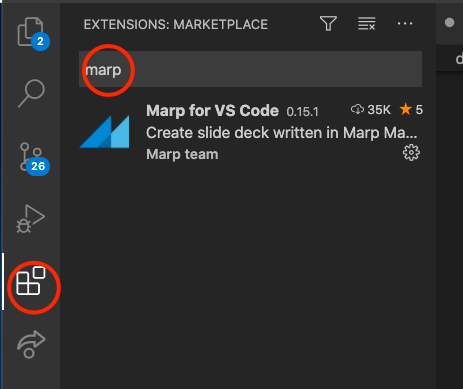
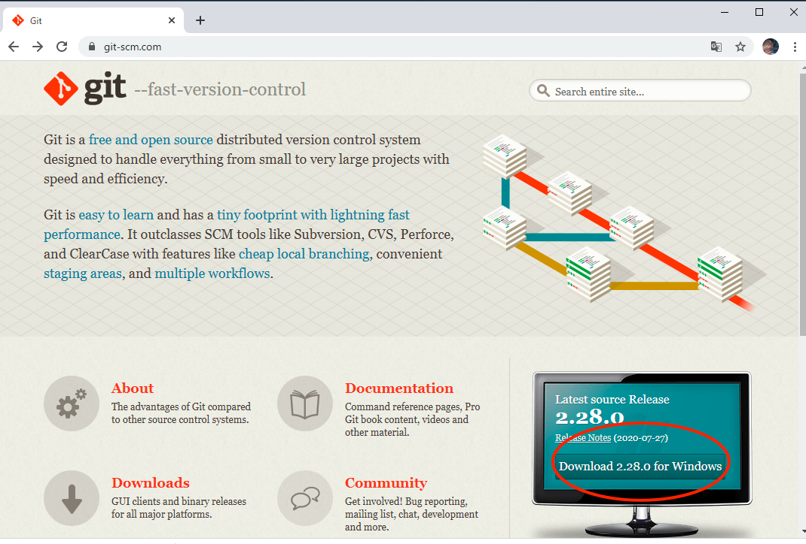
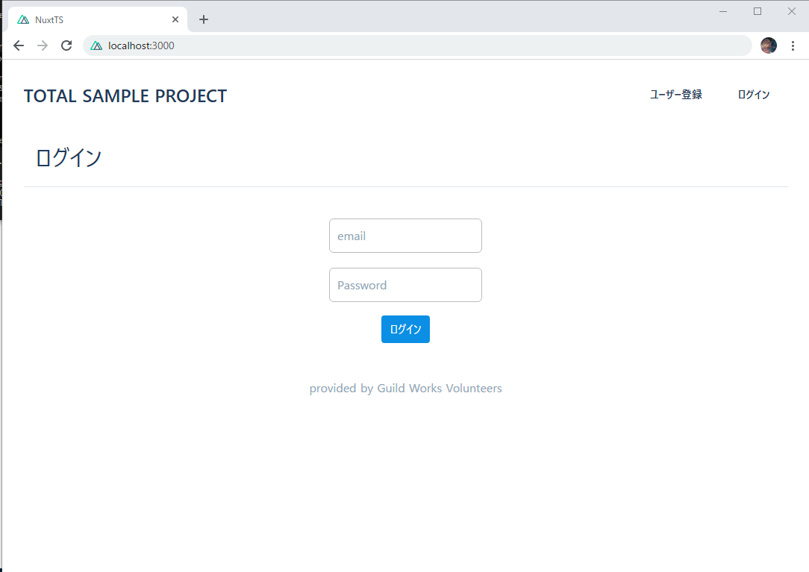

<!-- page_number: true -->
<!-- paginate: true -->

# 1. Let's set up the development environment

Let's prepare the minimum necessary environment for proceeding with today's development.

---

# What to set

1. Text editor (Visual Studio Code)
2. Version control tool (Git / Github)

---

# Text editor

## Why do you need it?
The comfort of editing text makes development more efficient.
Some can add useful features needed for development.

- Code completion, format, decoration
- Access to program execution, version control, etc.

---

## What do you use?
(This time) Visual Studio Code
* Abbreviation is called vscode.

---


---

## Let's set up

Download from the URL below
Let's install without changing the settings.
https://code.visualstudio.com/

---


Please download from here.

---


If this screen is displayed, you are done.

---

## Let's install the following plugins
- Marp for VS Code
- etc

---



---

# Version control tool

## Why do you need it?
By managing the version of the code under development
It becomes easier to return / advance to the state of a specific development timing,
It makes it easier to collaborate with other developers.

---


Source: [Structural difference between Git and Subversion-Ricksoft Blog] (https://www.ricksoft.jp/blog/archives/9483/)

---

## What do you use? What can i do? )
- git (version control system)
- github (repository hosting & various development support functions)

---

## Let's set up
Download from the URL below
Let's install without changing the settings.
https://git-scm.com/downloads

---



---

## First clone
A set of codes to be used in the lecture from today,
Let's clone (duplicate the remote repository to the local repository).

1. Create a GitHub account (free) in advance
    --https://github.com/
1. Right-click in the directory where you want to put the cloned set from File Explorer and open the menu.
1. Select "Git Bash Here" to launch Git Bash (command input screen for Git operation).
1. Run the command `git clone https://github.com/GuildWorks/titech-2020.git`
1. When you are prompted to log in, enter the ID / Password of the account you created in advance.

---


A set of such files should be placed.

---


If you look under the titech-html-sample folder, you will find an HTML file.

---


If you open detail.html, you can see today's final form.

---

Let's open it with ## vscode

1. Select "File" from the top menu of vscode
1. Select "Open Folder ..."
1. Select the cloned folder

---


---


---

# Node.js / npm

## Why do you need it?
What is Node.js? Network application
A JavaScript environment designed to build.

For application execution and package management from the second time onwards
You will need it.

---

## Let's set up

Download it from the following and install it without changing any settings.
https://nodejs.org/en/download/

---


---

Let's use the following command from the git bash screen.
```
node --version
```
When the version is returned, the installation is successful.
```
v12.19.0
```

---

## Let's run the sample project
Open git bash in the titech-nuxt-sample folder and
Let's execute the following command.

```
npm install
```
* It will take some time to complete.

```
npm run dev
```
---


---

Let's access the following URL.
http://localhost:3000/

---



---


# Development environment setup, end

Do you have any question.