**Programming Boot Camp #4**

# 4： What it takes to develop a team

**Tokyo Institute of Technology 2020/11/28**
　
　
　
　
　
　　　　　　　　　　　　　　　　　　　　　　**Naotake Kyogoku**

----

## Review previous sessions

- In the first session, we learned the basics of HTML, CSS, and Javascript.
  - [Reference: 1st handout](https://github.com/GuildWorks/titech-2020/blob/master/docs/Phase1)
- In the second session, we learned the basics of Vue.js (Nuxt.js).
  - [Reference: 2nd handout](https://github.com/GuildWorks/titech-2020/blob/master/docs/Phase2)
- In the third session, we learned about authentication from user registration with Firebase.
  - [Reference: 3rd handout](https://github.com/GuildWorks/titech-2020/blob/master/docs/Phase3)

----

### Things to do today

:black_square_button: What it takes to develop a team: development edition

* Learn all the commands in Git
* Learn to review code using GitHub's Pull & Request
* Learn what to do when code conflicts occur

:black_square_button: What it takes to develop a team: communication

* Everyday communication
* Regular communication

----

<!-- _class: lead -->

# <!-- fit --> So let's get going!

----

### :black_square_button: What it takes to develop a team: development edition

* Learn all the commands in Git
* Learn to review code using GitHub's Pull & Request
* Learn what to do when code conflicts occur

----

### First, a review of Git

※From the first lecture material

> By managing the version of the code under development
> It becomes easier to return / advance to the state of a specific development timing,
> It makes it easier to collaborate with other developers.

----

※From the first lecture material


Source：[GitとSubversionの構造的な違い - Ricksoft Blog](https://www.ricksoft.jp/blog/archives/9483/)

----

<!-- _class: lead -->

### <!-- fit --> Learn all the commands in Git :sunglasses:


----

### First things first...

Git has a variety of **commands** that we'll be learning a bit about.
We'll learn a few of these commands in a moment.

But first.

Here's an important concept for learning Git: :point_up:

----

### Git for Multi-Person Development...

When multiple people are working on a project, there is a good chance that the files will be modified at their own pace and will not look the same as they did when they first appeared.

And it's the same from the others' perspective.

----

### So...

In Git, you can use something called **branches** to create
It eliminates a lot of hassle when developing with multiple people.

What this branch is...

First of all, this was the first command you hit when you took this course.

```bash
git clone https://github.com/GuildWorks/titech-2020.git
```

----

What this command is doing behind the scenes is... * Indicates that it is a Git command in `git`:

* Indicates that it is a Git command with `git`.
* Run the Git `clone` command next
* This `clone` command creates a "local repository" based on the contents of the following "remote repositories".
* At this point, it is important to know which branch** state to bring in from the remote repository.
* In this case, it brings the state of the default branch (in this case, the `master` branch) set in the target remote repository.

----

* If you want to bring the contents of a remote repository with a specific branch state, you might look like this

```bash
git clone -b feature/phase4 https://github.com/GuildWorks/titech-2020.git
```

* Also, when creating a "local repository", if you expect to have a different name than the "remote repository", it will look like this

```bash
git clone https://github.com/GuildWorks/titech-2020.git titech-2020-day4
```

In this case, the directory name after the `clone` will be `titech-2020-day4`.


----

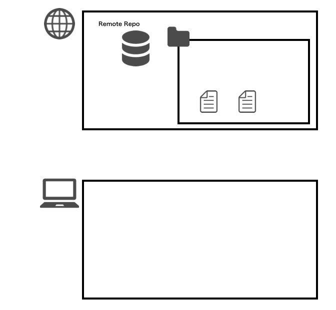

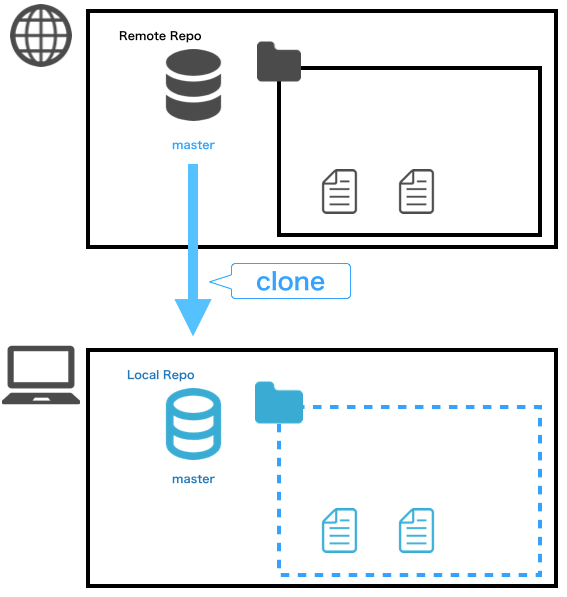

----

### In this way...

It's very important to be aware of **branching** when working with Git :innocent:

We're going to be hearing a lot of words and ideas about branches in the future, so keep that in mind!

----

Now, let's get right into learning the commands of Git.

Before that, we'll all do some preliminary preparation together.

There are three things to do.

1. :black_square_button: Update the `titech-2020` directory used in #1 ~ #3
2. :black_square_button: We invite you to submit your GitHub account to the GitHub page for this workshop
3. :black_square_button: clone` a new repository for this workshop

----

#### 1. Update the `titech-2020` directory used in #1 ~ #3

The first thing to do is to update the `local repository' of `titech-2020`, which I've been using a lot.

The command you need is the one you were hitting at the beginning of #2 and #3: `git pull`.
Yes, it's a `git pull`.

So when you open GitBash(Terminal) in the `titech-2020` directory, you run the command.

```bash
git pull
```

----

#### 2. We invite you to submit your GitHub account to the GitHub page for this workshop

https://github.com/GuildWorks/titech-2020/issues/33

Go to this page and write an appropriate comment!
We will send out invitations to those who can write in order, please check back.


:sunglasses: 講師は[ココ](https://github.com/orgs/titech-2020-day4/teams/titech-2020/members)から招待していく！

----

If the invitation is successful, you should receive an email like this.

Click the `Join @titech-2020-day4` link in the body of the email if it arrives safely.

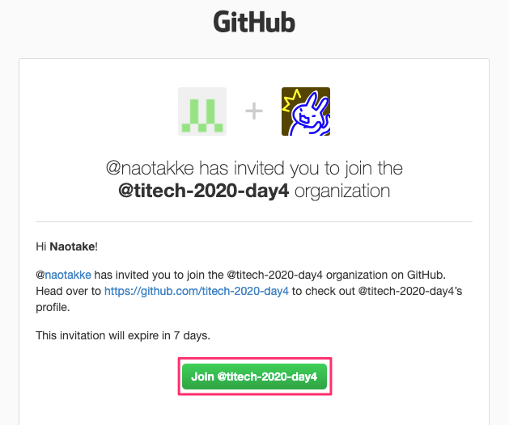

----

Then you'll be taken to a GitHub page and you should see a screen like this

Press the `Join titech-2020-day4` button when the page is displayed correctly.

The invitation will be completed successfully.

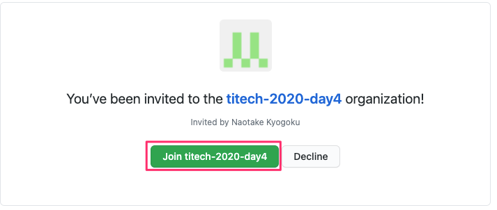

Who hasn't done well so far? :raising_hand:

----

#### 3. clone` a new repository for this workshop

:warning: Run this command on one level above the titech-2020 you've been using!

```bash
# Ensure that the end of this command is titech-2020
pwd

# Move up one level
cd ../

# clone the repository for the workshop
git clone https://github.com/titech-2020-day4/workshop.git titech-2020-day4

# Go to the cloned directory
cd titech-2020-day4
```

----

Did you get it done?
Anyone yet? 🙋‍♀️ 

1. :white_check_mark: ~~Update the `titech-2020` directory used in #1 ~ #3~~
2. :white_check_mark: ~~We invite you to submit your GitHub account to the GitHub page for this workshop~~
3. :white_check_mark: ~~clone` a new repository for this workshop~~

Now you're ready!

----

Let's see if the branch of the repository you just `clone` is really a `master` branch👀

Let's run the `git branch` command directly under the `titech-2020-day4` that we just cloned

----

If you do, you should see a `*` next to the current branch name.
If you're using GitBash or Terminal, you'll see a different color :smile:


This command will show you what branches currently exist in the "local repository" and which branch is currently facing you.

----

<!-- _class: lead -->

# <!-- fit --> A little bit of **brunch** is now familiar to you, isn't it? :heart:

----

Now, let's create a new branch.
The image of creating a new branch is literally a branching image.

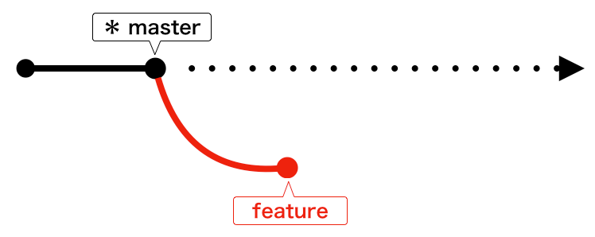

This is an image of the `feature` branch branch branch branch branching off the `master` branch.

----

Now let's create a branch.
The command is here.

```bash
git branch feature/{your-name}
```

The `{your-name}` part should be your surname, for example, I would be `feature/kyogoku`.
For example, I would be `feature/kyogoku`, so

```bash
git branch feature/kyogoku
```


----

I don't think anything special happened.
Let's see if the branch was really created.

... You know what command to use, don't you :kiss:?

That's right!
It's the `git branch` command that we just hit.

----

```bash
git branch
```

Now, besides the `master` branch that was there when you hit the first `git branch`, the `feature/{your-name}` branch that you just created should be there!


----

This means that a new branch has been created in your "local repository", but it's still marked with a `*` mark.
But the `*` symbol is still on the `master` branch, isn't it?
So, if you edit any file, you will be working against the `master` branch.

----

So, let's go to the branch we created.
Let's run the `git checkout` command.

```bash
git checkout feature/{your-name}
```

This is how you specify the name of the branch you want to move after the `checkout`.

In my case, it looks like this

```bash
git checkout feature/kyogoku
```

----

When you hit this command

```git
Switched to branch 'feature/{your-name}'
```

You should see a message that says!
Who isn't? 🙋‍♀️

----

So let's see if you really moved the branch.

... You know what command to use, right? :kiss::kiss:

That's right!
Three appearances! The `git branch` command.

----

```bash
git branch
```

Doesn't the position of the `*` change when you run it?
Earlier, the `master` branch should have been marked with a `*`.
If you hit it now, the `feature/{your-name}` branch should have a `*` attached to it.


The working branch has now been moved to the `feature/{your-name}` branch successfully.

----

Let's have a quick review of the commands we've learned so far.

Commands|Uses|
:-|:-|
`clone`|Create a local repository from a remote repository|
`branch`|Create a branch|
`checkout`|Move Branch|

----

Now, let's edit the file and add its contents to the "Remote Repository"!

The process goes something like this

1. :black_square_button: Add the directory just `clone` to VS Code
2. :black_square_button: Adding files in the working directory
3. :black_square_button: Reflect the changes to "Local Repository
4. :black_square_button: Reflect the contents of the "Local Repository" to "Remote Repository

----

#### 1. Add the directory just `clone` to VS Code

As a prelude, add the directory we have just `clone` to VS Code so that it can be edited in VS Code.

----

First, make sure that the left panel of VS Code is marked with `GITHUB (WORKSPACE)` or `UNTITLED (WORKSPACE)`.

And drag & drop the directory you just `clone` into the area.

The name of the directory should be `titech-2020-day4`, everyone!


----

When Drag & Drop succeeds, you should see a confirmation dialog like this, so click the `Add Folder to Workspace` at the top.


----

Then in the left panel of the VS Code, `GITHUB (WORKSPACE)`, there should be a new `titech-2020-day4`!

Not more people? 🙋‍♀️

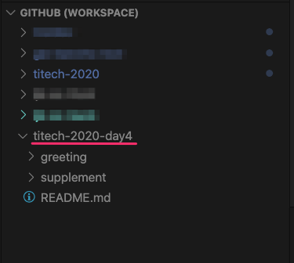

Now let's add the actual file!

----

1. :white_check_mark: ~~Add the directory just `clone` to VS Code~~
2. :black_square_button: Adding files in the working directory
3. :black_square_button: Reflect changes to "Local Repository
4. :black_square_button: Reflect the contents of the "Local Repository" to "Remote Repository

----

#### 2. Adding files in the working directory

Select the following directory in VS Code

```bash
titech-2020-day4/greeting
```

Then create a new file by selecting `New File` from the right-click menu.

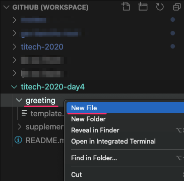

----

Name your file `{your-name}.txt` as if it were a file in the same order.
Once the file is created, add your own personal statement to the contents.

* 名前 (Name)：
* 誕生日 (Birthday)：
* 出身地 (Birthplace)：
* 学部 (Faculty)：
* 趣味 (Hobbies)：
* ニックネーム (Nicknames)：

:notebook: Copying the contents of the `template.txt` in the same order is also OK :information_desk_person:

----

Have you finished your self-introduction postscript?

1. :white_check_mark: ~~Add the directory just `clone` to VS Code~~
2. :white_check_mark: ~~Adding files in the working directory~~
3. :black_square_button: Reflect changes to "Local Repository
4. :black_square_button: Reflect the contents of the "Local Repository" to "Remote Repository

----

#### 3. Reflect changes to "Local Repository

Now, you need to make sure that Git recognizes your modified file.

That's where the `git status` command comes in.

This command lets you see what files have changed on your current branch.

----

```bash
git status
```


When you run it, you should see the path to the file you just added.
At this point, remember that the file path is colored in red!

----

Now that you've verified that Git recognizes your changes, you can put them in your local repository.

... However, there are two steps to reflect your changes to the local repository: 1.

1. reflect your changes in the staging area
2. reflect the contents of the staging area to the local repository

Let's take a look at them in order! :eyes:

----

##### 1. Reflect the changes to the staging area

**Staging Area**

There are some unfamiliar words 💧

Don't worry. I'll walk you through it all in order!

----

In fact, the local repositories include

* "Work Area
* "Staging Area

There are two areas of


----

These two areas each have the following roles

* The work area
  * The part where you guys are actually doing the work
  * Add files and directories, etc.
* Staging area
  * The part to remember the changes that will be reflected in the local repository

----

And now your changes are only reflected in the "work area".

So we will reflect it into the "staging area".

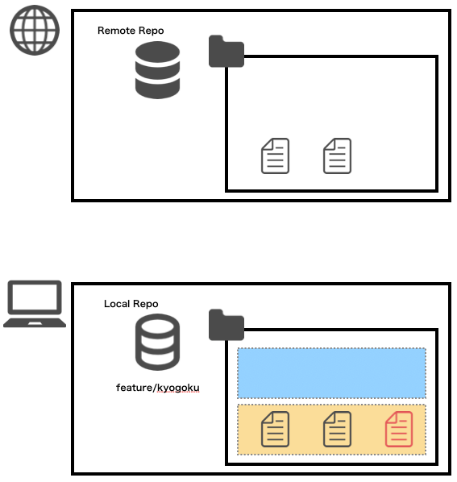

----

That's where the `git add` command comes in.

This command allows you to reflect your work in the "working area" to the "staging area".

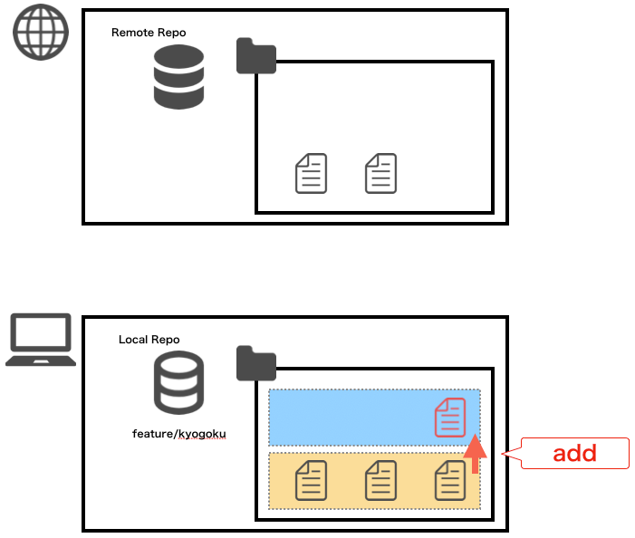

----

You can specify the path of the file you want to reflect in the "staging area" following the `git add`, and only that file will be reflected in the "staging area".

... But it's a hassle to type that file by hand, isn't it?

That's where the `git status` command from earlier comes in handy.

----

The file displayed after executing the `git status` command is the path to the currently modified file, so you should copy it.


And paste the path behind the `git add` (which should not show anything when run).
(You should see nothing when you run it.)

```bash
git add greeting/{your-name}.txt
```

----

Did you get it done?
Now, let's see if we really got it reflected in the "staging area".

Which command to hit... You get the idea. :smile:

That's right! The `git status` command!

----

The `git status` command allows you to see what files have changed on the current branch.

```bash
git status
```


When you run it, the path to the file is the same as it was before `git add`, but there are some changes, right?

... That's right! The color!

----

Before `git add`, the color of the file path should be red :heart:.
But after `git add`, the file path is green :green_heart:, indicating that the file is correctly reflected in the staging area.

This means that the file has been correctly reflected in the staging area.

Now that you've verified that the staging area is correctly reflected, it's time to reflect it in your local repository.

----

##### 2. Reflect the contents of the staging area to the local repository

Now that we have successfully reflected the changes in the staging area, it's time to reflect the changes in the local repository.

The local repository is now updated with the `git commit` command.

----

The `git commit` commands reflect what is reflected in the staging area (i.e., what is staged) to the local repository.
Therefore, `git commit` does not require you to specify a specific file.


----

However, when you do a `git commit`, you need to include a **commit message** that includes the "what" and the "why" for the local repository.

In general, you can see the "what" in the commit message, so you'll often include the "why" in the commit message.
Well, you don't have to be that conscious right now :ok_hand:

----

Based on these, the command to be executed looks like this.

```bash
git commit --message "{your-name}の自己紹介文を追加"

# -m でもイケます
git commit -m "{your-name}の自己紹介文を追加"
```

The `----message` is an **option** to the `git commit` command to set the commit message.

----

A little digression... :railway_car:

We won't go into the details here, because there are a variety of options available in the Git commands, like `----message`.
For more information, type `--help` or `-h` at the end of each command to see a list of options for the command.

```bash
git branch --help
git checkout --help
```

----

:warning: A little caution here :warning:

If you have a large amount of help, the cursor position on the terminal may be marked as `:`, and pressing `Enter` or `Backspace` won't finish the screen.

In such a case, try hitting the `q` command once.
If that happens, don't panic, just hit the `q` command once, and you should be able to exit the screen.

This means that the screen is open in the referring mode of the `vi` editor, but I won't go into details.

----

I got sidetracked... :railway_car:

Let's go back and hit `git commit`.

```bash
git commit --message "{your-name}の自己紹介文を追加"

# "-m" is also OK
git commit -m "{your-name}の自己紹介文を追加"
```


----

Now let's see if the `git commit` succeeds.
Yes, it did! The `git status` command.

When you hit the `git status` command...


Huh?
The file that I was supposed to be editing no longer appears 😱

Don't worry. That's the correct behavior.
(Who is showing the opposite?🙋‍♀️）

----

So, where did the edited file go?

The answer is reflected in the local repository.

Now, let's see if the local repository is updated.

That's where the `git log` command comes in.

----

This command will allow you to see the commit history (log) of the current branch.

```bash
git log
```


----

If you actually hit it, you can see the commit history from top to bottom, starting with the most recent.

The top commit message probably shows the `git commit` message that you just hit, and the `git log` is also in vi's referencing mode, so you can see it when you're done.

(The `git log` is also shown in vi's referential mode, so if you want to finish it, just type `q` once.

----

Now, we are almost at the finish line.

We have completed the reflection to the local repository.
The final step is to populate the remote repositories.

1. :white_check_mark: ~~Add the directory just `clone` to VS Code~~
2. :white_check_mark: ~~Adding files in the working directory~~
3. :white_check_mark: ~~Reflect changes to "Local Repository~~
4. :black_square_button: Reflect the contents of the "Local Repository" to "Remote Repository

----

#### 4. Reflect the contents of the "Local Repository" to "Remote Repository

The `git push` command is used to push the content of the local repository to the remote repositories.

This command pushes everything that is reflected in the local repository, but not yet in the remote repository.

----

```bash
git push origin feature/{your-name}
```

The `origin` refers to a remote repository, followed by the name of the branch you want to `push`.
The `origin` refers to the remote repository, followed by the name of the branch you want to `push`.

So this command is called

Push the contents of the `feature/{your-name}` branch that is not yet reflected in the remote repository.

command.

----

```bash
git push origin feature/{your-name}
```
Push the contents of the `feature/{your-name}` branch that is not yet reflected in the remote repository.

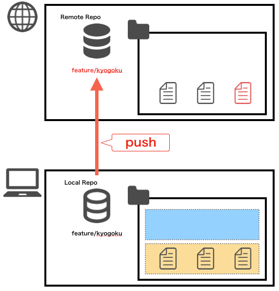

----

... What do you think?

Did you `push` successfully?
You got an error? 🙋‍♀️ 

----

Thank you for your hard work.

Now your work on your computer is reflected in the remote repository 🎉🎉🎉

0. :white_check_mark: ~~Add the directory just `clone` to VS Code~~
1. :white_check_mark: ~~Adding files in the working directory~~
2. :white_check_mark: ~~Reflect changes to "Local Repository~~
3. :white_check_mark: ~~Reflect the contents of the "Local Repository" to "Remote Repository~~

Now let's take a look at the content from GitHub.

----

Access the GitHub page of the workshop repository.
https://github.com/titech-2020-day4/workshop

Click on the part that says "master" around the bottom right of this screen.

----

You should see the `Switch branches/tags` pull-down.
There should be a text box that says `Find or create a branch...`, and you can type in the name of the branch you just `pushed`. Let's type in the name of the branch you just `pushed`, and you'll see a text box `Find or create a branch...`.

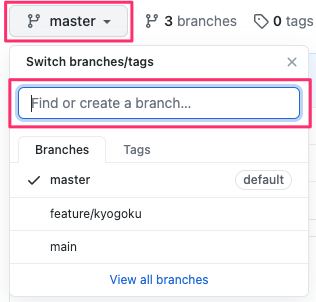

It should come up when you type your `{your-name}`!

----

Is there anyone who doesn't have their own branch? 😭

----

<!-- _class: lead -->

### Now you can see that it is successfully reflected in the remote branch!

:innocent: Good job! :innocent:

----

Let's review the command we just struck.

Command|Uses|
:-|:-|
`branch`|Create a branch in the local repository|
`checkout`|Branch Switching|
`add`|Add and edit files in the work area and reflect them in the staging area|
`commit`|Reflect the contents of the staging area in the local repository|
`log`|Check the current branch's commit history|
`push`|Reflect the contents of the local repository to the remote repository|

----

When several people are developing at the same time, they can slog through the process without affecting the work of others. 😎

----

### Wait a minute... :neutral_face:

But isn't that the case, where you want to capture other people's work in your work area as well?
Everyone can work apart, but you can't build one application apart.

----

### That's where GitHub comes in!

You'll want to consolidate your changes into one place.

We'll use GitHub's **Pull & Request** feature to merge your self-introduction files into a single branch.


----

First, open the GitHub page of the workshop repository you just opened.
Next, select the `Pull & Request` at the top of the screen.

Then, click on the `New pull request` button on the right to create your Pull & Request.

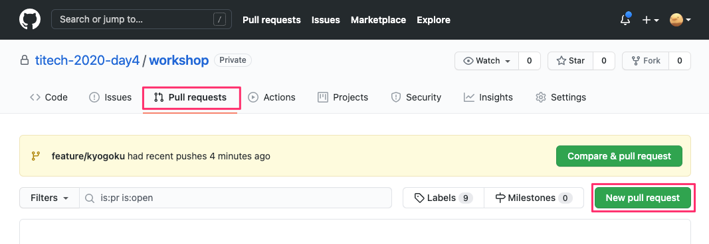

----

You should see a page called Comparing changes, so first, enter **base** and **compare**.

This is for when your `feature/{your-name}` branch you `pushed` is merged into the `master` branch, so that the branches are merged together and your changes become one.
This makes it look like your changes are merged together, branch by branch.


----

Press the **Create pull request** button once you have set up the following

1. base (Merge to)
  `master`
2. compare (Merge former)
  `feature/{your-name}`

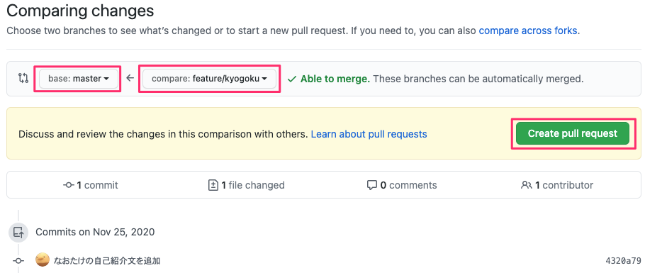

----

You should see a page named **Open a pull request**, so set up the rest of the Pull & Request.

3. title
  The contents of the `push` that we just gave you should be set, so you can use the
4. description
  Fill out this Pull & Request Summary
Concerns, agenda items, etc.
5. review
  **naotakke**
6. assignee
  Click **assign yourself**.

----

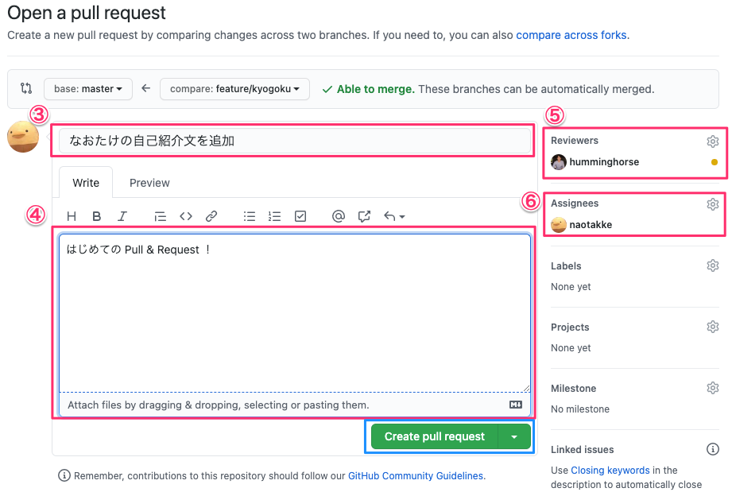

----

When you're done, press the **Create pull request** button PUSH!

You'll see the Pull & Request screen, and you're done!
Who's not doing well? 🙋‍♀️

----

I'll review the Pull & Request and approve it if it's OK!
If you are approved, try merging the Pull & Request yourself.

Merge Pull & Request by pressing the **Merge pull request** and **Confirm merge** buttons at the bottom of the screen, in that order!

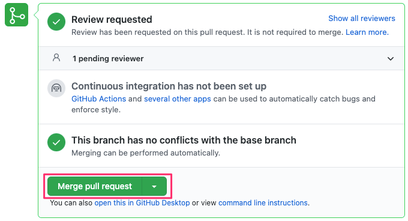

----

When you're done merging, you won't need the branch you created, so tell me the `Delete branch` button under the merge button to delete it!


----

Finally, let's get the self-introductions of everyone merged into your local repository.

The procedure is like this.

1. Check the current branch status
2. Move the current branch to `master`.
3. Fetch the contents of the latest `master` branch

----

Each step is already perfect, right? 😎

1. Check the current branch status
  Check for the absence of unintended differences with `git status`.
  Check `git branch` to see that the current branch is `feature/{your-name}`.
2. Move the current branch to `master`
  `git checkout master`, moving the current branch to `master`.
  `git branch` confirms that the current branch has been changed to `master`.
3. Fetch the contents of the latest `master` branch
  `git pull` to get the latest state

----

When you're done with the above, take a look in the `titech-2020-day4/greeting` directory with VS Code!
I'm sure there are files of self-introductions of all the participants today, besides you all :raised_hands:

----

<!-- _class: lead -->

## Good job!

Next... Conflict resolution :scream:

----

### Before we get to the conflict resolution...

Here is a little more about the `git pull` command you just ran.

What the `git pull` command does internally is...

----

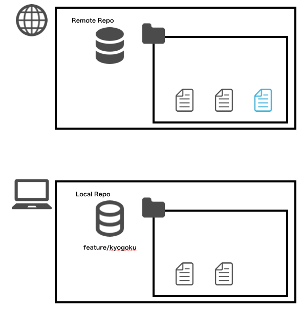
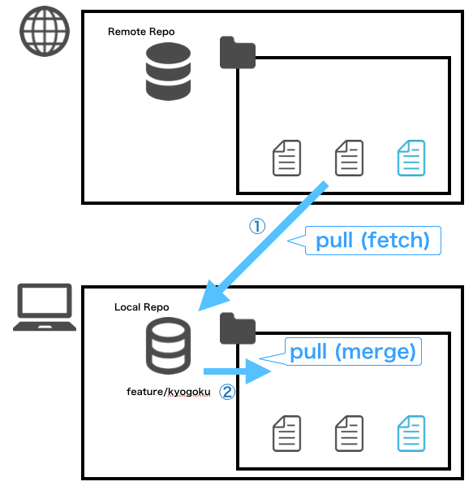

----

This is how the contents of the "Remote Repository" are brought to the "Working Area" in a single command.

And actually, this command is equivalent to doing the following two commands in one go.

`git fetch`
`git merge`

----

Talking in depth here might confuse you even more, so I'll abbreviate it and explain... :sweat_smile:

Use `git fetch` to get the latest contents of a **remote repository** into the local repository
`git merge` brings the latest contents of **local repository** into the working area

This is what they have done for me.
convenient 🤤

----

But why bother with the `fetch` and `merge` commands when you can do it in one command?
That's because the content of the file we're about to discuss will be useful when the content of the file conflicts with others.
When the content of an edited file conflicts with others, it is called **"conflicting"** in our industry.

So from the next page onwards, I'll use the word "conflict" to describe it :wink:

----

Now, let's go through the process of actually conflicting files and resolving them.
This will be the last Git chapter, so let's take one more step :muscle:

:musical_note: :curly_loop: :musical_note:

From here on, you will work in pairs, so you should pair up with someone on the left or right side.
(Seating is fine.)
(If you feel like you're going to be alone, please let me know if you're a GW member or I'll be paired with you.

----

This is what we do in pairs (which is a lot).
(Let's say the pair is Mr. A / Mr. B.)

1. Mr. A creates a new branch and brings it to the work area of each of the pairs
2. Ms. A adds "favorite movie or book" at the end of her self-introduction
3. Reflect the added content in the remote repository
4. Mr. B wrote at the end of Mr. A's self-introduction, "That's nice! And postscript
5. Mr. B reflects the contents of #4 in the remote repository
6. **If you do, there will be conflicts successfully** :fire::fire::fire:

----

7. Mr. B resolved the conflicts and re-posted the content in the remote repository
8. Mr. A gets the latest content from a remote repository
9. Mrs. A checked the end of her self-introduction and made sure that it included both her favorite movie or book and Mrs. B's impressions

Once you have done so far, switch Ms. A / Ms. B and start again from #2.
(We may leave it out of time.🙇‍♀️

----

So, let's get on with it!

Mr. A：💚
Mr. B：💛

----

#### 1. Mr. A creates a new branch and brings it to the work area of each of the pairs

💚 ： Create a new branch from the `master` branch
A branch named `feature/{A-name}-step2`, where A-name is the name of Ms. A
💚 ： After creating the branch, use the `git checkout` to switch branches
💚 ：And run the `git push` command without changing any contents yet
💚💛 ：Verify that the branch you just added from GitHub exists

----

💛 ：Switch to the newly created branch in the following steps
(In the meantime, Mr. A should do the contents of the next sheet.
1. `git pull`
2. `git branch feature/{A-name}-step2 origin/feature/{A-name}-step2`
3. `git checkout feature/{A-name}-step2`

💚💛 ：Finally, check that the current branch is `feature/{A-name}-step2` via `git branch`.

----

#### 2. Ms. A adds "favorite movie or book" at the end of her self-introduction

💚 ：Add "favorite movie or book" at the end of your own personal statement file created in the first work

#### 3. Reflect the added content in the remote repository

💚 ：Now let's reflect the added content in the remote repository
`git add`
`git commit`

----

:rotating_light: STOP here for a moment :rotating_light:
💛 Make sure that Mr. B has finished executing everything up to the following commands.

```bash
# 💛 Conducted by Mr. B
git checkout feature/{A-name}-step2
```

If all is well, 💚 A will reflect the self-introductions added with a `git push` to the remote repository.

```bash
# 💚 Conducted by Mr. A
git push origin feature/{A-name}-step2
```

----

4. Mr. B wrote at the end of Mr. A's self-introduction, "That's nice! And postscript

💛 ：Check Ms. A's self-introduction and make sure that her "favorite movie or book" is not **added to the end
💛 ：Check Ms. A's self-introduction statement and add "Lovely content! And postscript

----

5. Reflect the added content in the remote repository

💛 ：Now let's reflect the added content in the remote repository

* `git add`
* `git commit`
* `git push`

You should see some error message here, so we'll move on...

----


If you see an error message like this, you are in the right state.

This is because the `feature/{A-name}-step2` branch in the remote repository has changed, so you should use the `git pull` to get the latest contents.

That would be the message.

----

So let's hit the `git pull` accordingly.


### 6. Then there will be conflicts successfully

----

Now, let's get rid of this conflict.

The current state of affairs is that Mr. A and Mr. B have edited the same file, resulting in a content conflict.

Because Git doesn't know which of the two edits is the correct one, it encourages you to modify Mr. B's changes.

----

7. Mr. B resolved the conflicts and re-posted the content in the remote repository

💛 ：So, let's get on with resolving the conflicts.
(After this, Mrs. A will switch roles, so Mrs. A should look at the previous screen.

----

💛 ：Try `git status`.


Then you should see `both` in Mr. A's self-introduction file, which literally means that the edits were made both in the remote repository and in the work area.
This literally means that the edits were made both in the remote repository and in the working area.

----

💛 ：Try to open that file in fact.

It would contain symbols such as `<<<<<<<` and `>>>>>>>`.
This represents the modifications of the "remote repository side" and "work area side" respectively, separated by `=======`.


----

We will continue to resolve the conflicts as we go through the content.
There are roughly three patterns of resolving conflicts.

1. Deleting modifications on the remote repository side, setting the contents of the working area side as **positive**
2. On the contrary
3. Leave the modifications on both the remote repository side and the work area **side**

This time we will use the #3 pattern to resolve conflicts.

----

💛 ：You should see the letters `<<<<<<<` and `>>>>>>>` in the conflicting files, and you should see the notation
`Accept Current Change | Accept Incoming Change | Accept Both Changes | Compare Changes`
above them.


----

This represents #1 ~ 3, respectively.

1. Deleting modifications on the remote repository side, setting the contents of the working area side as **positive**
  → `Accept Current Change`
2. On the contrary
  → `Accept Incoming Change`
3. Leave the modifications on both the remote repository side and the work area **side**
  → `Accept Both Changes`

💛 ：So select `Accept Both Changes` from #3 this time.

----

Then the characters `<<<<<<<` and `>>>>>>>` should disappear.
This means that the conflicts have been resolved.

💛 ：Now, let's reflect it to the remote repository.

* `git add`
* `git commit`
* `git push`

----

8. Mr. A gets the latest content from a remote repository

💚 ：Let's get the latest contents from a remote repository

* `git pull`

If you get a message like `Please specify which branch you want to merge with.

```bash
git branch --set-upstream-to=origin/feature/{A-name}-step2 feature/{A-name}-step2
```

----

9. Mrs. A checked the end of her self-introduction and made sure that it included both her favorite movie or book and Mrs. B's impressions

💚 ：Open your own self-introduction file and make sure that it contains both your favorite movie or book at the end and the impressions written by Mr. B

Now you can successfully import the contents of each other's files edited.

----

Now, let's switch from person A to person B and try the conflict resolution process again.
Since #1 has already been addressed, we'll start with step #2.

1. ~~Mr. A creates a new branch and brings it to the work area of each of the pairs~~
2. Ms. A adds "favorite movie or book" at the end of her self-introduction
3. Reflect the added content in the remote repository
4. Mr. B wrote at the end of Mr. A's self-introduction, "That's nice! And postscript
5. Reflect the added content in the remote repository
6. **If you do, there will be conflicts successfully** :fire::fire::fire: 

----

7. Mr. B resolved the conflicts and re-posted the content in the remote repository
8. Mr. A gets the latest content from a remote repository
9. Mrs. A checked the end of her self-introduction and made sure that it included both her favorite movie or book and Mrs. B's impressions

----

<!-- _class: lead -->

### Good job!
### That's the end of the Git / GitHub chapter!

----

I'd like to review what I've learned.

### :ballot_box_with_check: What it takes to develop a team: development edition

* Learn all the commands in Git
* Learn to review code using GitHub's Pull & Request
* Learn what to do when code conflicts occur

----

##### :beginner: Tips at the end

As you may have noticed, the current branch is actually listed at the bottom left of VS Code.
Basically, you can see here and it's OK. 😅


----

<!-- _class: lead -->

# <!-- fit --> So, let's go for the second half!

----

### :black_square_button: What it takes to develop a team: communication

* Everyday communication
* Regular communication

----

Communication is important when developing with multiple people.
You may think it's obvious, but it's surprisingly difficult.

Everyone's background is different.
We all have different backgrounds, different values.

But we are a team that has come together to achieve a goal!

:two_men_holding_hands: :two_women_holding_hands: :two_men_holding_hands: :two_women_holding_hands: :two_men_holding_hands: :two_women_holding_hands: :two_men_holding_hands: :two_women_holding_hands: :two_men_holding_hands: :two_women_holding_hands: :two_men_holding_hands: :two_women_holding_hands: :two_men_holding_hands: :two_women_holding_hands: :two_men_holding_hands: :two_women_holding_hands: :two_men_holding_hands: :two_women_holding_hands: :two_men_holding_hands: :two_women_holding_hands: :two_men_holding_hands: :two_women_holding_hands: :two_men_holding_hands:

----

We can't change everyone's ideas and values.
Rather, it is important to accept the other person's views and values before proceeding with daily development.

This is where communication becomes important.

In this section, we will discuss "**Normal Communication**" and
We will talk about it in "**Regular Communication**".

If you only talk about it in the abstract, you may not get a good picture, so I'll use my usual example! :wink:

----

<!-- _class: lead -->

First...
# <!-- fit --> 「Normal Communication」

----

First up is **Slack**!


The engineering industry has been communicating with Slack for a long time, even before this day and age.
(Of course, that's not to say that there is no face-to-face communication at all.

----

But you're not really interested in talking about **Slack**, are you?
(You'll know it when you see it online! (You can hear the voice of the mind saying, "I'm not going to do this.

Here's how I usually use Slack.

----

### Channel Dedicated

Creating a new Slack workspace creates the `#general` and `#random` channels.

If it's really just one or two people, it's okay, but
If you talk about all the conversations in the `#general` channel alone, the content of that channel gets jumbled.

* I don't know where we were talking at the time... 🤔
* I want to check about xxx, but it's hard to write about it now that we are in the middle of a conversation about something else...

And then there are the problems that come up. 😥

----

So, divide the channels by the topics you need and make the channels dedicated.
For example, here's what it looks like

`#dev-all` : General Development Interaction
`#dev-vue` : Interaction about Vue.js
`#dev-design` : Design Exchanges
`#ざつだん` : Usual chatter (can also be `#randome`)
`#general` : What we want everyone to know

This way, the exchange on each topic will be consolidated, making it easier to exchange on that topic and easier to find later.

----

However, if you are just a friendly group of friends, you can use the `#ざつだん` channel to get everyone excited about writing.
However, if you don't know the other person very well, it may be difficult for you to write in the `#ざつだん` channel.

:pensive: :disappointed: :frowning: :pensive: :disappointed: :frowning: :pensive: :disappointed: :frowning: :pensive: :disappointed: :frowning: :pensive: :disappointed: :frowning: :pensive: :disappointed: :frowning: :pensive: :disappointed: :frowning: :pensive: :disappointed:

----

So what do you think is a little lowering the bar and what are the team members thinking? How do I feel now? It's a great opportunity to have a flat conversation about

The `#poem-{your-name}` channel.

This is a soliloquy channel, so to speak! :man:
You can write here whatever you feel/think about the person.  👌
（I wonder if it feels like a closed Twitter within a team :bird:）

----

# <!-- fit --> For example, with my `#poem-kyogoku`...


----

Like, anything really, like :dog:

And although this channel is basically a channel that originates from that person, the whole team participates in it! :mouse: :hamster: :rabbit: :wolf: :bear: :frog:

This way, someone's soliloquy can be a conversation starter! :v:

----

Slack can expand the scope of communication depending on how you use it!

Then, broaden your communication and get to know the other person.
What do they like and what are they good at?
What kind of thinking they have.

From knowing these things, the team starts to run a little bit more!

:house: :runner: :running: :running: :dash: :dash: :dash:

----

In addition to that, the usual communication that we usually do is
There is some talk about Zoom and so on, but I'll spare you the time :bow:

If you're interested in it, we'll talk about it during our break!


----

<!-- _class: lead -->

Followed by...
# <!-- fit --> 「Regular Communication」

----

When working in a team of several people, it is very important to know who they are and what they are willing to do and what they don't like in order to facilitate communication.

Here is a framework for getting to know each other
Here are some dragger-style exercises.

:dancers: :curly_loop: :triangular_flag_on_post: :dancers: :curly_loop: :triangular_flag_on_post: :dancers: :curly_loop: :triangular_flag_on_post: :dancers: :curly_loop: :triangular_flag_on_post: :dancers: :curly_loop: :triangular_flag_on_post: :dancers: :curly_loop: :triangular_flag_on_post: :dancers: :curly_loop: :triangular_flag_on_post: :dancers: :curly_loop:

----

### :dancers: Dragger-style exercise :dancers: 

Each person will answer about the following

1. What I'm good at
2. What you can contribute
3. Value to be treasured
4. Disgusting things to be done
5. What you think you are expected to do by those around you

The question must be strictly this! This is not the case.
It's totally OK if it's easy to do in each situation :ok_woman:

----

For example, it looks like this :eyes:


----

Each person answers a question and presents in turn.
The members of the audience will ask, "What does that mean? or "Tell me more about it! I'll paste additional questions and use them to dig deeper later on :honey_pot:

Of course, doing this does not make the team atmosphere better.
But it does make you wonder what kind of person they are. I think this will be the first kicker in understanding that

If you want to try it in the future at a camp, etc.! If you have a team that says, "I'm not sure I can do it," please let us know! :raising_hand:

----

<!-- _class: lead -->

One more thing.
# <!-- fit --> 「Regular Communication」

##### :raised_hands: Now let's actually do it! :raised_hands:

----

When you are working on a team activity for a certain period of time, there are moments when you think, "I'm glad I did it," "I realized something," or "I'd like to do this.

It's important to share this with your team, not just by yourself, to encourage their growth!

Let's put **YWT** to work here, introducing it as a framework for increasing team self-reflection!

----

### YWT

This..

Y：Things I've done. mean "YATTAKOTO"
W：What we found. mean "WAKATTAKOTO"
T：What to do next. mean "TSUGIYARUKOTO"

It's a framework for everyone to come up with and put together
(It's a framework born in Japan.)

----

### YWT

It is a very useful look back method to stop and think about the learning, experience and awareness from the practice and not leave it undone as you go through the trial and error process.

Reference：https://codezine.jp/article/detail/11118?p=3

----

First, **[ Y ]**, reflect on your own experience of what you have "done" so far.

Write down on sticky notes what you did in a certain period of time (weeks or months), what you did in this or that way, etc.
Write down one "thing" you have done on a sticky note.

----

When you have finished writing down the "what you did," one by one, give a brief description of what you did.

Once you have finished explaining your content, turn to the next person.
This is done in a roundabout way by everyone.

----

Next, **[ W ]**, we'll consider what we learned, realized, and discovered from what we just did.

We will look back on our learning, not only on positive things such as "it got better" and "it worked", but also on negative things such as "it didn't work" and "xxx got worse".
Write it down again on a sticky note as a single "takeaway".

----

When you've finished writing down your "findings," briefly explain your content in the same way you did before.

When you have finished explaining your content in one step, turn to the next person.
This is also a round trip for everyone.

I write down on stickies any sympathy or new insights I have for other people's "get-togethers".
Posting a sticky near the original sticky note of an understanding is a good way to understand the relationship between the two. 👍 

----

Finally, as **[ T ]**, think about what you want to do next (what you want to do), using the learning and awareness from what you understand.

As I told you in "What we found out," there were both positive and negative learning perspectives.
So, here's what I'm going to do.

* Positive learning: what to do to continue?
* Negative learning: what to do to improve?

You might want to think about it like this.

----

Again, write down a single "what to do next" on a single sticky note.
We all take turns explaining what we are doing, and then we all go around the circle.

At the end of the session, the team reviews the "next thing" and as a team asks, "Can we do it? Check and finish.

----

In summary, this is what it looks like.

* **Y [YATTAKOTO]**：Reflect on what you have done and worked on
* **W [WAKATTAKOTO]**：Consider the experience learned from it
* **T [TSUGIYARUKOTO]**：Think about what you will do to continue and improve based on that experience

I'd like to do this with you guys this time💪

----

However, I'd like to do a compact version of what I've described up to this point, because it's not enough time for this many people to work on it at 100% capacity!

* Y [YATTAKOTO]：Reflect on what you have done and worked on
  :watch: Think & :pencil2: Try to write：5min
* W [WAKATTAKOTO]：Consider the experience learned from it
  :watch: Think & :pencil2: Try to write：5min
* T [TSUGIYARUKOTO]：Think about what you will do to continue and improve based on that experience
  :watch: Think & :pencil2: Try to write：5min

----

However, I don't think you can look back without a theme, so I'm going to focus on

#### <!-- fit --> YWT for Learning Phase #1 to #4

I'd like to try it in!

----

#### <!-- fit --> YWT for Learning Phase #1 to #4

##### Ground rules

* Punctuality :hourglass_flowing_sand: :hourglass:
* Do not deny / interrupt the statements and opinions of others :police_car: :dash:
* Swear words about the instructor are not acceptable :no_good: :no_good:
  * Of course, FB for lecture content is welcome! :heart:
  * Good, it was hard to understand, I wish it had been explained more, etc.

----

So, let's do this YWT using a service called **Miro**!


----

Miro allows you to conduct workshops using a whiteboard online with a service called Online Whiteboard.

We chose Miro because we thought it would be a great opportunity for everyone to use it.

----

A picture is worth a thousand words.

Let's start by visiting the Miro page at the following URL

https://miro.com/app/board/o9J_ldDAzpY=/

You'll probably be asked for a password to access it, so enter it below.

```none
2Efwt4nENbxquV
```

Who can not open the screen?🙋‍♀️

----

Explaining how to use Miro would again be time-consuming, so I'll just give you the bare minimum.

#### Fill out a new sticky note


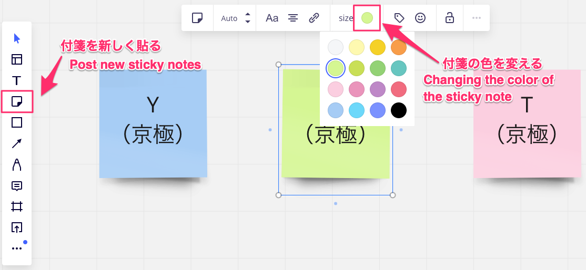

----

The colors of the sticky notes should be uniform in the following colors for later clarity

**Y**：Blue color :blue_heart:
**W**：Green color :green_heart:
**T**：Peach color :sparkling_heart:

You can also write your last name in parentheses at the end of the form.

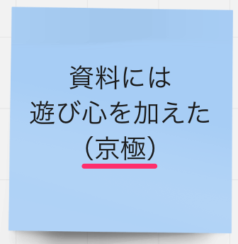

----

So let's get on with it!

#### <!-- fit --> YWT for Learning Phase #1 to #4

* Y [YATTAKOTO]：Reflect on what you have done and worked on
  :watch: Think & :pencil2: Try to write：5min
* W [WAKATTAKOTO]：Consider the experience learned from it
  :watch: Think & :pencil2: Try to write：5min
* T [TSUGIYARUKOTO]：Think about what you will do to continue and improve based on that experience
  :watch: Think & :pencil2: Try to write：5min

----

First... 

#### <!-- fit --> YWT for Learning Phase #1 to #4

* **Y [YATTAKOTO]：Reflect on what you have done and worked on**
  **:watch: Think & :pencil2: Try to write：5min**
* W [WAKATTAKOTO]：Consider the experience learned from it
  :watch: Think & :pencil2: Try to write：5min
* T [TSUGIYARUKOTO]：Think about what you will do to continue and improve based on that experience
  :watch: Think & :pencil2: Try to write：5min

----

<!-- _class: lead -->

#### Takes 5 minutes of time
#### Let's write on sticky notes in the area of **Y** for each person!

:hourglass_flowing_sand: :curly_loop: :curly_loop: :curly_loop: :curly_loop: :curly_loop::hourglass:

----

<!-- _class: lead -->

# <!-- fit --> That's enough!

----

Next...

#### <!-- fit --> YWT for Learning Phase #1 to #4

* Y [YATTAKOTO]：Reflect on what you have done and worked on
  :watch: Think & :pencil2: Try to write：5min
* **W [WAKATTAKOTO]：Consider the experience learned from it**
  **:watch: Think & :pencil2: Try to write：5min**
* T [TSUGIYARUKOTO]：Think about what you will do to continue and improve based on that experience
  :watch: Think & :pencil2: Try to write：5min


----

<!-- _class: lead -->

#### Takes 5 minutes of time
#### Let's write on sticky notes in the area of **W** for each person!

:clock11: :curly_loop: :curly_loop: :curly_loop: :curly_loop: :curly_loop: :clock1:

----

<!-- _class: lead -->

# <!-- fit --> That's enough!

----

Last...

#### <!-- fit --> YWT for Learning Phase #1 to #4

* Y [YATTAKOTO]：Reflect on what you have done and worked on
  :watch: Think & :pencil2: Try to write：5min
* W [WAKATTAKOTO]：Consider the experience learned from it
  :watch: Think & :pencil2: Try to write：5min
* **T [TSUGIYARUKOTO]：Think about what you will do to continue and improve based on that experience**
  **:watch: Think & :pencil2: Try to write：5min**

----

<!-- _class: lead -->

#### Takes 5 minutes of time
#### <!-- fit --> Finally, let's write a sticky note in the **T** area!

:watch: :curly_loop: :curly_loop: :curly_loop: :curly_loop: :curly_loop: :watch:

----

<!-- _class: lead -->

# <!-- fit --> Exit!:bell:！

----

<!-- _class: lead -->

#### Is there anyone who would like to make a presentation? 🙋‍♀️

#### ... Thank you!" first. Let's say! LOL

----

<!-- _class: lead -->

#### That concludes the workshop with YWT!
### Good job!
（Later, I'll save a capture of today's full YWT page to today's Dropbox :camera:）

----

We introduced today's YWT as one of the frameworks to encourage reflection on an individual or team basis.

Of course, there are other frameworks for doing this kind of reflection.
I suggest you try them out and do them in a way that suits you and your team and is easy to do!

----

Another important thing is to do this kind of reflection on a **regular basis** as a team.

Individual growth is important, of course, but when you add to that team growth, the power of a team of, say, three people becomes not 1+1+1=3, but 4 or 5!

It will take some time, but I hope you will consider it necessary and try to work on it as a team :blush:

Here's another one, if you want to try it in the future at a training camp or something! If you have a team that says, "I'm not sure I can do it," please let us know!:raising_hand:

----

<!-- _class: lead -->

#### That's the end of "What You Need for Team Development: Communication"!

----

### :ballot_box_with_check: What it takes to develop a team: communication

* Normal Communication
  * How to use Slack on a regular basis
* Regular Communication
  * Getting to know each other through dragger-style exercises
  * Reflection and reflection through YWT

----

### At the end ...

What we have discussed so far is just a small part of team building.

There are many activities that can be done to make a **team** into a **team**.
Using the techniques presented here will have some effect.

However, each member has its own backbone and values.
In a team with such diverse members, there will be occasional conflicts and things may not go as planned.

----

When you do, instead of trying to change the thoughts and actions of the member (the other person), you should
What's important to the team?
What can we do as a team?
It is important for a **"team "** to understand, think, and act on

For this, I think it is important to know and accept the other person.

I hope that today's discussion will give you an impetus to do so.

----

Of course, if there is anyone who would like to talk or listen to a more in-depth discussion in light of today's talk, I'd like to talk to you about
Email us at :envelope: or zom :tv: and let's talk about it at the camp!

:beer: :smile::beer: :smile::beer: :smile::beer: :smile::beer: :smile::beer: :smile::beer: :smile::beer: :smile::beer: :smile::beer: :smile::beer: :smile::beer: :smile::beer:

----

## Today's Review

#### :ballot_box_with_check: What it takes to develop a team: development edition

* Learn all the commands in Git
* Learn to review code using GitHub's Pull & Request
* Learn what to do when code conflicts occur

#### :ballot_box_with_check: What it takes to develop a team: communication

* Normal Communication
* Regular Communication

----

<!-- _class: lead -->

# <!-- fit --> Enjoy Team, more Teamwork!!

### Thanks :kissing_heart:
