**Programming Boot Camp**

# Adalo Basics

**Tokyo Institute of Technology 2021/10/23**
　
　
　
　　　　　　　　　　　　　　　　　　　　　　**Ryo Imahashi**

---
## Table of Contents
  - What is Adalo?
  - Adalo account registration
  - Try template application
  - Overview of application development with Adalo
  - Sample application development
  - Exercise
  - Summary

---
## What is Adalo?
- [Adalo](https://www.adalo.com/) is a no-code tool from the United States. It allows you to develop applications without programming.
- You can create an app by selecting the parts you want to use from those provided and dragging and dropping them onto the screen.
- You can develop not only web apps(to be displayed in a browser), but also smartphone apps for Android and iOS. It is also possible to publish the developed application on Google Play and AppStore.

---
#### Example of apps created with Adalo
- Union: https://union-jp.site/
  - A social networking service limited to undergraduates, graduate students, university faculty and university staff developed by university students.
  - Funding of 10 million yen was raised in 2021.
    - https://prtimes.jp/main/html/rd/p/000000001.000076669.html
- More examples on #MadeInAdalo
  - https://www.adalo.com/made-in-adalo

---
## Adalo account registration
- Go to Adalo's SignUp page.
  - https://app.adalo.com/signup

---
- You can register for free!
-  Enter your email address, password and full name.
-  Check the box to agree to the Terms of Use.
- Click the  DO THIS! button to proceed.

---
#### Reference: Limitations of the [Free Plan](https://www.adalo.com/pricing)
- Cannot use external integration with other applications.
  - However, trial use is available for 14 days
- The maximum number of database records is 50.

:white_check_mark:  Consider using a Pro Plan when you actually launch your app.

---
#### Platform Selection
- You can select Native Mobile App or Desktop Web App.
- This time, select Native Mobile App.

---
#### Selecting a template
- Finished apps are provided as templates.
- This time, select Chat template.

---
#### Branding
- Enter the App Name, Primary Color, and Secondary Color.
  - Primary Color is the base color that will be used most in your app.
  - Secondary Color is the color for important parts (e.g. register button)

---
- When you see Adalo's admin panel like this, you are good to go!
- From now on, we will use this admin panel to develop our application.

---
## Try template application
- First of all,  try to operate the Chat app template to see how the application created by Adalo works.
- Click the Preview button in the upper right corner of the screen

---
- The preview screen will be launched.
- Let's operate the Chat application together!
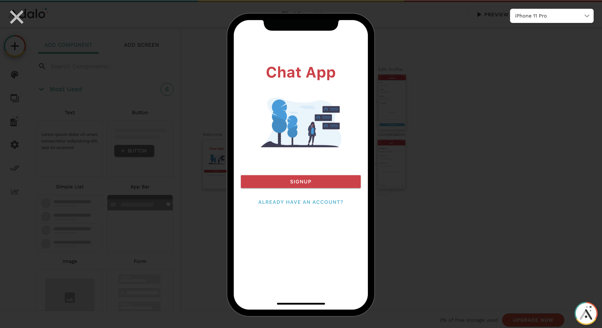

---
- Sign up.
  -  Enter your Email and Password (remember them so that you can use again later).

---
- The list is empty because no conversation has taken place yet
-  Press the + button at the bottom right of the screen.

---
- It looks like you can't chat because you just created the app and there are no other users.

---
- Let's share the app you created with others and have a conversation with them.
- Close Preview mode with the x button in the upper left corner, and click SHARE in the menu.

---
- Click on the SHARE APP button and select COPY LINK.
- Post the copied link to Slack so that all students can see it.

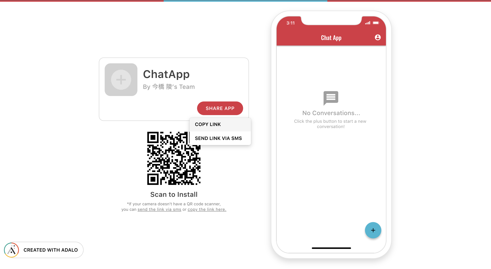

---
- Click on a links posted in slack to signup for their app and send them a message.
  - You'll see the creator of the app (and other students) in the list of users!

---
- (Around the time when the message would have been sent to everyone's apps,)
Display the Preview screen of your app again.
  - You should have received a message, so click on it to check it!

---
- Message received :tada:

---
- In addition to the Chat we tried this time, there are several other templates available.
- If there is one that is similar to the application you want to build, you may be able to use that template to boost your development. When you have time, try out other templates.

---
## Overview of application development with Adalo
Next,  take a look at how to develop an app with Adalo.

---
## Three basic concepts
- Let's learn the following three basic concepts of Adalo.
  - Components
  - Database
  - Actions

--- 
#### Components
- Elements that are placed on the screen to create a user interface.
- Examples:
  - Lists
  - Buttons
  - Text
  - Image

---
#### Database
- A set of organized data.
- Data can be registered, read (displayed), updated, and deleted.
- Example: In the case of a Chat application

---
#### Actions
- This is used to specify what to do when a specific component is clicked.
- Example :
  - Transition to another screen.
  - Registering, updating, and deleting data in the database.

---
### Explanation of Adalo's functions
Next, take a look at the features available in Adalo's admin panel.

---
#### Canvas
- A work area for creating screens.
- Elements can be selected and moved by dragging and dropping.

---
#### Left Toolbar
Let's learn each function of the left toolbar.

---
######  Add Panel
- This allows you to select a component or screen to add to your app.

---
######  Branding
- You can change colors and fonts.

---
######  Screens
- List of screens and their configurations.

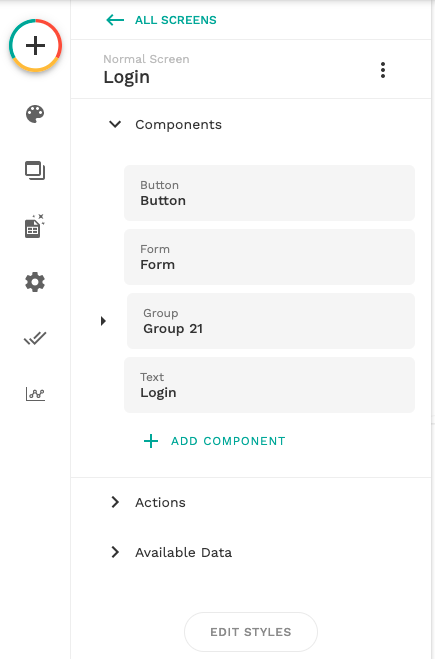

---
######  Database
- Displays the structure of the database and the data stored in it.
- Collection: A collection of data that has the same properties.
 

---
######  Settings 
- You can change the name of the app and set the app's icon.
- You can configure display settings for the canvas.
- You can set access permissions to the app.
- You can copy or delete an app.

---
###### Publish
- You can publish your apps (paid plan required).

---
######  Analytics
- Show usage analysis report.
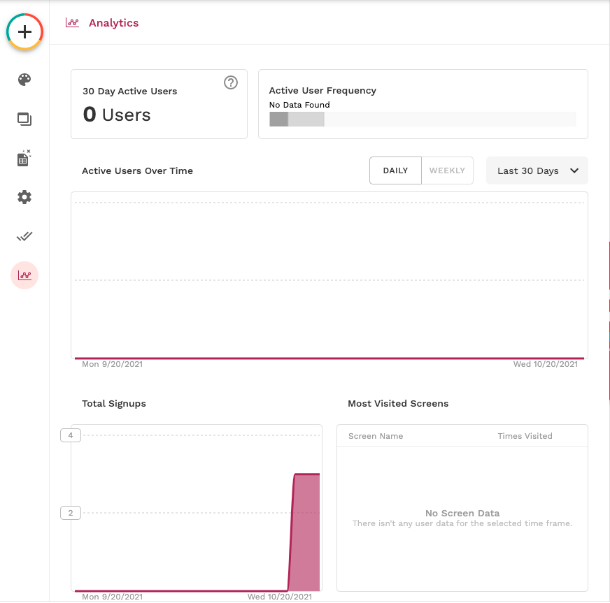

---
#### Top Bar
Let's learn each function of the top toolbar.

---
###### App Switcher
- Displays the name of the opened app.
- You can switch to other app.
- New apps can be added.

---
###### Preview
- You can run the app and try it out.
- You can switch to devices with different screen sizes to check the display image.

---
###### Share
- You can share the app to get others to use it.
  No Adalo account required to use shared app.
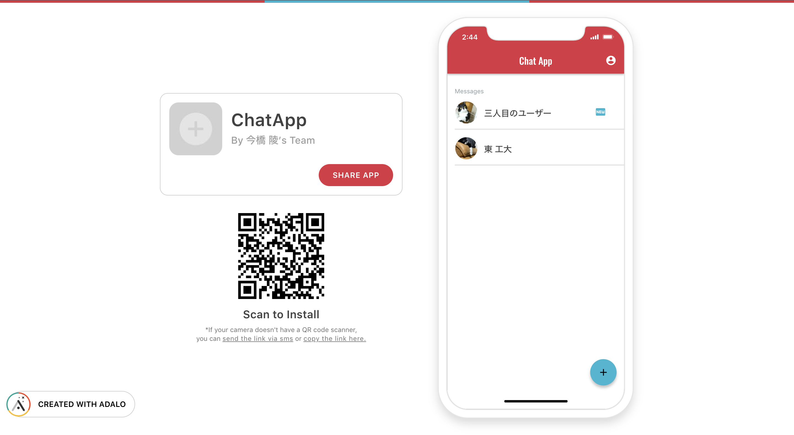

---
###### Account Menu
- Allows you to configure various settings.
- Link to help and documentation.
- Sign Out.

---
#### Tips
- If you edit something by mistake, you can undo it with `Ctrl + Z` on Windows or `Command + Z ` on Mac!
- Entering japanese text may not work well with Adalo's development tools. Use copy and paste instead.

---
## Sample application development
Let's create a new application.

- In this lecture, we will create a static site without using a database (the content displayed will remain the same no matter which user accesses the site).
- In the next lecture, we will create a dynamic app using a database (the content displayed will change for each user).

---
#### UI of the sample application
This is a health management application for your pet.
First, check the UI.

---
###### User Registration Screen
- You can register as a user by entering the following information
  - Email
  - Password
  - Full Name
- For those who have already registered, there is a link to the login screen.

---
###### Login screen
- You can log in by entering the following information
  - Email
  - Password
- There is a link for those who have forgotten their password.
- There is a link to the user registration page.

---
###### Pet Registration Screen
- You can enter your pet's name.
- You can select your pet's photo.
- You can enter your pet's birthday.
- You can click the "Register" button to register your pet and move to the pet list screen.

---
###### Pet List screen
- Registered pets can be displayed in a list.
- Clicking on a pet will take you to the pet details screen for that pet.
- Clicking the icon at the bottom right take you to the Pet Registration screen.

---
###### Pet Detail Screen
- There is a link to the weight Record screen.
(Link2 is for exercise)
- Birthday is displayed.
- The latest weight is displayed.

---
###### Weight Record screen
- A graph showing the transition in weight is displayed.
- You can enter your pet's current weight.
- You can add your pet's weight by pressing the button

---
#### Creating the application
Now, let's start creating the application.

-  select CREATE NEW APP

--- 
- Select Native Mobile App !

---
-  select Template: Blank

---
- Enter App Name and Color as you like.
- Leave Team setting as default.
  (It won't be displayed to people who haven't set up a Team.)

---
- The application is ready!
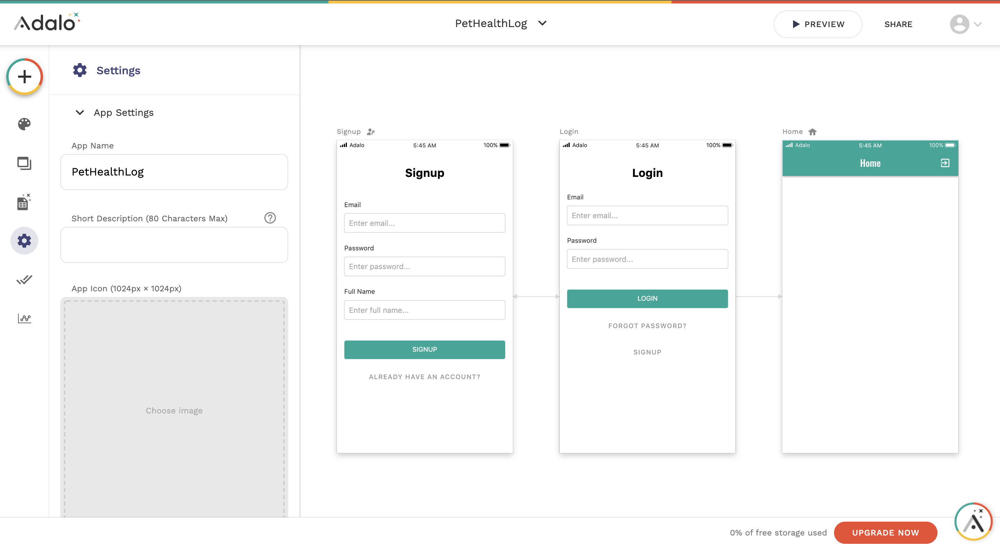

---
###### User registration screen, login screen

User registration screen and login screen are generated by default.

---
Check the preview function to see how they works.

- User Registration Screen
  - When you signup, you will be redirected to the Home screen.
  - You can log out from the icon in the upper right corner of the Home screen.

---
- Login screen
  - Log in with the same Email and Password that you used to register earlier, then you will be redirected to the Home screen.

---
It seems like the registration screen and login screen are fine as they are.
Let's create the other four screens.

---
###### Pet Registration Screen
- You can enter your pet's name.
- You can select your pet's photo.
- You can enter your pet's birthday.
- You can click the "Register" button to register your pet and move to the pet list screen.
Let's create this screen!

---
- Select "App Bar" from ADD SCREEN.

---
- Enter the Screen Name.

---
The Screen has been added.

Let's add components on this screen.

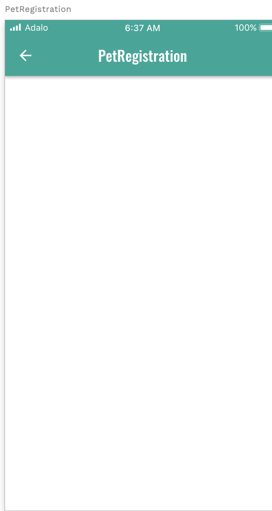

---
- Select "Text" from ADD COMPONENT.
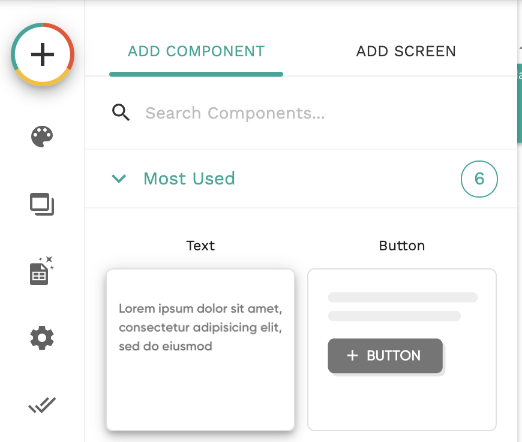

---
- Place it on the screen.

---
- Change the value of "Text" to Name.

---
- Let's put text "Image" and "Birthday" in the same way.

---
- Select "Text Input" from ADD COMPONENT

---
- Place it on the screen and change the "Placeholder" value to "Enter Name"

---
- Select "Image Picker" from ADD COMPONENT.

---
- Place it on the screen.

---
- Select "Date Picker" from ADD COMPONENT.

---
- Place it on the screen and change the Style to "Date Picker".
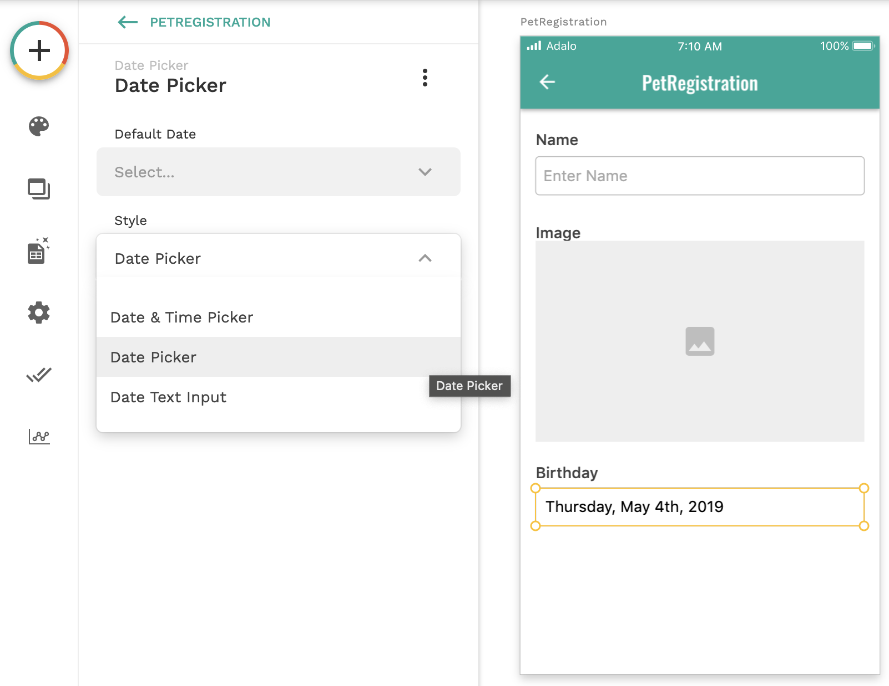

---
- Select "Button" from ADD COMPONENT.

---
- Place it on the screen.
- Change the "Text" value to Register.
- Change "Button Color" to "Secondary".
- Change the "Icon & Text Color" to "Default Background"(White)

---
Let's Preview the appearance of the pet registration screen.
- Since there is no link yet, we can't display this screen with screen transitions, so we'll set it to the Home Screen, which is the screen displayed after logging in.
- Change the Screen Navigation Type of Pet Registration screen to Home Screen.

---
- Open Preview. After logging in, you can see the Pet Registration screen.
- You can enter a name, select an image, and select a birthday.
- Nothing happens when you press the Register button yet.

The pet registration screen is done.

---
###### Pet List Screen
- Registered pets can be displayed in a list.
- Clicking on a pet will take you to the pet details screen for that pet.
- Clicking the icon at the bottom right take you to the Pet Registration screen.

Next, let's create this screen.

---
- Select "App Bar" from ADD SCREEN and enter the Screen Name.

---
- Select "Image" from ADD COMPONENT

---
- Place it on the screen.
- Upload a photo of your pet from "Image Source" -> "Upload"

---
- Select "Text" from ADD COMPONENT

---
- Enter your pet's name in "Text" value and change the text color to White.
- Depending on the photo you choose, the white text may be difficult to see, so the next step is to make the text easier to read.

---
- Select "Rectagle" from ADD COMPONENT

---
- Place it over the pet's name.
- After selecting Black as the Background color, change the value of A in RGBA to 10.
  - RGBA is a form of color representation that combines the intensity of each of the three primary colors (Red, Green, and Blue) with a degree of transparency (Alpha).

---
- Select the Pet List screen from Screens, and confirm that Rectangle is above Text in the Components order.
  - The Rectangle is now hiding the Text because the one on top is displayed in front of the others.

--- 
- Let's switch the order. Put Text at the top and Rectangle at the second.
  - The Text is now in the foreground, and the Rectangle makes it easier to see the white text!

---
Next, let's add one more pet.
- Select the three components you added (Image, Rectangle, Text) on Canvas, and click "MAKE GROUP".
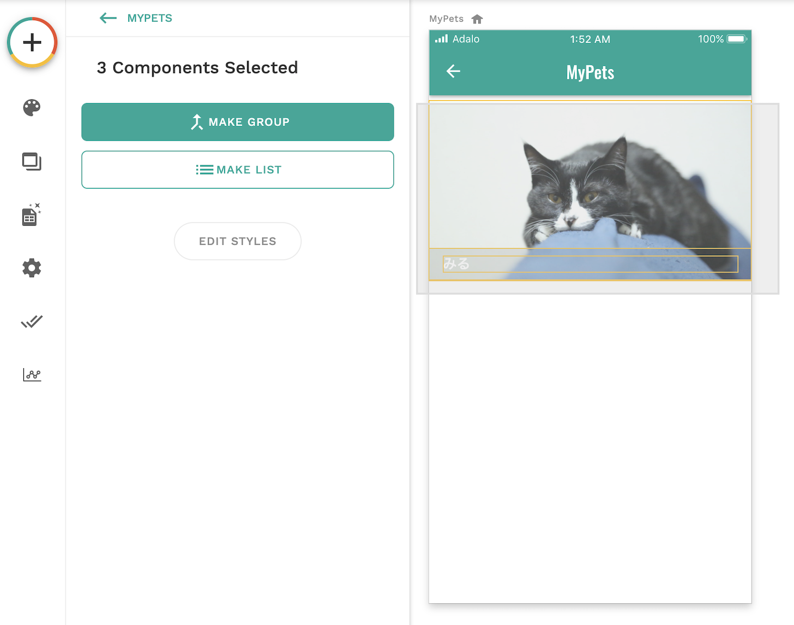

---
- Copy and paste (`Ctrl + C` and `Ctrl + V` on Windows, `Command + C` and `Command + V` on Mac) the created Group while it is selected, and place the duplicated Group under first pet.

---
- Change the second Image and Text to those of another pet.

---
Next, add the link to the pet registration page.
- Select "Action Button" from ADD COMPONENT
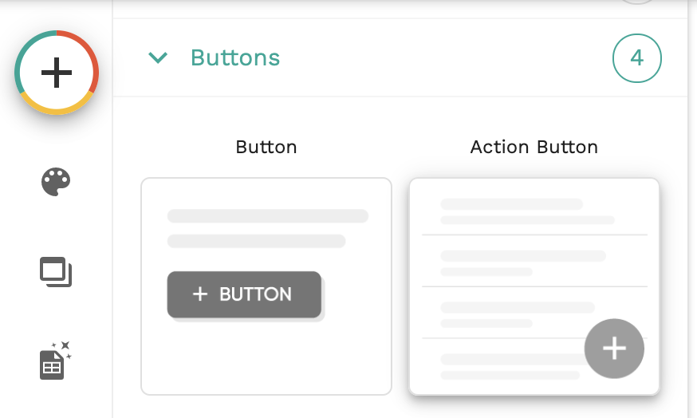

---
- Place it in the lower right corner of the screen.
- Change the "Icon and Text Color" to "Default Background"(White).

---
- Select "ADD ACTION"
  - Select "Link"
    - Select [Pet Registration Screen Name]

---
Let's add a link from the pet registration screen to the pet list screen.
- Select the Register button on the Pet Registration page
- ADD ACTION -> Link -> Select [Pet List Screen Name]
You can't register your pets yet because you just added a link (Data registration is in the next lecture).

---
- Change the destination of the SIGNUP button on the SignUp screen and the LOGIN button on the Login screen from Home to the Pet List screen.

---
- The Home screen that was created by default is no longer needed. You can delete it.

---
Preview the appearance of the Pet List screen.
- Change the "Screen Navigation Type" of the Pet List screen to "Home Screen" as you did when you previewed the Pet Registration screen.
- After logging, you can see the Pet List screen.

Pet List screen seems OK.

---
###### Pet Detail Screen
- There is a link to the weight Record screen.
(Link2 is for exercise)
- Birthday is displayed.
- The latest weight is displayed.

Next, let's create this screen

---
- Select "Info with Links" from ADD SCREEN and enter the Screen Name.
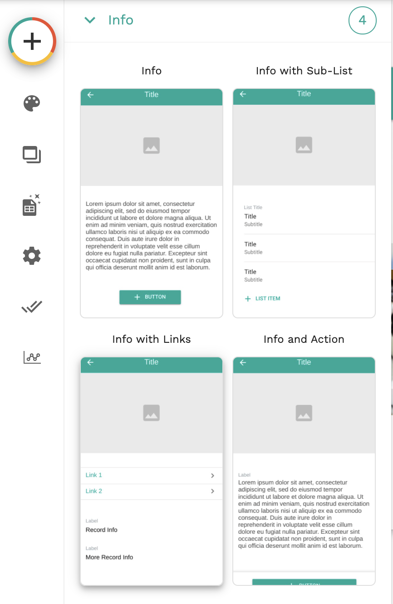

---
- Upload one of the photos used in the Pet List screen in Image Source.

---
- Rewrite the Text with the label "Birthday" and its value, and the label "Latest Weight" and its value.

---
- Change the Text named "Link 1" to "Weight Log"
- Leave Link 2 as it is.
(This will be used as a link to the screen created in the exercise)

---
Let's make it possible to move from the pet list screen to the pet detail screen.
- Select the Group that contains the components for the first pet in the Pet List screen, and click "ADD ACTION" -> "Link" -> [PetDetailScreenName]

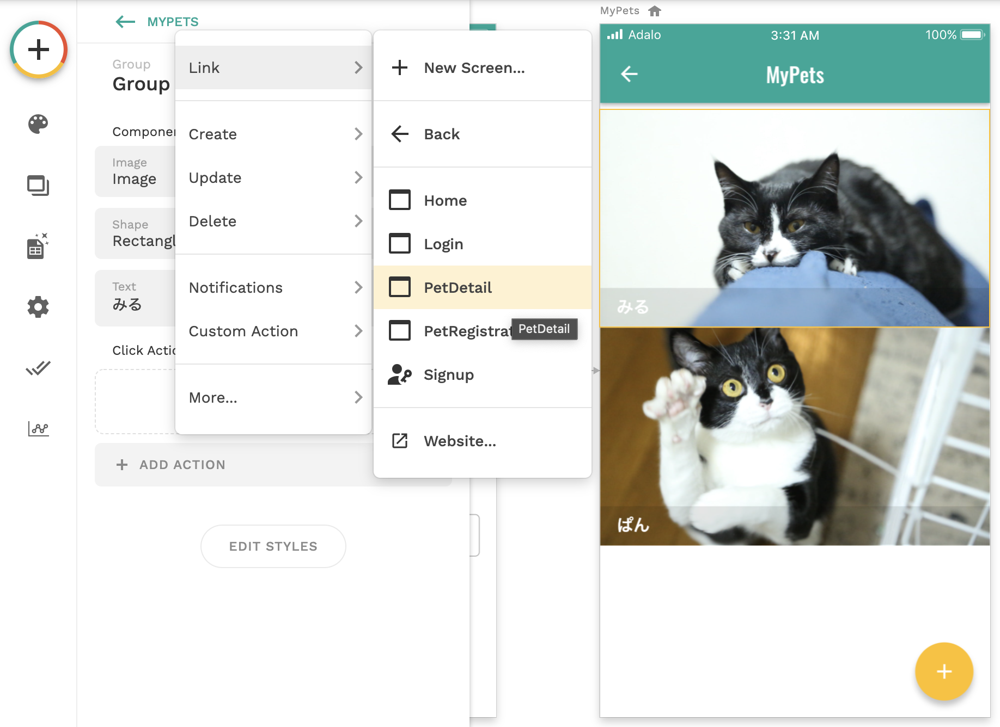

---
- Preview the appearance of the Pet Detail screen.

The pet detail screen seems OK.

---
###### Weight Record screen
- A graph showing the transition in weight is displayed.
- You can enter your pet's current weight.
- You can add your pet's weight by pressing the button.

Let's create this screen.

---
- To create a Chart, we need to prepare a database, which will be explained in the next lecture.
- This time, paste the Chart image instead of using actual chart.
  - I'll share the Chart image with you via Slack.
  (You can also take a screenshot of the image on the right and use it)
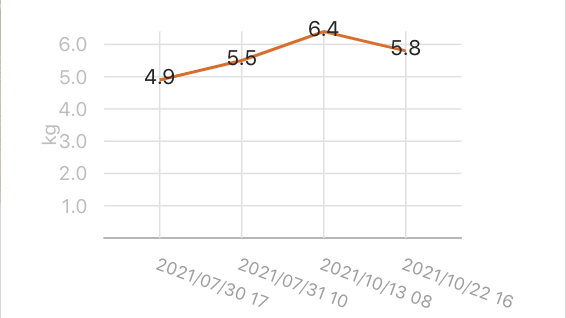

---
- Add an Image from ADD COMPONENT and upload the Chart image.

---
- Add "Text Input" from ADD COMPONENT.
- Change "Type" to "Number".
- Change "Placeholder" to "Enter current weight".

---
- Add a "Text" from ADD COMPONENT.
- Change the value to "Weight(kg)".

---
- Add "Button" from ADD COMPONENT.
- Change Text to "Add".

---
Set up a link from the pet detail screen to the weight record screen.
- Set up a link to the weight record screen with "Click Action" of the Group containing "Text:'Weight Log'" in the pet detail screen.

---
Let's preview the screen.

The weight record screen seems OK.

---
We have created all UI for the sample app :tada:

---
#### URL for cloning
- You can clone the application from the following URL, and use it to check completed version.
https://previewer.adalo.com/014fd9d1-80c6-4325-899a-d943e778c865

---
## Exercise
- Create your own screen that will be the transition destination for "Link 2" on the pet details screen.
  - When you are done, share the URL on Slack to make it available for everyone .

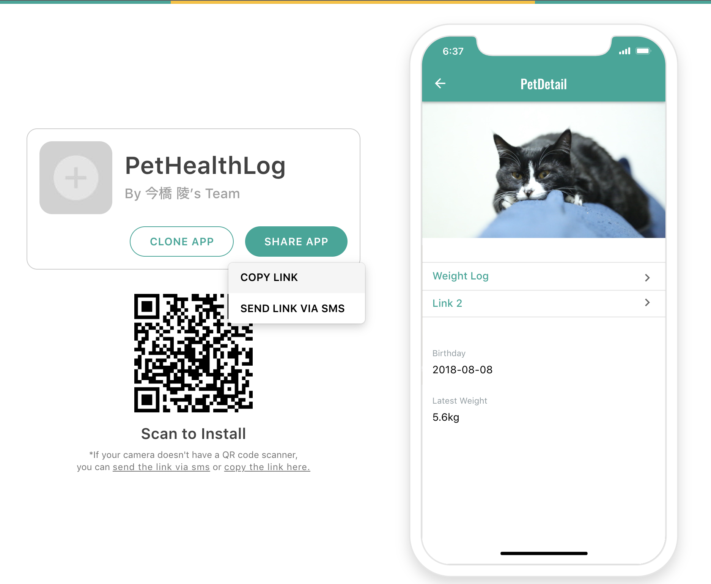

---
#### Notes about the exercise
- Components and Screens named "xxxxList" may be difficult to use because they need to be connected to the database, which will be explained in the next lecture.
  - If you face a problem and can't solve by yourself, I recommend you to avoid using "xxxxList" for today.
- While the NoCode tool allows you to create apps easily, it may not allow you to achieve complex UI and functions.
  - If you are stuck, think about how you can achieve what you want to do with a simple UI and functions.
    - For example: Avoid including too many components in one screen(separate them into multiple screens).

---
#### Presentation of exercise results
(If there is enough time)

Would you like to present the app you made in the exercise?

---
## Summary
- In this lecture, we learned about Adalo and created the UI of the pet health management application.
  - We used only simple components that do not require a database.
- In the next lecture, we will continue to use Adalo to build a database that matches the UI we created today, and make it possible to manipulate data from the app. 
  - By using a database, various functions can be realized and the UI can be easily created. I hope you'll enjoy it!

---
# That's all!
# Thanks for your time!