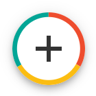
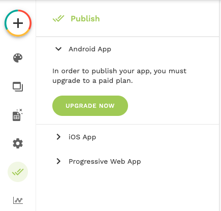

**Programming Boot Camp**

# Adaloの基本

**東京工業大学 2021/10/23**
　
　
　
　
　
　　　　　　　　　　　　　　　　　　　　　　　　**Ryo Imahashi**

---
## 目次
  - Adaloとは
  - Adaloに登録しよう
  - テンプレートアプリを操作してみよう
  - Adaloでのアプリ開発の概要説明
  - アプリを作ってみよう
  - 演習
  - 時間が余れば話したいこと
  - 次回に向けて

---
## Adaloとは
- [Adalo](https://www.adalo.com/)は、アメリカ発のノーコードツールです。プログラミング不要でアプリを開発することができます。
- 用意されているパーツから使用したいものを選び、それを画面にドラッグ＆ドロップしていくことで、アプリを作ることが可能です。
- ブラウザで表示するWebアプリだけでなく、AndroidやiOS向けのスマートフォンアプリも開発できます。開発したアプリのGooglePlayやAppStoreでの公開も可能です。

---
#### Adaloで作られたアプリの例
- Union: https://union-jp.site/
  - 大学生が開発した、大学生・大学院生・大学教員・大学職員限定のSNS
  - 2021年に1,000万円の資金調達を実施している
    - https://prtimes.jp/main/html/rd/p/000000001.000076669.html
- その他にも、 #MadeInAdalo でたくさん紹介されています
  - https://www.adalo.com/made-in-adalo
---
## Adaloに登録しよう
- AdaloのSignUp画面にアクセスしてください
  - https://app.adalo.com/signup

---
- 無料で登録できます
- ご自身のEメールアドレス、パスワード、フルネームを入力してください
- 利用規約への同意のチェックを入れてください
- LET'S DO THIS! ボタンを押して、次の画面に進んでください

---

#### 参考: [無料プラン](https://www.adalo.com/pricing)の制限
<!--  -->
- 外部アプリケーションとの連携ができない
  - ただし、14日間はトライアル利用が可能
- ドメインを変更できない(Adaloのドメインになる)
- ロゴの変更ができない(Adaloのロゴが表示される)
- GooglePlayやAppStoreへの申請ができない
- 1つのアプリで登録できるデータベースのレコード数の上限が50件

※ 実際にサービスを運用していく際は、有料プランへの移行を検討してください

---
#### プラットフォームの選択
- Native Mobile AppとDesktop Web Appが選べます
- 今回は、Native Mobile Appを選択しましょう

---
#### テンプレートの選択
- 完成されたアプリがテンプレートとして提供されています
- 今回は、Chatを選択しましょう

---
#### ブランディング

- App Name、Primary Color、Secondary Colorを自由に入力してください
  - Primary Colorは、アプリで最も使われるベースになる色です
  - Secondary Colorは、目立たせたい時に使う色です。重要なボタンなどに使われます。

<!-- - ADVANCED OPTIONSは変更せず、そのままで大丈夫です -->
---
- このようなAdaloの管理画面が表示されたらOKです
- 今後はこの管理画面を使って、アプリを開発していきます

---
## テンプレートアプリを操作してみよう
- まずはAdaloで作ったアプリがどのように動作するかを確認するために、先ほど選択したChatアプリを操作してみましょう
- 画面右上のPreviewボタンをクリックしてください

---
- プレビュー画面が起動します
- 一緒にChatアプリを操作してみましょう

---
- Signupしましょう
  - EmailとPasswordはメモしておいてください(後で使います)

---
- まだ会話が行われていないため、リストが空の状態です
- 画面右下の + ボタンを押してみましょう

---
- 作成したばかりのアプリで他のユーザーがいないため、Chatができないようです。。

---
- 作ったアプリを他の人にシェアして会話してみましょう
- Previewモードを左上の×ボタンで閉じて、メニューにあるSHAREをクリックしてください

---
- SHARE APPボタンをクリックして、COPY LINKを選択してください
- コピーしたリンクを、参加者全員が見られるところ(Slack?Zoom?)に投稿しましょう

---
- 他の人の投稿したリンクをクリックしてその人のアプリにSignupし、メッセージを送りましょう
  - ユーザーのリストにアプリの作成者(と他の登録者)が表示されると思います

---
- (みんなのアプリにメッセージが送られたであろう頃に、)
自分のアプリのPreview画面をもう一度表示してください
  - メッセージが届いているはずなので、クリックして表示してみましょう

---
- メッセージが受信できました :tada:

---
- 今回試したChat以外にも、いくつかのテンプレートが提供されています。
- 自分たちが作りたいアプリに近いものがあれば、そのテンプレートを流用して開発スピードをアップさせられるかもしれません。時間がある時に、他のテンプレートも試してみましょう。

---
## Adaloでのアプリ開発の概要説明
次に、Adaloでのアプリ開発の概要を説明していきます。

---
### 3つの基本コンセプト
- 基本となる以下3つのコンセプトについて紹介します
  - Components
  - Database
  - Actions

--- 
#### Components
- ユーザーインターフェースを作るために画面上に配置される要素。
- 例:
  - リスト
  - ボタン
  - テキスト
  - 画像

---
#### Database
- 整理されたデータの集合。
- データの登録、読込(表示)、更新、削除が行われる。
- 例: Chatアプリの場合

<!--  -->

---
#### Actions
- 特定のコンポーネントをクリックした時に何を行うかを指定するために使われる。
<!-- - コンポーネントとそこで表示するデータベース内のデータを紐付けたり、ユーザー体験をカスタマイズする。 -->
- 例:
  - 別の画面に遷移させる
  - データベースのデータを登録、更新、削除する

---
### Adaloの機能説明
次に、Adaloの管理画面で利用できる機能を紹介していきます

---
#### Canvas
- 画面を作る作業領域
- 要素を選択したり、ドラッグアンドドロップで動かしたりできる

<!-- - スクロール、拡大、縮小ができる -->
<!--  -->

---

#### Left Toolbar
左側のツールバーの各機能を紹介します。

---
######  Add Panel
- コンポーネントや画面を選択してアプリに追加できる

<!-- 画面とコンポーネントの追加を実演する -->
---
######  Branding
- 色やフォントを変えられる

<!-- 色とフォントの変更を実演する -->
---
######  Screens
- 画面の一覧や、その画面の構成を表示できる

---
######  Database
- データベースの構成や保存されているデータを表示できる
- Collection: 同じ属性(プロパティ)を持ったデータの集まり
 

---
######  Settings 
- アプリの名前を変えたり、アプリのアイコンを設定したりできる
- キャンバスに関する表示設定ができる
- アプリへのアクセス権限の設定ができる
- アプリの複製や削除ができる

---
###### Publish
- 作ったアプリを公開できる(有料プランのみ)

---
######  Analytics
- 利用状況を分析したレポートを見ることができる

---
#### Top Bar
上部のツールバーの各機能を紹介します。

---
###### App Switcher
- 開いているアプリの名前が表示される
- アプリを切り替えられる
- 新しいアプリを追加できる

---
######  Preview
- アプリを実行して試すことができる
- 画面サイズの異なるデバイスに切り替えて表示の確認ができる

---
###### Share
- アプリをシェアして他の人に使ってもらうことができる。
  Adaloのアカウントを持っていない人でも利用可能。

---
###### Account Menu
- 各種設定ができる
- ヘルプやドキュメントを開ける
- ログアウトできる

---
#### 開発に役立つTipsを覚えておこう
- 間違って編集してしまった時は、Windowsなら`Ctrl + Z`、Macなら `Command + Z ` で元に戻せます
- Adaloの開発ツールでは、日本語の直接入力がうまくいかないことがあります。日本語のテキスト入力はコピー＆ペーストで行ってください。

TODO: 他にもあれば追加

---
## アプリを作ってみよう
次に、新しくアプリを作ってみましょう
TODO: ペットの健康管理アプリのUIを作っておけると良さそう(データベースに触れずに作るのは難しいので、1テーブルへの登録と表示くらいはやる？)

---
#### テンプレート: Blank でのアプリ作成
TODO

---
#### 画面の見た目を変えてみよう
TODO

---
#### 画面を追加してみよう
TODO

---
#### 画面遷移をさせてみよう
TODO

---
## 演習
TODO

--- 
#### 演習の回答

TODO

---
## 時間が余れば話したいこと
- Home画面、Welcome画面の設定
- 他のテンプレートの紹介

---
## まとめ
:white_check_mark: 

---
## 次回に向けて

TODO

---
# 以上です！
# お疲れさまでした！
---
## 参考
- [Adalo Resourcesメモ](https://www.notion.so/Adalo-Resources-3b58f37ac0894b038c30d6b0d8274370)
- https://hashikake.jp/articles/adalo-no-code-app-creation-platform-ep01
- https://www.no-code.tv/course/nocode135

---
メモ
- [1対1のリレーションがないことについて](https://help.adalo.com/database)
>While One-to-One relationships do not exist in Adalo, sometimes it is necessary to adapt the One-to-Many relationship type for this purpose. These instances are rare, but do crop up from time to time. For example, if an event host can only be assigned one event at a time and the event can only have one host. The "Many" side of the relationship can be disregarded.
- [配色](https://note.com/tomokortn/n/n0d3d9da16907)