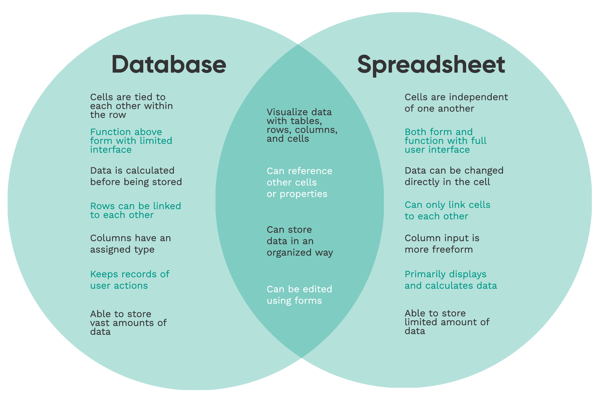
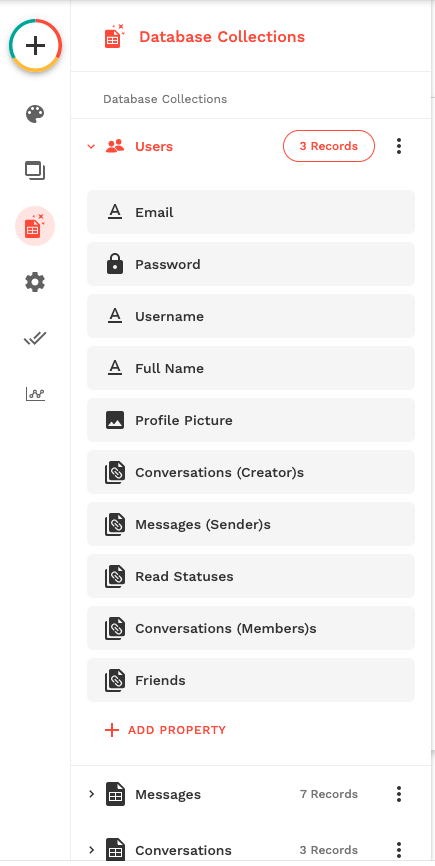
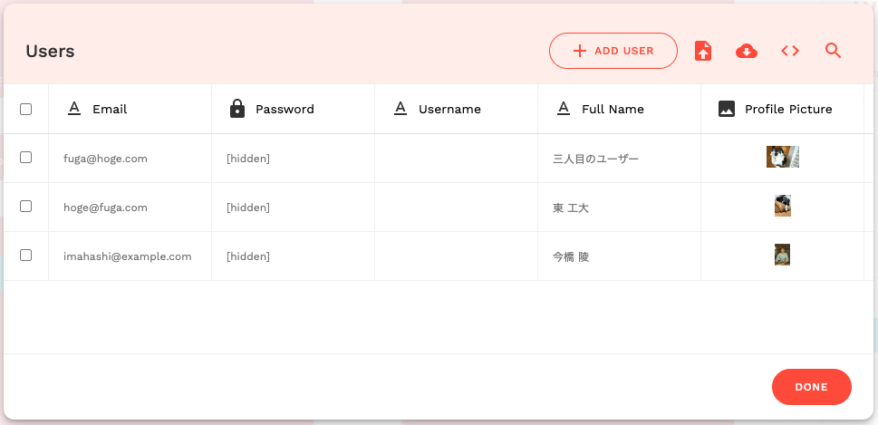
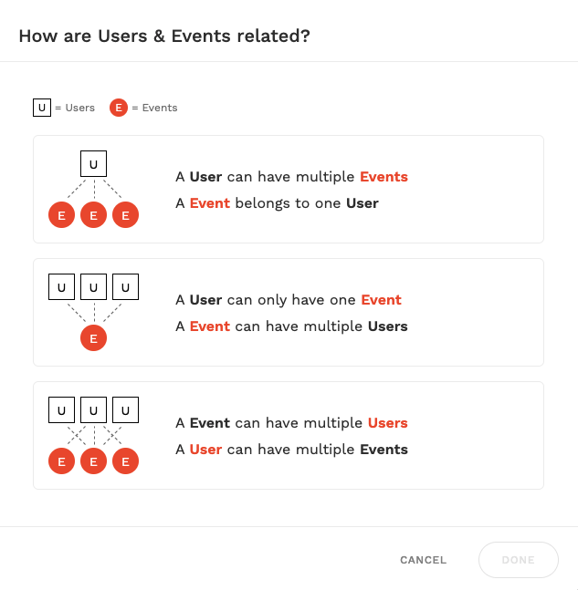
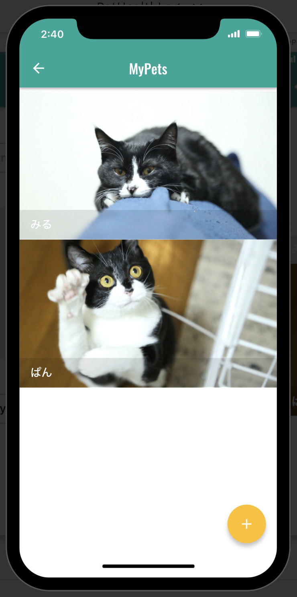

**Programming Boot Camp**

# Adaloでのデータ操作と外部連携

**東京工業大学 2021/11/6**
　
　
　
　
　
　　　　　　　　　　　　　　　　　　　　　　　　**Ryo Imahashi**

---
## 参考
- https://nocodo.net/media/media-4553/
- https://note.com/shinya_matsui/n/n05335098aaeb
- [ペットの健康管理アプリ開発ログ](https://www.notion.so/72d6bec451574cadb3d333a1ebc9355c)

---
## 目次
  - 前回のふりかえりと今回のゴールの確認
  - データベースについて学ぼう
  - データベース設計
  - データベース操作
  - サンプルアプリを完成させよう
  - 外部サービス連携
  - 演習
  - まとめ

---
## 前回のふりかえりと今回のゴールの確認
- 前回のレクチャーでは、ノーコードツールのAdaloについて紹介し、ペットの健康管理アプリを題材にアプリのUIを作成しました。
  - レクチャーでは、データベースを必要としない、シンプルなコンポーネントを使いました。(演習の中でデータベースを使った人もいるかもしれません)
- 今回のレクチャーでは、引き続きAdaloを使って、前回作ったUIに合わせたデータベースを構築し、アプリからデータを操作できるようにしていきましょう。 
- その後は、Adaloだけでは実現できないことを、Adaloと外部のサービスを連携させることで実現する方法をいくつかご紹介します。

---
## データベースについて学ぼう
まず、これから学んでいくデータベースがどのようなものかを確認します。

---
#### Database(前回の復習)
- 整理されたデータの集合。
- データの登録、読込(表示)、更新、削除が行われる。
- 例: Chatアプリの場合

<!--  -->

---
もう少し詳しい説明は、以下のようになります。
> データベースとは、電子的にアクセスされる情報の組織化された集合体に過ぎません。 データベースでは、ユーザーはコンピュータに保存されている情報を作成、読み取り、更新、削除することができます。 これらの機能を略してCRUDと呼びます。
データベースを説明するのに最もよく使われる例えは、「表計算ソフトのようなものだ」というものです。 表計算ソフトがデータベースとして機能することは事実ですが、この2つは全く同じではありません。図を見て、いくつかの違いを確認してみましょう。

https://help.adalo.com/database

---
データベースと表計算ソフト

---
#### Adaloのデータベースの基本
 このアイコンでAdaloのデータベースにアクセスできる
構成要素は、
- Collection
- Property
- Record

---
###### Collectionとは
同じ属性(プロパティ)を持ったデータの集まり
 

---

>コレクションは、データベースをさまざまなタイプのデータに対応するテーブルに分割します。これらは、レストラン、トリップ、ユーザー、オーダー、メニュー、アクティビティなど、アプリ内の「名詞」と考えることができます。 ユーザーのテーブルとイベントのテーブルがあるのと同じように、ユーザーコレクションとイベントコレクションがあります。  デフォルトでは、すべてのアプリはUsersコレクションで始まり、残りはあなたが追加できます。

---
>何がコレクションにふさわしいかを判断するのは難しいことです。 コレクションの決定を容易にするには、ユーザーがリストアップしたり、見たり、作成したりできるものを考えるとよいでしょう。例えば、ユーザーと投稿を持つソーシャルメディアのアプリで、ユーザーが投稿に「いいね！」を付けることができるとします。いいね！」コレクションも作りたくなるかもしれませんが、「いいね！」をリストアップする場合、実際には特定の投稿に「いいね！」をしたユーザーをリストアップすることになります。

---
###### Propertyとは
プロパティは、コレクションに含まれる可能性のあるアイテムの特性を定義します。User's Collectionの例では、ユーザーは、名前、電子メール、誕生日、プロフィール写真、さらには目の色を持っているかもしれません。これらはすべて、そのユーザーのプロパティとみなされます。

---
Typeについて
また、追加できるプロパティには、入れるデータの種類を定義するさまざまなタイプがあります。コレクションにプロパティを追加するには、「+Add Property」をクリックします。

テキスト - 一般に「文字列」として知られており、テキスト、数字、または記号で構成されます。

数値 - 一般的に「整数」として知られており、整数または小数のみ使用できます。負の数や15桁までの数字にも対応しています。 カスタム数式で使用できます。

True/False - 一般的に「ブーリアン」値として知られており、true/falseはチェックボックスとして表示されます。

Date/Time - 日付と時間のプロパティをデータベースに保存することができます。データベースにはUNIXタイムスタンプとして保存されますが、我々には様々なフォーマットのフレンドリーな日付として表示されます。 カスタム数式で使用することができます。

日付 - このプロパティは、日付のみを保存し、時間情報は保存しません。また、UNIXタイムスタンプとして保存され、私たちにはフレンドリーなフォーマットで表示されます。カスタム数式でも使用できます。

Image - このプロパティは、データベースにイメージを保存します。 また、保存された画像の公開URLリンクにも同様にアクセスすることができます。ファイルサイズの制限は50MBです。

ファイル - このプロパティは、あらゆる種類のファイルをデータベースに格納できます。PDFやJPGからパワーポイントや.MP4ファイルまで。ファイルサイズの制限は50MBです。

リレーションシップ - このプロパティは、2つのコレクションをリンクすることができます。このプロパティタイプの詳細については、こちらをお読みください。

---
Relationships
>1 つのレコードに対して何百ものプロパティを保存する代わりに、コレクション間のリレーションシップ（またはリンク）と呼ばれる特別なタイプのプロパティを作成して、データベース内の混乱を減らすことがあります。Users and Events の例では、Event には Event Host があります。 しかし、ホストの名前、電子メール、写真を保持するためにEventsコレクションにプロパティを作成する代わりに、UsersとEventsコレクションの間にリレーションシップを作成することができます。 これにより、Eventsコレクションに余分なプロパティを作成することなく、UsersコレクションからEventのホストに関する情報を検索することができます。 また、リレーションシップはコレクション間で双方向に作用し、いわゆる「相互作用」となります。UserがホストしているEventを持っているのと同じように、Eventもホストを持っています。 Adaloのリレーションシップには、コレクション間でリンクされているレコードの数に応じて、主に2つのタイプがあります。 
>1対多。 1対多：1つのレコードが、別のコレクションにある複数のレコードと関係を持つことを意味します。 このロジックは、表示しているコレクションとリンク先のコレクションの2つの方法で現れます。 例えば、1人のユーザーが複数のイベントを主催したり、複数のイベントに1人の主催者がいたりしますが、どちらも真の1対多の関係を表しています。
多対多。 これは、両方のコレクションのレコードが、他のコレクションの複数のレコードにリンクできることを意味します。例えば、イベントが複数のホストを持ち、ホストが複数のイベントを持つことが可能です。
>Adaloでは、コレクション間のリレーションシップを設定する際、コレクションが共有するリレーションシップの種類を定義するよう求められます。繰り返しになりますが、実際には2つのタイプ（1対多、多対多）しかありませんが、用途に応じて3つのオプションとして表示されます。

---

---
>リレーションシップを作成する際には、各コレクションがリレーションシップの中でどのような役割を果たしているかを考えるとよいでしょう。上の例では、「イベントには1つのホストしかいない」と定義するリレーションを作りたいとします。そこで、選択肢を「User」という言葉で読むのではなく、「User」を「Host」という言葉に置き換えることで、どの選択肢を選べばよいのかをより明確にすることができます。この場合は、選択肢1となります。 もし、「参加者」と「イベント」の関係を作るとしたら、あなたはどちらを選びますか？ 実際に試してみてください。
>コレクションのレコードをクリックすると、そのコレクション内のレコードも表示されるので、リレーションシップを含むプロパティは、Adaloのデータベースの列としても視覚化できます。
---
###### Recordとは
>レコードとは、コレクション内の情報を保持（記録）することを意味します。レコードは、行のすべてのセルが互いに結合されていることを除けば、スプレッドシートの行に視覚的に似ています。  Usersの例では、1人のユーザーがコレクション内の1つのレコードとみなされます。

---
>アプリには、ユーザーがデータベースからレコードを作成、更新、削除するためのフォームやその他の方法が含まれているのが理想的ですが、レコードビューの右上にある「+Add _____」をクリックして、手動でレコードを追加することもできます。 また、右上のボタンを使って、データベースを検索したり、Adaloコレクションに.CSVファイル（スプレッドシート）をアップロードまたはダウンロードすることもできます。
---
## データベース設計
前回のレクチャーで作成したサンプルアプリのUIを見ながら、保存が必要なデータを考えて、データベースを設計・構築しましょう。

---
前回のレクチャーで作成したアプリのクローン用URL
- 以下のURLからアプリをクローンしてください。それを使ってここからのレクチャーを進めます。
https://previewer.adalo.com/014fd9d1-80c6-4325-899a-d943e778c865

---
画面を見て、必要そうなデータをリストアップしてみましょう

---
- ユーザーのEmail
- ユーザーのパスワード
- ユーザーのFullName
- ペットの名前
- ペットの写真
- ペットの誕生日
- ペットの体重(登録日時別)
---
Collectionは、
- User
- Pet
- PetWeightLog
---
Propertyまで含めると、
TODO:

---
必要なリレーションは？
TODO: 

---
#### ミニ演習
ペットの運動記録を取る画面に必要なデータをリストアップして、Collectionやプロパティ、リレーションを作成しましょう。

---
## データベース操作
設計・構築したデータベースを使って、サンプルアプリでデータを操作できるようにしましょう。

---
#### データの作成(CREATE)
TODO: データ登録用の画面、フォームを作ろう

---
#### データの表示(READ)
TODO: 登録したデータを表示する画面を作ろう

---
#### データの更新(UPDATE)
TODO: 登録したデータを更新する画面を作ろう

---
#### データの削除(DELETE)
TODO: データの削除ができるボタンを作ろう

---
## 参考: 実際のアプリ開発の流れについて
- サンプルアプリでは、UI作成->データベース作成->それらの連携という流れで作成を進めました
  - どのような画面かがイメージできていないと、それに必要なデータが分からず、データベースの設計も難しいと考えたため、このようなレクチャーの流れにしています
- 今後Adaloを使ってアプリ開発をする際は、必要なデータが分かっているのであれば、先にデータベースの設計・構築を行うことをオススメします。それによって、UIの作成も簡単に行うことができます。
  - とはいえ、実際の開発は一方的な流れではなく、試行錯誤してデータベースとUIを行ったり来たりしながら進めていくことになると思います。

---
## サンプルアプリを完成させよう
TODO: 

---
#### クローン用URL
- 以下のURLから完成したアプリをクローンできますので、答え合わせに使ってください
TODO: URL貼り付け

---
## 外部サービス連携
TODO: 

---
## 演習
- データベース設計の演習？
- 
- あるいは、好きなアプリを新しく作成してもOKです

できたらSlackでURLを共有して、みなさんに見てもらいましょう

---
#### 演習における注意事項
- 

---
#### 演習結果の発表
(時間があれば)

演習で作った画面を紹介してみませんか？

---
## まとめ
- 

---
# 以上です！
# お疲れさまでした！

