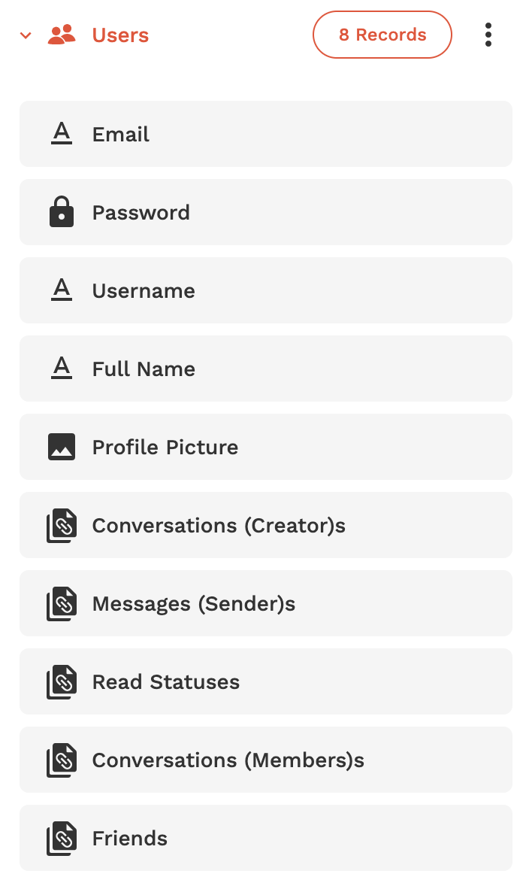
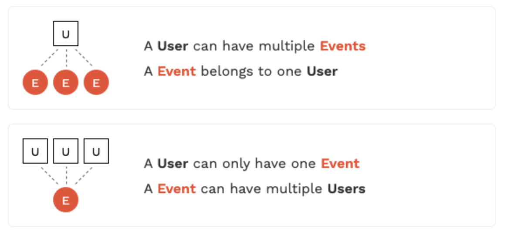

**Programming Boot Camp**

# Adaloでのデータ操作と外部連携

**東京工業大学 2021/11/6**
　
　
　
　
　
　　　　　　　　　　　　　　　　　　　　　　　　**Ryo Imahashi**

---
## 参考
- https://nocodo.net/media/media-4553/
- https://note.com/shinya_matsui/n/n05335098aaeb
- [ペットの健康管理アプリ開発ログ](https://www.notion.so/72d6bec451574cadb3d333a1ebc9355c)

---
## 目次
  - 前回のふりかえりと今回のゴールの確認
  - データベースについて学ぼう
  - データベース設計
  - データベース操作
  - サンプルアプリを完成させよう
  - 外部サービス連携
  - 演習
  - まとめ

---
## 前回のふりかえりと今回のゴールの確認
- 前回のレクチャーでは、ノーコードツールのAdaloについて紹介し、ペットの健康管理アプリを題材にアプリのUIを作成しました。
  - レクチャーでは、データベースを必要としない、シンプルなコンポーネントを使いました。(演習の中でデータベースを使った人もいるかもしれません)
- 今回のレクチャーでは、引き続きAdaloを使って、前回作ったUIに合わせたデータベースを構築し、アプリからデータを操作できるようにしていきましょう。 
- その後は、Adaloだけでは実現できないことを、Adaloと外部のサービスを連携させることで実現する方法をいくつかご紹介します。

---
## データベースについて学ぼう
まず、これから学んでいくデータベースがどのようなものかを確認します。

---
#### Database(前回の復習)
- 整理されたデータの集合。
- データの登録、読込(表示)、更新、削除が行われる。
- 例: Chatアプリの場合

<!--  -->

---
もう少し詳しいデータベースの説明は、以下のようになります。
- データベースとは、電子的にアクセスされる情報の整理された集合です。
- データベースを使ってユーザーはコンピュータに保存されている情報を作成(CREATE)、読み取り(READ)、更新(UPDATE)、削除(DELETE)することができます。 これらの機能を総称してCRUDと呼びます。
- データベースは、よく「表計算ソフトのようなもの」と例えられます。(実際に、表計算ソフトをデータベースとして使うことも可能です) 

---
#### Adaloのデータベースの基本
 このアイコンでAdaloのデータベースにアクセスできます。
Adaloのデータベースの構成要素は、以下の3つです。
- Collection
- Property
- Record

---
###### Collectionとは
同じ属性(Property)を持ったデータの集まり
 

---
- Collectionは、データベースで扱う様々なデータをデータの種類ごとに分割し、整理するためのものです。(類似の言葉として、「テーブル」があります)
- アプリの中でユーザーが登録、表示、更新、削除といった操作を行うものがCollectionとなります。(「名詞」として表現できるものがCollectionになることが多いと言われます)
- デフォルトでは、UsersがCollectionとして用意されており、それ以外は開発するアプリに合わせて追加していきます。

※ どのようなCollectionを用意するかを決めるのはとても難しいです。練習しながら慣れていきましょう。(悩んだ時は、メンター陣に相談するのもオススメです)

---
###### Propertyとは
- Propertyは、コレクションに含まれる(可能性のある)データが持つ項目です。
- 例えばUsers Collectionでは、Eメール、パスワード、名前、プロフィール写真などのPropertyを持つことが考えられます。

---
<!-- ###### Typeとは -->
- Propertyとして扱うデータがどのようなものかを定義するため、様々なTypeが用意されています。Propertyの追加時にどれか一つを選択します。
  - Text
  - Number
  - True/False
  - Date/Time
  - Date
  - Image
  - File
  - Relationship

---
Relationshipとは
- 1つのレコード(データセット)に対して多数のプロパティを保存する代わりに、Relationshipと呼ばれる複数のコレクションを関連づけるための特別なプロパティを設定します。これにより、Collectionを人間が理解しやすい形で分割することができます。
- AdaloのRelationshipでは、コレクション間でリンクされるレコードの数に応じて、1対多と多対多という2つの種類のいずれかを選択します。 

---
1対多
- 1つのレコードが、別のコレクションにある複数のレコードと関係を持つことを意味します。 
- 表示しているCollectionを1と多のどちらにするかで、2種類の選択肢が現れます。
- 例えば、主催者がイベントに対して1人だけいる場合の、主催者とイベントのRelationshipは1対多です。

  <!-- 表示しているCollectionを1と多のどちらにするかで、2種類の選択肢が現れます。 -->
   <!-- 例えば、1人のユーザーが複数のイベントを主催したり、複数のイベントに1人の主催者がいたりしますが、どちらも真の1対多の関係を表しています。 -->

---
多対多
- 両方のコレクションのレコードが、もう一方のコレクションの複数のレコードにリンクできることを意味します。
- 例えば、参加者は複数のイベントに参加できるし、イベントには複数の参加者がいるという場合の、参加者とイベントのRelationshipは多対多です。
  <!-- 例えば、イベントが複数のホストを持ち、ホストが複数のイベントを持つことが可能です。 -->

<!-- ---
「イベントには主催者が1人だけいる」「参加者は複数のイベントに参加できるし、イベントには複数の参加者がいる」と定義するリレーションを作りたいとします。そこで、選択肢を「User」という言葉で読むのではなく、「User」を「Host」という言葉に置き換えることで、どの選択肢を選べばよいのかをより明確にすることができます。この場合は、選択肢1となります。 もし、「参加者」と「イベント」の関係を作るとしたら、あなたはどちらを選びますか？ 実際に試してみてください。
>コレクションのレコードをクリックすると、そのコレクション内のレコードも表示されるので、リレーションシップを含むプロパティは、Adaloのデータベースの列としても視覚化できます。 -->

---
###### Recordとは
- Recordは、コレクション内へ情報を保存する際に1セットとなるデータの組み合わせです。
- Usersの例では、1人のユーザーがコレクション内の1つのレコードとみなされます。

---
- Recordの登録は基本的にアプリの画面上のフォームからできるようにしますが、レコードビューの右上にある「+Add xxxx」ボタンから追加することも可能です。
- Collection内のRecordの検索や、CSVファイルのアップロード(インポート)、ダウンロードも可能です。

---
## データベース設計
前回のレクチャーで作成したサンプルアプリのUIを見ながら、保存が必要なデータを考えて、データベースを設計・構築しましょう。

---
前回のレクチャーで作成したアプリのクローン用URL
- 以下のURLからアプリをクローンしてください。それを使ってここからのレクチャーを進めます。
https://previewer.adalo.com/014fd9d1-80c6-4325-899a-d943e778c865

---
###### 演習
画面を見て、必要そうなデータをリストアップし、Collectionに分けてみましょう

---
まずは、必要そうなデータをリストアップ
- ユーザーのEmail
- ユーザーのパスワード
- ユーザーのFullName
- ペットの名前
- ペットの写真
- ペットの誕生日
- ペットの体重(登録日時別)
---
Collectionに分割
- User
- Pet
- PetWeightLog

※ ペットの体重は1匹のペットに対して登録日時別で複数登録されるため、Collectionを分けます(ペットとペットの体重が1対多の関係になります)

---
Propertyまで含めると、
TODO:

---
必要なリレーションは？
TODO: 

---
#### ミニ演習
ペットの運動記録を取る画面に必要なデータをリストアップして、Collectionやプロパティ、リレーションを作成しましょう。

---
## データベース操作
設計・構築したデータベースを使って、サンプルアプリでデータを操作できるようにしましょう。

---
#### データの作成(CREATE)
TODO: データ登録用の画面、フォームを作ろう

---
#### データの表示(READ)
TODO: 登録したデータを表示する画面を作ろう

---
#### データの更新(UPDATE)
TODO: 登録したデータを更新する画面を作ろう

---
#### データの削除(DELETE)
TODO: データの削除ができるボタンを作ろう

---
## 参考: 実際のアプリ開発の流れについて
- サンプルアプリでは、UI作成->データベース作成->それらの連携という流れで作成を進めました
  - どのような画面かがイメージできていないと、それに必要なデータが分からず、データベースの設計も難しいと考えたため、このようなレクチャーの流れにしています
- 今後Adaloを使ってアプリ開発をする際は、必要なデータが分かっているのであれば、先にデータベースの設計・構築を行うことをオススメします。それによって、UIの作成も簡単に行うことができます。
  - とはいえ、実際の開発は一方的な流れではなく、試行錯誤してデータベースとUIを行ったり来たりしながら進めていくことになると思います。

---
## サンプルアプリを完成させよう
TODO: 

---
ペット0匹通知

---
バリデーション
- 必須チェック
- 他はテキストとVisibilityを駆使するとのこと。デフォルトのフォームでやれないのはとても面倒。。
https://note.com/uramot/n/n035bc528aefc

---
Auto Reflesh

---
最新のn件だけ表示
- リストにして最新の1件だけを表示すればできる

---
#### クローン用URL
- 以下のURLから完成したアプリをクローンできますので、答え合わせに使ってください
TODO: URL貼り付け

---
## 外部サービス連携
TODO: 

---
## 演習
- データベース設計の演習？
- 
- あるいは、好きなアプリを新しく作成してもOKです

できたらSlackでURLを共有して、みなさんに見てもらいましょう

---
#### 演習における注意事項
- 

---
#### 演習結果の発表
(時間があれば)

演習で作った画面を紹介してみませんか？

---
## まとめ
- 

---
# 以上です！
# お疲れさまでした！

