Programming Boot Camp Learning Phase # 4

# Bubble Basic # 2

2021/11/20

---

## In advance

- Today, we will add design and logic to the pet health management application created last time.
- Since we have made some modifications for today's lecture, we will ask you to use a duplicate of the application prepared by this side in order to align the starting point.
- We will distribute the duplicated application, so please send the email address that created the Bubble account to `@Naotake KYOGOKU`.


---

## What to do today

  - Last review
  - Creating a design
  - Creating logic

---

## Review of the last time

-[Bubble](https://bubble.io/) is called a visual programming tool, and it is a tool that allows you to program the appearance and movement by operating it from the screen.
- It is a prerequisite for Web applications, and we will make it compatible with smartphones and PCs by incorporating support according to the display size.

- If you were absent last time, let's catch up with this material.
  - https://github.com/GuildWorks/titech-2021/tree/master/docs/Bubble1

---

## Review of the last time

Pet registration, list, details, weight record screen of pet management application
While making it, I learned how to use Design / Workflow / Data, which is the basis of Bubble.

   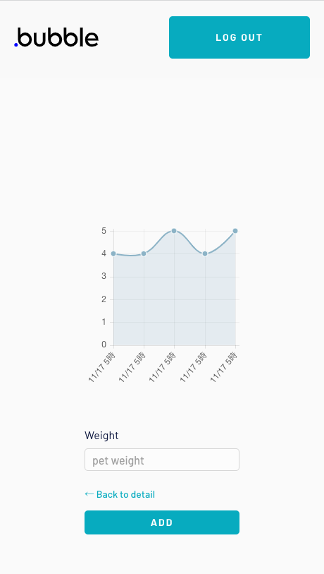

---

## What to do today

This time, we will further create the design and logic for the applications up to the previous time.

---

### Eventually it will look like this

top page

 

---

Pet list


---

Pet details


---

Advisor Pet List


---

Pet details for advisors


---

### So let's get started.
### First of all, we will create the design

---

### What to do by creating a design

- Let's make a screen that fits the display size
  - Using a technique called responsive web design, the appearance is controlled as follows according to the display size.
    - Stretch / shrink
    - Wrap / Do not wrap
    - Display / Do not display
- Let's use Style
  - Edit / add Styles or apply styles individually

---

## Let's make a screen that fits the display size

---

## Let's make a screen that fits the display size

- Web applications are used on various terminals such as PCs, tablets, and smartphones.
- The display size is different for each terminal, but there is a design method called responsive web design as a method to deal with them.
- It is a method to switch the appearance such as stretching / shrinking, wrapping / not wrapping, and displaying / not displaying according to the screen size.
- Bubble has responsive web design function as standard, and it may be supported without being aware of it.

---

## How to apply responsive web design

- When thinking about responsive web design, it is common to first create a PC screen and then add display rules when the display size becomes smaller.
- When the main usage is on a smartphone, the screen of the smartphone may be created first and the PC display may be adjusted later.

---

## In advance (again)

- Today, we will add design and logic to the pet health management application created last time.
- Since we have made some modifications for today's lecture, we will ask you to use a duplicate of the application prepared by this side in order to align the starting point.
- We will distribute the duplicated application, so please send the email address that created the Bubble account to `@Naotake KYOGOKU`.


---

## Place images and catches on the top screen

Place images and catches on the top screen to control responsive expansion and contraction.
Let's do it together.


---

## Image preparation

I use this image.
https://raw.githubusercontent.com/GuildWorks/titech-2021/master/docs/Bubble2/materials/hero.jpg

Depending on the aspect ratio and resolution, the adjustment method may not match the content of the lecture, so try to use the same image.


---

## Place the image on the top page

Please move to the top page. Do you remember the procedure?
- Click to the right of the b logo at the top left of the screen and select the index page.


---

- From the left menu, click `Design`>` Image`.
- Place it in an appropriate size around the center of the screen.
  - Drag to the size you want to place where you want to place it.
- OK when the image Element is placed (the image is still empty).


---

- A pop-up for setting appears on the right side of the image Element, so enter the settings.
- Upload the prepared image to `Static Image`.
- Stretch the image to the left and right, and arrange the top and bottom as you like.
  - In the case of Inu-chan Man, `w:1080` and` H: 645` seem to be good.


---

Then place the text.
- Click `Text` from the left menu to center it on the screen.
- A setting pop-up appears on the right side of the text Element, so enter the settings.
  - Put your favorite tagline in the text area at the top.
  - I say `Protect your pets! Sign up !!`.
  - Specify `H1 Heading - Light` for Style


---

Let's preview it.
- `Preview link` at the top right of the screen or shot cut (Windows:` Ctrl + p`, Mac: `Cmd + p`)


I haven't added responsive support in particular, but it makes me feel good on my own.
This is because Bubble supports responsiveness as standard.

---

I will explain a little.
Let's take a look at the image and text settings. There is such a setting around the middle row.
- `Make this element fixed width`
- `Minimum width`
- `Apply a max width when the page is streached`

Use these settings for each element and make adjustments to achieve the intended appearance. Try changing the settings and displaying.


---

`Make this element fixed width`: This is the setting whether to fix the width of this element. If it is not checked, it will expand and contract according to the screen width.
Let's check the image settings and preview.


The width of the image element does not change even if the screen width is increased. (Please uncheck it.)

---

`Minimum width`: This is the minimum width of the element. As the screen width is narrowed, the element also becomes smaller, but it does not become smaller than the size specified here. Try setting it to 80% in the text settings and preview it.

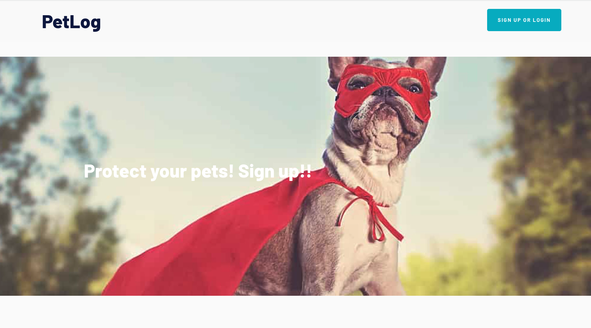
Even if the screen width is reduced, the width used for text display is not as narrow as before the change. (Please return it to 20%.)

---

`Apply a max width when the page is streached`: This is the maximum width of the element. As you widen the screen width, the element will also grow, but it will not be larger than the size specified here.
Try setting the text to 100% by checking it.


If you make the screen bigger, the element will not grow.
So, The letters no longer depend on the left.
(Leave this setting as it is.)

---

Next, I will explain the arrangement of elements when the screen width is changed.

I think that the catch phrase may be shifted to the left or right depending on the person when the screen is enlarged.

The placement of the element when the screen width is extended is determined by the original relative position.
If you originally see it in the middle and shift it to the right or left even if you don't mind it, it will be noticeable when the screen gets bigger.

If you want to make sure it's in the middle, right-click (or tap with two fingers) last week and specify `Center horizontally`.

---

It's here.


---

## The above is the basis of control of expansion and contraction.

You used these settings for each element and adjusted them to the intended appearance.

- `Make this element fixed width`
- `Minimum width`
- `Apply a max width when the page is streached`

Also, don't forget that you need to be careful about the relative position such as centering.


---

## Wrap / Do not wrap, Show / Do not show

Next, we will add controls such as wrapping / not wrapping and displaying / not displaying on the details screen.


---

Currently, pet_detail has elements arranged vertically regardless of the screen width,
The screen width of the PC is not fully utilized.


---

## Images and other information are displayed in separate columns.

- Select the text and image of `Image` and move it to the left
- Select from the `Name` text to the` UPDATE` button and move it to the upper right
  - Don't forget that there is an empty text box under `Gender`


---

## Let's preview
I don't think the placement and folding method will work.
This is because each Element determines its relative position and wraps around.


---

## TIPS

When previewing the detail screen many times, it is convenient to display it by reloading the browser without having to reselect it on the list screen.

---

## Create a group
You will be able to control it well by creating a group for each group that has been folded and arranged.

- Select the text and image of `Image`, right-click (two-finger tap) and select` Group elements in a Group`
- The size of the group fits perfectly to the element, but let's expand it a little to make it easier to choose later.

* If you want to select more than one, hold down `Shift` and click.


---

There will be a square that surrounds both the `Image` text and the image.


---

By the way, you can also select Group from the menu on the left and place it.
However, after placing the Group, you have to reposition the elements in it.

If you want to put the placed elements in the Group, the above method is easy.


---

- Select from the `Name` text to the` UPDATE` button, right-click (two-finger tap) and select `Group elements in a Group`
  - Don't forget that there is an empty text box under `Gender`
- The size of the group fits perfectly to the element, but let's expand it a little to make it easier to choose later.

* If you want to select more than one, hold down `Shift` and click.


---

There will be a square that surrounds the `Name` text to the` UPDATE` button.


---

## Let's preview

The arrangement is still subtle, but I think that the wrapping has come to be folded together.

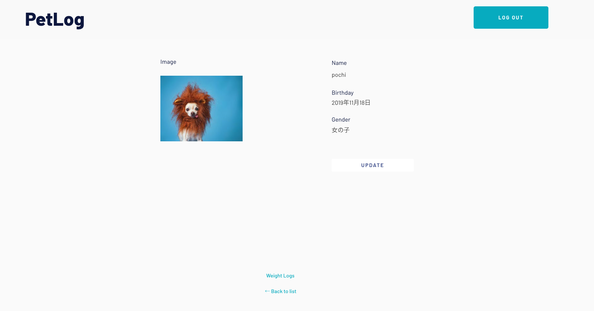

---

I want to put the images and names together in the center, and I want to keep them from separating even if the screen width expands, so I also want to control these as a group.
Therefore, the group of images and the group such as the name are also surrounded by the group.

Select group 2 while holding down `Shift` and right-click (two-finger tap) to specify` Group element in a Group`.

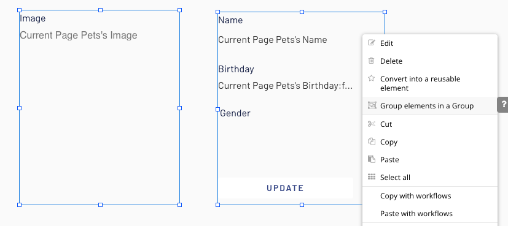

---

Using the knowledge I learned when controlling the expansion / contraction here,
Set it to the intended placement.

- Specify 50 for `Minimum width`.
- Select the whole group and check `Apply a max width when the page is stretched`
- Specify 100 for `Maximum width`.


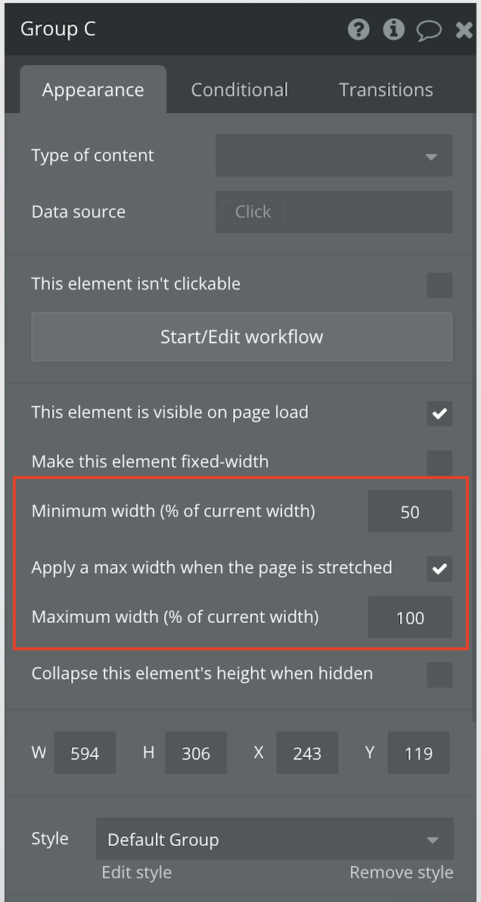

---

In addition, select the enclosing group, right-click and specify `center horizontally`.

Now, as a group, even if the screen width changes, it will be placed in the center of the screen.


---

## Let's preview
it is a good feeling.


---

## Next, I'll bring you a weight graph

- On the pet_weight_register screen, click the graph to copy it.
- Paste on the pet_detail screen
- Place it under the image or name and spread it sideways
- Right-click and `center horizontally`

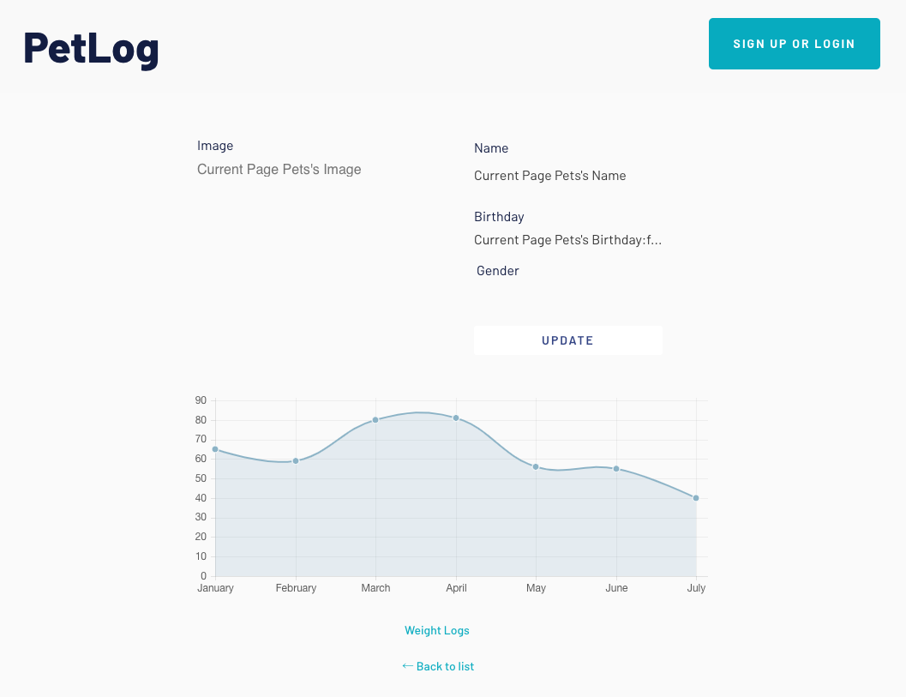

---

## Let's preview

It's cramped to display graphs on one screen with a smartphone.


---

## Opens a view for responsive web design

Click on the `Responsive` part of the left menu

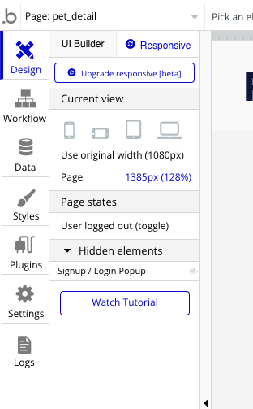

---

A screen with a scale is displayed at the top of the screen


---

You can pinch the edge of the scale to reduce the screen width in a pseudo manner.


---

The graph is not displayed at the timing when the name etc. wraps
- Slowly move the width of the screen and stop when the group such as the name wraps
- Click the graph in that state
- Click `Add hiding rule`
- Click `Save`
  - Since the scale is stopped at the timing of turning back, the width is a condition.

---
Like this
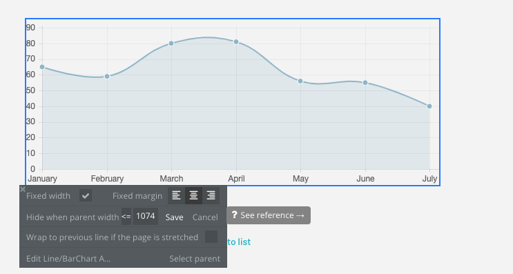

- Check if the scale switches as intended by increasing or decreasing the scale again.
  - If it doesn't work as intended, delete the rule once and try again.

---

## Let's preview

Hooray
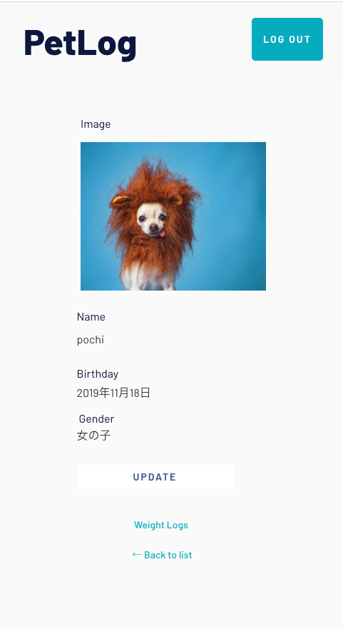

---

It's a fine adjustment, but if the back link is at the bottom, it's difficult to use on a smartphone, so I'll bring it up.

- Expand the group that surrounds the whole up a little
- Place the link closer to the top left of the group
- By doing this, even when you expand the screen, the `Max Width` applied to the whole group will work and it will not be too close to the edge.


---

## Let's preview


The above is the control of wrapping / not wrapping and displaying / not displaying.
It was also a review of extending / shortening.

---

## Take a break
Do you have any questions so far?

---

## Let's use Style

---

## Let's use Style

- So far, I have used the style that Bubble has prepared as standard.
- In the actual product, we will draw and apply the design concept that suits the product.
- From here, I will explain how to change the style.

---

## There are three main ways to apply Style.

- Editing an existing style
- Apply styles individually
- Add a new style

Let's do it in order

---

#Edit an existing style

I would like to change the existing style to change the color of the buttons and links.
I want to make it red to match the image of Inu-chan Man.


---

## Let's use the color palette

In Bubble, frequently used colors can be set in the palette in the application settings.

- Select `General` in the tab at the top of the screen,` Settings`> on the left menu.
- Move to the lower `Color palette`


---

I'm thinking of changing the buttons and links with the red `# D62755` that was originally set.
As I will explain in detail later, I also want a little dark red when I hover the button, so I will set a little dark red here as well. I add the `# B32246` red to the palette.

Everyone, try adding a base color and a slightly darker color.


---

Now let's set the style. Open `Styles` on the left menu.

Let's take a quick look first. There are some style settings that I have used so far.


---

Change the color of the button.

- Select `Button` from the Element type at the top of the screen
- Select `Primary Button`
- Click Color on the right side of the screen
- Select your own basic color from the color palette

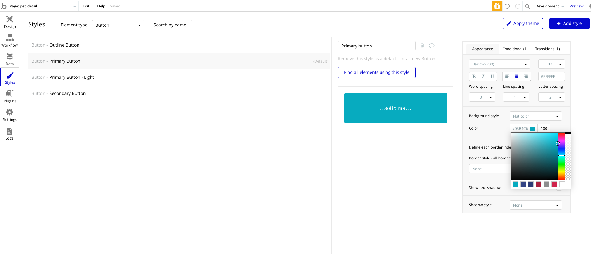

---
### Let's preview

The button color is now red.


However, when you mouse over it, it turns green (blue?).


This is because the color when the mouse is over is specified separately.

---

- Return to Styles Primary button settings
- Select Conditionl on the right side of the screen
  - The style that will be applied if certain conditions are met is specified here (more on this later).
  - You have specified that the color will change when you hover.
- Specify this color that is a little darker than the base color you decided earlier.


---

### Let's preview

No hover


Hover


it is a good feeling.

---

Similarly, change the font color of `Primary Button` to the base color.


---

In addition, the font color of `Standard Link` will be changed.


---

## Let's preview


There are basic colors in various places.


---

## Next, let's specify the style individually

I want to match the header logo with the basic color and make the font a little more cute.


---

b Open the menu to the right of the logo and select Header

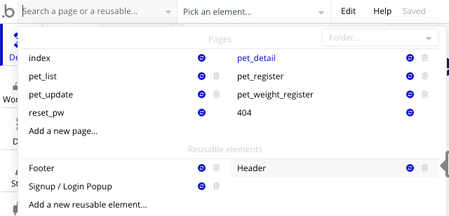


---

- Double-click on the logo to open the settings
- Move to the `Style` part of the setting interruption
- Click `Remove style` near the bottom right of the pull-down
  -It will be possible to specify individually instead of applying the defined Style.

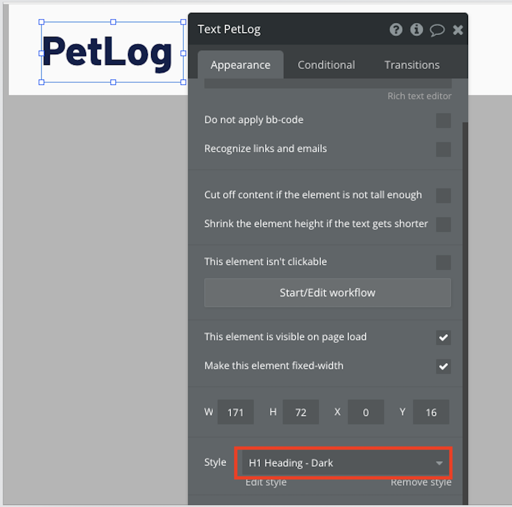

---

Specify your favorite style
- I used the font color red, which is a slightly darker base color that I put in the palette.
- I like the font `Noto Serif Devanagari (800)`, so specify it.
- If you change the font, the logo may be cut off, so please adjust the width appropriately.


---
## Let's preview

It has changed.


---

## Next, let's add a new style

I'm worried that the label and the content are the same style and difficult to distinguish, so
I'm going to make a style for the label.


---

First, specify the style individually.

- Open pet_detail and double-click on the `Image` text to open the settings
- Click `Remove style` at the bottom right of the pull-down of` Style`


---

Make the following settings
- Font is `Barlow (600)`
- Font size is `12`
- Check `Center the text vertically`


---

Then define the specified individual styles as a common style.

- Open the `Style` pull-down in the` Image` settings.
- Click `Create a new style ..` at the bottom


---

- Enter `Label` in the Style name
- The Element style remains `Text` to indicate that it is the style of the text Element.
- Use style of remains `Text Image` and creates a style as the source of` Text Image`

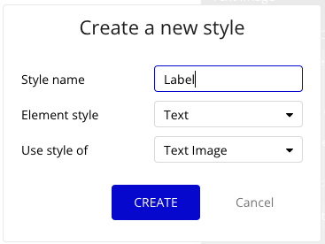

---

Label should be specified for the style.


Instead of defining individually specified styles as a common style
You can define the style first, but you can define the style individually.
It is better to set the specified one as a common style
It is easy to do because you can make it while checking the image in the design view.

---

Now let's apply the defined style to other labels.

- pet_detail: Name, Birthday, Gender
- pet_register: Image, Name, Birthday, Gender
- pet_update: Image, Name, Birthday, Gender
- pet_update: Image, Name, Birthday, Gender
- pet_weight_register: Weight

It's a little too much work.

If you had separated the styles from the beginning, you only had to change the style in one place, so it's a good idea to keep in mind that if you see screen elements that have different meanings, you should define the styles.

----

## Let's preview


That's it for Style.

---

## Build logic

---

## Build logic

Logic is embedded in various places in the application.

- Return feedback on screen operations
- Extract and process data
- Various things such as switching screens depending on the authority

Even with Bubble, you can embed logic in various places, so let's do it together.

---

## Give feedback on screen operations

---

## Give feedback on screen operations

Bubble allows you to embed logic in screen elements.
It can be used to create and crowd feedback on screen operations.

If you hover over your pet list, try moving it so that it has a red frame.


---

I will embed the logic in the image Element
- Open pet_list
- Double-click the image Element of the pet image to open the settings
- Specify `Conditional` from the tab
- Click the `Define another condition` button

As I mentioned a bit last week, here you can define the conditions and whether to change the properties as well if the conditions are met.


---

First, let's see what conditions can be specified.

- The image element, its parent element, and other elements on the screen
- Login user
- New data search
- Current status such as date, current position, page width, scroll position, etc.

You can see that various conditions can be specified.


---

This time, simply select the corresponding image `This Image`.

Then, the state of the image will be lined up next. There are many things here as well, but this time select `is hovered`.

Now, the condition is that the image is hovered.


---

Next, specify which property to change and how to change it when the conditions are met.
Click `Select a property to change when true` and take a look inside.

- Image source, alt attribute
- Can you click, border, etc.

You can see that it seems that various changes can be made.
What is lined up here depends on the type of Element.


---

This time, if it is hovered, it will have a red border.
- Click `Border style - all borders`
- Change the part that is `None` to` Solid`
- It means that the frame line specified as `None` is changed to` Show solid line`.


---

- Select `Select a property to change when true`
- Click `Border coloer - all borders`
- You will be able to specify the color, so select the basic color.
- Similarly, next, specify `Border width - all boarders` and set` 2`.


This completes the settings.

---

## Let's preview

After hovering, a red frame will appear.


In this way, you can create a product by embedding logic such as giving easy-to-understand feedback to user operations and switching screen decoration depending on the state.

---

## Extract and process data

---

## Extract and process data

You can extract only specific data, or process or calculate the acquired data.
Display your pet's initials, age, and latest weight.

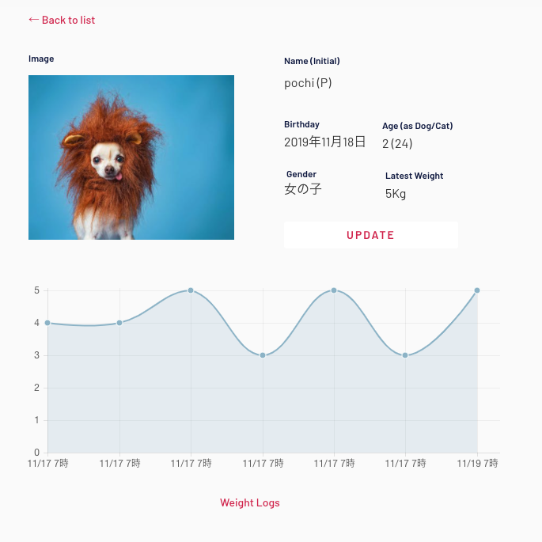

---

## Advance preparation

We'll be adding more elements, so let's reduce the width of Name, Birthday, and Gender.
- In pet_detail, double-click Name to open the settings
- Hold down Shift and select from the Name label to the Gender text element
- Specify `110` for W (width)
- Press the `Apply changes to elements` button

Please check the preview to see if the screen has collapsed.

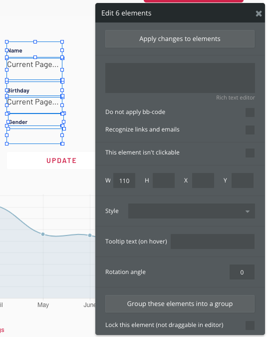

---

## First, display the initials

- Change the contents of the Name label to `Name (Initial)` so that you can see that it contains initials.


---

- Select the text that contains the contents of Name
- Click the part of the text input field where there is no character to focus
- Enter `(`
- Select `Insert dynamic data`
- Select `Current Page Pets`> `'s Name`
- It should be faint as `More ...`, so click it.

Various processing methods can be selected here. Let's take a look.


---

- Select `truncated to`
  - This means to cut up to the specified number of characters.
- Type `1` and press Enter to confirm
- Click because it says `More` again
- Select `: uppercase`
  - This means to convert to uppercase
  -(It doesn't make sense for those who have Japanese names)
- Click the part of the text input field that does not have characters and enter `)`


---

## Let's preview


---

## Show the latest weight

- Copy and paste the birthday label and text and place it
- Change the label to `Latest Weight`

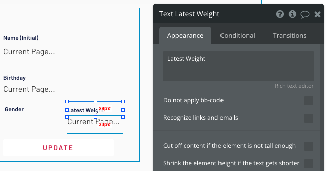

---

- Open the text settings that bring out the contents of Latest Wight and empty the text entry area.
- Focus and click `insert dynamic data`
- Click `Do a search for`
  - It means to search the data.


---

Specify to get the weight of the pet currently displayed on the page

- Specify `PetWeightLogs` for` Type`
- Click the `Add a new constraint` button
- The condition input field will appear. Click it and specify `pet`,` = `,` Current Page Pets` in that order.

You can get it under various conditions, so let's see what kind of conditions there are.


---

Specify the order of creation date, that is, the order of newly created ones.

- Specify `Created Date` for` Sort by `
- Specify `yes` for` Descending`
- Close

It's easy to forget to specify the order, but it's often important.


---

Shows the latest 1 weight
- Click `More` in the text entry field to see what's inside
- Specify `: first item` because you want to get the first item.
- Next, specify `'s Weight Kg`
- Click on the blank area and enter `kg`

This completes the latest weight setting.
Let's remember and wake up as a method of data extraction and list processing.


---

## Let's preview.

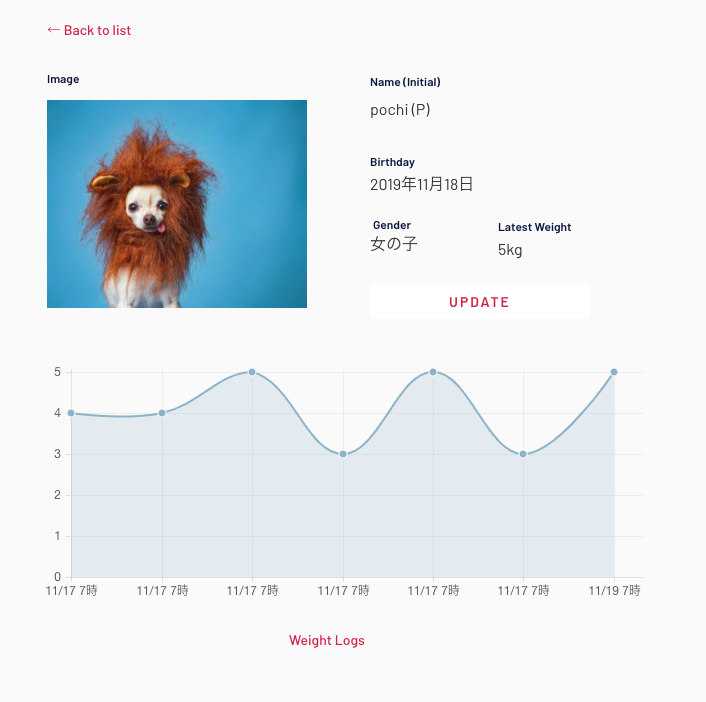

---
#### <Advanced>

## A little off the side street,
## Let's look at the number More and the date More.

Bubble offers various processing and calculation methods for numerical values ​​and dates.

---

#### <Advanced>

## Calculate age

Next is the age. As you saw earlier, it is possible to process and calculate numerical values ​​and dates, but age calculation seems to be a little difficult, so I will try to embed the code directly.

By introducing a plugin in Bubble, you can operate simple processing using a programming language called javascript.

---

#### <Advanced>

To embed javascript code, use a plugin called `Toolbox`.
Let's install it.

- Specify `Plugins` in the left menu
- Enter `tool` in the search text box (search will take some time)
- Press the `Install` button on the `Toolbox` that appears at the top of the search results


---

#### <Advanced>

There are two main ways to embed code in Toolbox, this time I will introduce the following two ways

- Execute with `Run javascript` on Workflow / Receive with` Javascript to Bubble` on Desing
  - Used for complicated processing that spans multiple lines
- Execute and receive with `Expression` on Design
  - Used for processing that ends in a single shot

---

#### <Advanced>

Now let's calculate the age.
Use `Run javascript` / `Javascript to Bubble`. First, put `Javascript to Bubble` in the pet_detail screen.

- Select `javascript to Bubble` from` Visual elements` in the left menu
- Place it in a place that does not get in the way, such as at the bottom of the screen
- Since it is for receiving the result of javascript, it is not displayed at the time of execution such as preview


---

#### <Advanced>

- Specify `age` in` bubble_fn_suffix`
- Check `Publish value`
- Specify `number` for` Value type`

Now, if you pass a value from javascript to a function (a block of processing) called `bubble_fn_age`, you will be able to receive it on this screen element.


---

#### <Advanced>

Next, define where to execute javascript.
- Select Workflow from the left menu
- There are squares lined up, but select the rightmost `Click here to an event ...`
- Select `General`>` Page is loaded`


---

#### <Advanced>

- Click here to add an action ... `
- Click `Plugins`>` Run javascript`
- The settings will open, so paste the code on the next page into the `Script` field.


---

#### <Advanced>

`` ```
//Birthday
const birthday = {
    year :,
    month :,,
    date: date:
  };;

function getAge (birthday) {

    //today
    let today = new Date ();
 
    // This year's birthday
    let thisYearsBirthday = new Date (today.getFullYear (), birthday.month-1, birthday.date);
 
    //age
    let age = today.getFullYear () - birthday.year;

    if (today <thisYearsBirthday) {
        // Birthday hasn't come yet this year
        age-;
    }

    return age;
}

bubble_fn_age (getAge (birthday));
`` ```

---

#### <Advanced>

Insert the date with `insert dynamic data` after` year: `,` ​​month: `,` ​​date: `in the 3rd to 5th lines.
- `year: Place the cursor after `(before`, `)
  - `insert dynamic data`>` Current Page Pets`> `'s Birthday`
  - `More`>` formatted as 11/20/21`
  - Specify `Custom` for` Format type`
  - Specify `yyyy` in` Custom format`
- Similarly, after `month:`, set `Custom format` to` m` and insert it.
- Similarly, after `date:`, set `Custom format` to` d` and insert it.

* The image after input is on the next page

---

#### <Advanced>

Image after input


---

#### <Advanced>

Let's arrange the screen elements to display
- Copy and paste birthday labels and text
- Changed the label to Age
- Specify the content of the text as `Javascript to Bubble A`>`'s value`

---

#### <Advanced>

## Let's preview


---

#### <Advanced>

Next, when converted to dog and cat age, I will also display how old it is.
Use `Expression`.

- Select `Expression` from Visual elements and place it next to` Javascript to Bubble`.
- Enter `24 + (` in Expression
- Insert `Javascript to Bubble A`>`'s value` with `insert dynamic data`
- Continue, enter `-2) * 4`
- Specify `number` for Result type


---

#### <Advanced>

Set the display.
- Changed the Age label to `Age (as Dog / Cat)` to make it easier to understand that it also includes the age of dogs and cats.
- Enter `(` after what was originally entered in the Age text
- Insert `Expression A`>`'s value` with `insert dynamic data`
- Enter `)`


---
#### <Advanced>
## Let's preview


---

## Switch screens by authority

---

## Switch screens by authority

So far, we have explained the incorporation of logic in parts such as feedback to screen operations and data extraction / processing.

Next, I would like to add logic that spans multiple functions.

Do the following:
—— Divide users into pet owners and pet advisors
- Owners can use the screens and functions they have created so far.
- Advisors can use screens and functions dedicated to advisors

---

## Screen image for advisors


---


---

As a development flow, we will make it in the following order.
- Add a field to the user information to determine whether it is an owner or an advisor
- When registering as a user, you can select whether you are an owner or an advisor to register.
- Create an advisor list screen and details screen
- Switch screen transition destination after login / sign-up depending on whether you are the owner or an advisor

It takes a lot of steps, but there are many products that handle multiple user types, so be sure to learn them.

---

## Add a field that can identify the user

First of all, it will be possible to retain the difference in the role of owner or advisor on the data.

You can keep it as a text like when you are a pet male or female, but it will be easier to handle the value specified from the fixed choices by defining the choices in advance and using them. Bubble provides a mechanism called Option set, so let's use it.

---

Let's set Options

- Go to `Data`> tab` Option sets` on the left menu
- Enter `Role` in` New Option set` and press the Create button
- Role is created as a new Option set


---

We will add specific options to the Option set called Role. This time, create a `Pet Owner` and a` Pet Advisor`.

- Enter `Pet Owner` in` New Option` at the bottom right of the screen and press the Create button.
- Similarly, enter `Pet Advisor` in` New Option` and press the Create button.

This completes the settings.


---

Next, let's add a role as a user attribute

- Go to `Data`> tab` Data types` on the left menu
- Select `User`
- Click the `Create a new field` button at the bottom right of the screen


---

- Enter `Role` in` Field name`
  - This can be any name as long as it is easy to understand.
- Select `Role` for` Field type`
  - The one specified here is the `Role` as the` Option set` created earlier.
- Press the Create button


---

Now that we've added a new field, the Role will be empty for users who have already created it. It will cause inconsistency later, so apply a patch (data correction) to the existing data.

- Go to the `App Data` tab and select` All Users`
- The table will be displayed. Click the pen icon at the left end of the table to edit it one by one.
  - All the users created now should be owners, so specify `Pet Owner` for` Role`.


---

All lines in Users are OK if `Role` is` Pet Owner`


---

## Allows roles to be specified during user registration

Next, when registering as a user, specify whether you are the owner or an advisor so that you can register.

I have reused the registration screen prepared by Bubble, but I will change it.

---

- b Go to `Signup / Login Popup` from the menu next to the logo
- Select `Dropdown` from` Input forms` in the `Design` menu and place it below the password entry field.


---

- The width of Dropdown is aligned with others to make it look good.
- Dropdown settings are as follows
  - Element name: `Dropdown Role`
  - Placeholder: `Choose a role ...`
  - `Choice style`:` Dynamic choices`
  - `Type of choices`:` Role`
  - `Choices source`:` All Role`
  - `Option caption`:` Current option`> `'s Display`
  - `Default value`:` Pet Owner`
  - `This input should not be empty`: Check


* The screen image is on the next page

---

Image after input


---

Next, make sure that the entered Role is set at the time of user registration.

- From the left menu, `Workflow`> From the squares in a row, move to` Button SIGN UP is clicked`> From the Actions in a row, in the order of `Sign the user up`.
- Click the `Change another field` button in the Action settings screen
- A input field will appear, so select `Role` =` Dropdown Role` `'s value`.


---

## Let's preview and check the operation

As an advisor, I was able to register for an account! (No dedicated screen yet)


---

## Create an advisor list screen and detail screen

Let's make a list screen and detail screen of advisors

- b Open the menu next to the logo and `Add a new page ...`
- Enter `pet_list_for_advisor` in` Page name`
- Select `pet_list` in` Clone from `
- A new screen is created


---

The advisor will make all registered pets visible.

- Delete the original list and button
- Place a `Repeating Group`
  - Type of content: `Pets`
  - Data source: `Do search for`
    - Type: `Pet`
    - Sort by: `Created Date`
    - Descending: `yes`
  - Layout style: `Full list`
  - This repeating group has fixed width: Check


---

For convenience, enclose the `Repeating Group` cell in` Group`.

- Since there is `Group` in the line on the left, place it on the screen.
- Make it large enough to fit in one cell of the `Rpeating Group` and put it in the Repeating Group.
- After putting it in, stretch it to the top, bottom, left, and right of the cell.
- Specify `Pets` for Type of content and` Current cell's Pets` for Data source.


---

Place the elements in the list.
- Image
  - Dynamic image: `Parent group's Pets``'s Image`
  - Run-mode rendering: `Zoom`
- Name
  - Text input field: `Parent group's Pets``'s Name`
- Birthday
  - Text input field: `Parent group's Pets``'s Birthday` `: formatted ad 2021/11/20`
- Owner
  - Text input field: `Parent group's Pets``'s Creator` `'s email`

* The screen image is on the next page

---


---

### Let's preview

Nothing comes out! ?? why? ??


Because you don't have the authority.

---

### Privilege control with Bubble

I didn't have to be aware of it until now, but Bubble has severely restricted access to Data.

Go to `Data`> tab` Privacy` on the left menu.
Initially, the data is only accessible to the creator.

Naturally, it's natural.


---

Now, if you are an advisor, we will add the authority to see all the data.

- Select `Pets` in the` Privacy` tab
- Click the `Define a new rule` button
- Enter `Visible to advisor` in the Rule name
- Select `Current User``'s Role` `is`` Pet Advisor` for When
  - The condition is that the user is an advisor.

If you are an advisor, you can see the data of all pets.
You can limit the fields that can be referenced for each rule, but this time we will not use it.

* The screen image is on the next page

---


Now, add rules to `PetWeightLogs` and` Users` in the same way.
The advisor should now be able to see all the data.

---

## Let's preview
Hooray


---

I will also make details for the advisor.
This can be made almost by duplication.

- From the b logo on the upper left, `Add a new page ...`
- Enter `pet_detail_for_advisor` for Page name
- Enter `pet_detail` in Clone from
- Press the Create button


---

You can leave it as it is, but since you don't need a lead to the update, remove the link between the `UPDATE` button and the` Weight Logs`.

Also, the return destination of the `Back to list` link should be` pet_list_for_advisor`.


---

Next, since there is no lead wire from pet_list_for_advisor, we will create it.

- Open the pet_list_for_advisor screen
- Select the `Group` created in the` Repeating Group` cell
- Click the `Start / Edit workflow` button
- Select `Click here to add an action`> `Navigation`>` Go to page`


---

- Enter `pet_detail_for_advisor` for Destination
- Select `Current cell's Pets` for Data to send


---

## Let's preview & check the operation

If you click on the line


---

It was out


---

Next, control the transition destination at login.
Actually, if you are already logged in on the top page, you have already set the transition to the pet list. I will edit it.

- Open Workflow on index page
- Select `User is logged in`
- Open the Action settings for `Go topage pet_list`
- Select `Current User``'s Role` `is`` Pet Owner` for `Only when`

Only the owner transitions to pet_list


---

Next, in the case of an advisor, add an Action that transitions to pet_list_for_advisor.

- Click here to add an action .. `
- Click `Navigation`>` Go to page .. `
- The settings will open, so select `pet_list_for_advisor` as the Destination.
- Select `Current User``'s Role` `is`` Pet Advisor` for `Only when`


---

## Preview & check the operation

After logging in as an advisor


---

After logging in as the owner
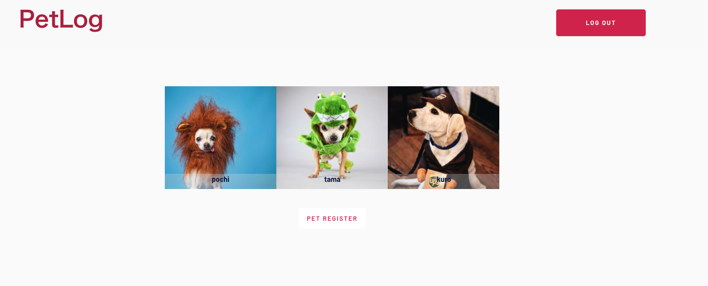

Good

---

#### <Advanced>

## An account is created by the advisor without permission,
## Can I see the information without permission?

---

#### <Advanced>

## Let's prevent you from starting use without approval by the system administrator

---

#### <Advanced>

## I will do the following

- Add a field to your user information to indicate if you are approved as an advisor
- Data access must be approved as well as advisor
- A message is sent to the pet list for advisors saying that it is under review if it is not approved.

---
#### <Advanced>

## Add a field to your user information to see if you are approved as an advisor

- From the left menu, click `User` in` Data types`> on the `Data`> tab.
- Click the `Create a new field` button at the bottom right of the screen
- Enter `Approved As Advisor` for the Field name
- Select `yes / no` for Field type
- Click the Create button


---

#### <Advanced>

There is a column called `default` in the added field, so set` no`.
At the time of creation, it will be in an unapproved state.
 
 

---

#### <Advanced>

For existing users, leave all `Approved As Advisor` as` no`
(It's troublesome and sloppy ... but it's important!)


---

#### <Advanced>

## See also if access to data is authorized

- From the left menu, click `Pets` in` Privacy`> on the `Data`> tab.
- Click `Pet Advisor` at the end of the part where the When condition of` Visible to advisor` is described.
--  "More` will appear, so click` More`
- Select `and`` Current User` `'s Approved As Advisor`` is "yes" `
- Do the same for `User` and` PetWeightLogs`

---

#### <Advanced>

Let's check the operation
Try logging in as a user whose `Approved As Advisor` is` no`


Alright

---

#### <Advanced>

What if the `Approved As Advisor` is` yes`?


Alright

---

#### <Advanced>

## If it is not approved, it will send a message that it is under review.

- Open the `Design` menu on the pet_list_for_advisor screen
- Add `Popup`
- Add a text Element above `Popup` and write a message that it is under review


---

#### <Advanced>

- Go to Workflow from the menu
- Click here to add an event .. `>` Page is loaded`
- Click here to add an action .. `>` Element Actions`> `Show`
- Specify `Popup A` for Element
- Specify `Current User``'s Approved As Advisor` `is" no "` for Only when


---

#### <Advanced>

## Let's check the operation

If yes advisor


Alright

---

#### <Advanced>

If no


Alright

---

#### <Advanced>

## How do system administrators notice?

---

#### <Advanced>

## Once you have registered as an advisor, let your system administrator be notified by email.

---

#### <Advanced>

## Let your system administrator be notified by email

- Open the `Signup / Login Popup` page
- Go to Workflow from the menu and select `Button SIGN UP is clicked`
- `Click here to ad an action ... `>` Email`> `Send Email`


---

#### <Advanced>

- Set your email address in To
- Sender name is `PetLog`
- Subject is `New Advisor Registered`
- Body selects `Input Email (sign up)` `'s value` with` dynamic data isert` below
`` ```
New Advisor has been Registered.
Please check it.

Email:
`` ```


---

#### <Advanced>

- Select `Dropdown Role``'s value` `is`` Pet Advisor` for Only When


---

#### <Advanced>

## Let's check the operation
After signing up with an advisor

Kita Kita

---

#### <Advanced>

If you are the owner

Yeah, it doesn't come. Yay

---

### Today's review

---

### I made a design

- I made a screen that fits the display size
  - Using a technique called responsive web design, we controlled the appearance as follows according to the display size.
    - Stretch / shrink
    - Wrap / Do not wrap
    - Display / Do not display
- I tried using Style
  - Editing / adding Styles and applying styles individually

---

## I made the logic

- Returned feedback on screen operations
- Data was extracted and processed
- The screen was switched according to the authority

We saw together that we could embed logic in various places with Bubble.

---

## Finally

This concludes the basic lecture on Bubble.
Next week, I'm thinking about applying Adalo and Bubble.

There are many features that I couldn't touch,
Bubble has a lot of manuals and references, so
If you adopt Bubble, please take advantage of it.

The manual is here.
https://manual.bubble.io/

The reference will appear when you hover over something you don't know on the screen.
Links to references will emerge for most features.

---

## Thank you!