Programming Boot Camp Learning Phase #4

# Bubble Basic #2

2021/11/20

---

## 事前準備

- 本日は前回作成したペットの健康管理アプリに、デザインやロジックを追加していきます
- 本日の講義用に多少手を加えていますので、開始時点をそろえるため、こちら側で用意したアプリケーションを複製したものを利用してもらいます
- 複製したアプリケーションを配布しますので、`Naotake KYOGOKU` 宛てに、Bubbleのアカウントを作成したメールアドレスを伝えてください。

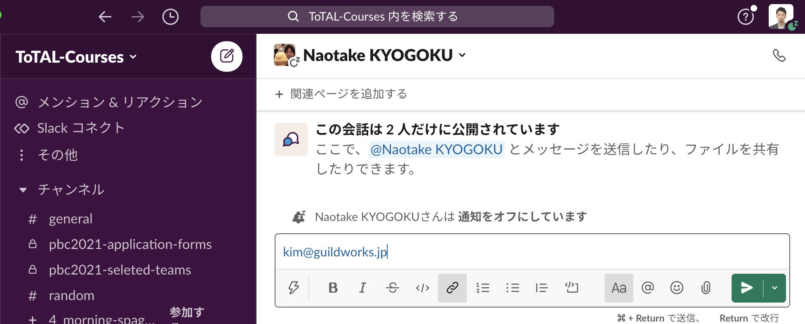

---

## 今日やること

  - 前回のおさらい
  - デザインを作りこむ
  - ロジックを作りこむ

---

## 前回のおさらい

- [Bubble](https://bubble.io/) はビジュアルプログラミングツールとうたっており、画面からポチポチと操作して、見た目や動きをプログラミングできるツールです。
- Webアプリケーション前提であり、ディスプレイサイズにあわせた対応をいれスマホやPCに対応させます。

- 前回お休みの方はこちらの資料でキャッチアップしましょう
  - https://github.com/GuildWorks/titech-2021/tree/master/docs/Bubble1

---

## 前回のおさらい

ペット管理アプリケーションのペットの登録、一覧、詳細、体重記録の画面を
作りながら、Bubbleの基本である、Design/Workflow/Dataの使い方を学びました。

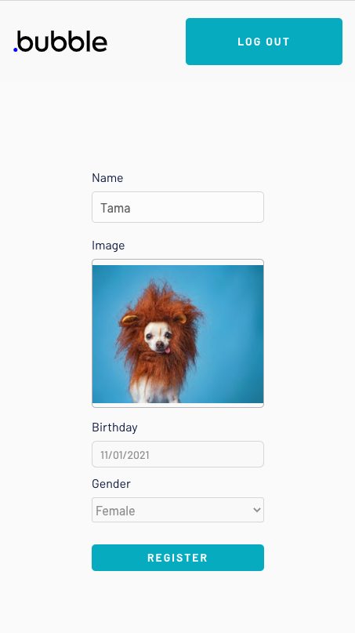 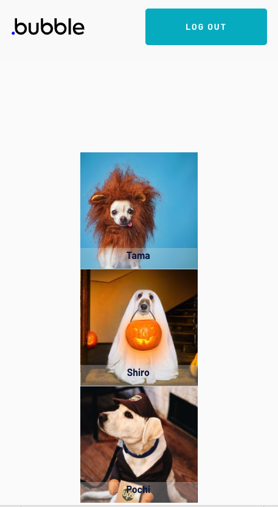 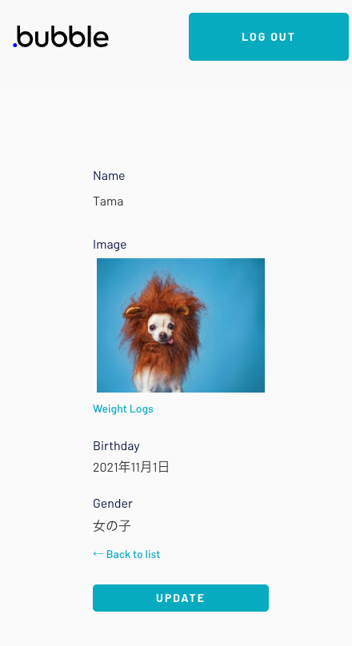 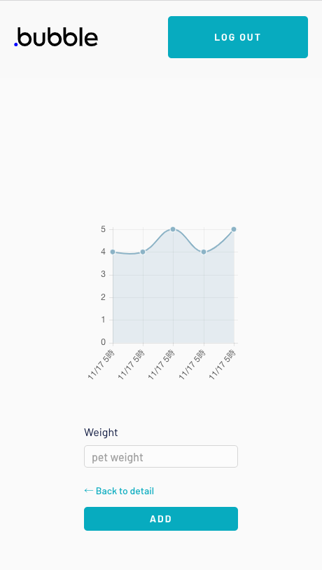

今回はここに対して、デザインやロジックを作り込んでいきます

---

### 最終的にはこんな感じになります

トップページ

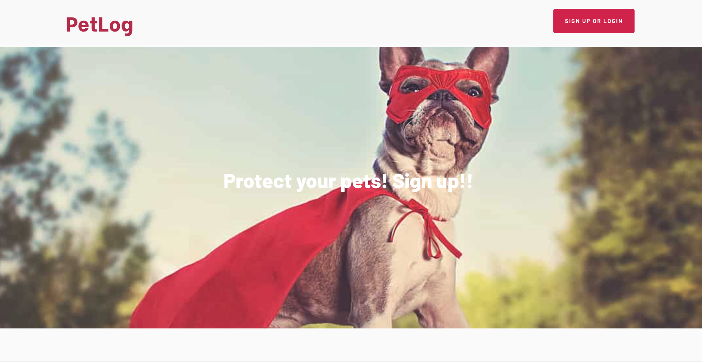　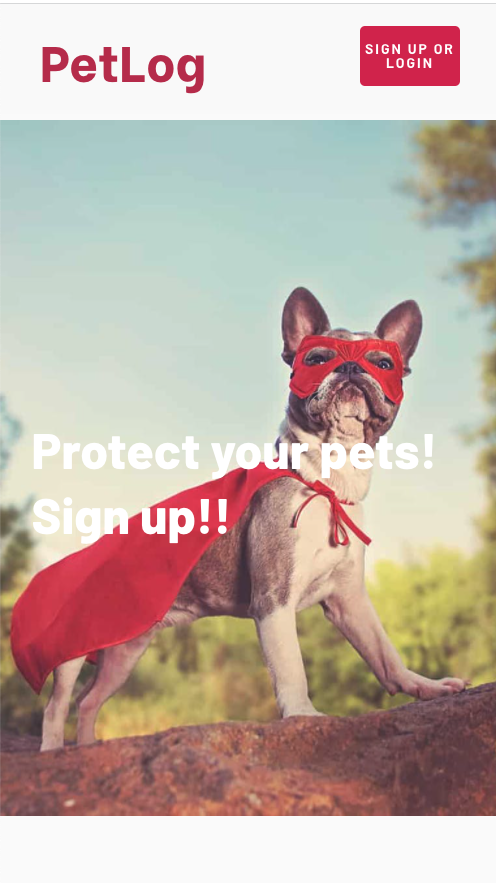

---

ペットリスト

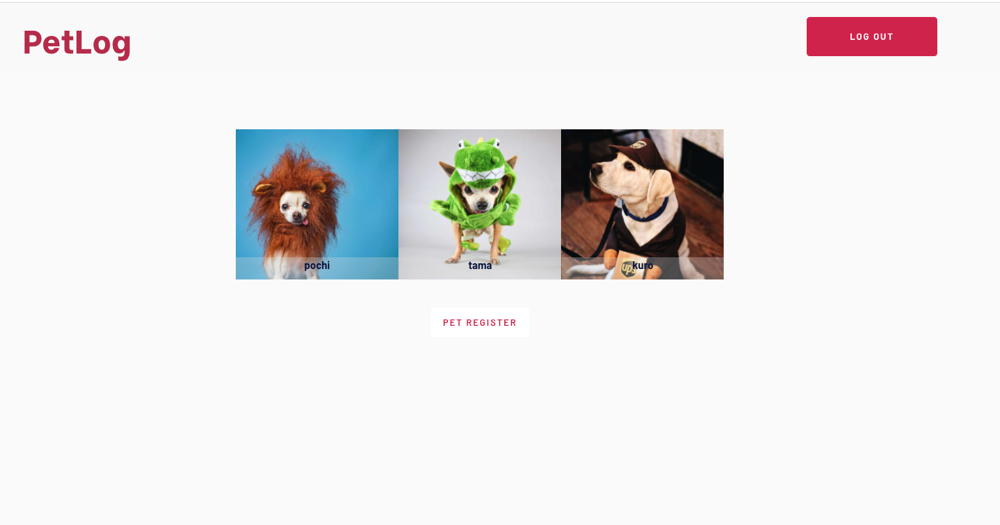　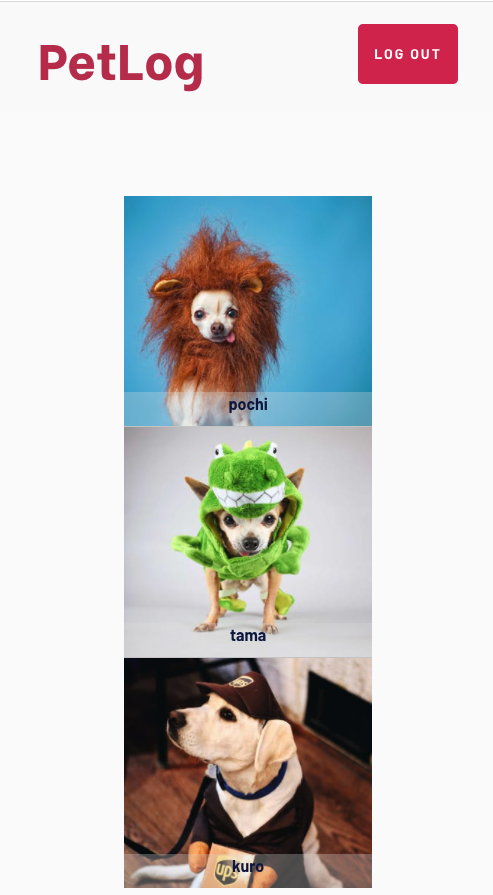

---

ペット詳細

　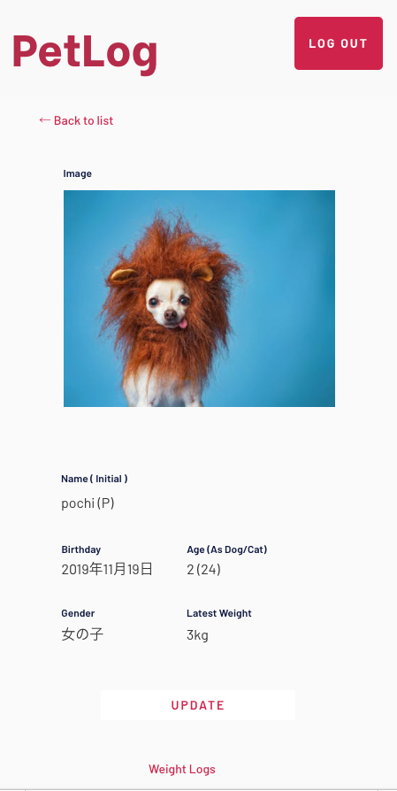

---

アドバイザー用ペットリスト

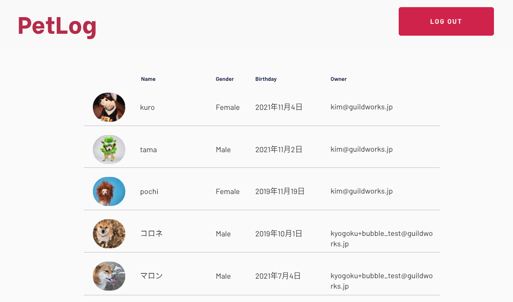

---

アドバイザー用ペット詳細

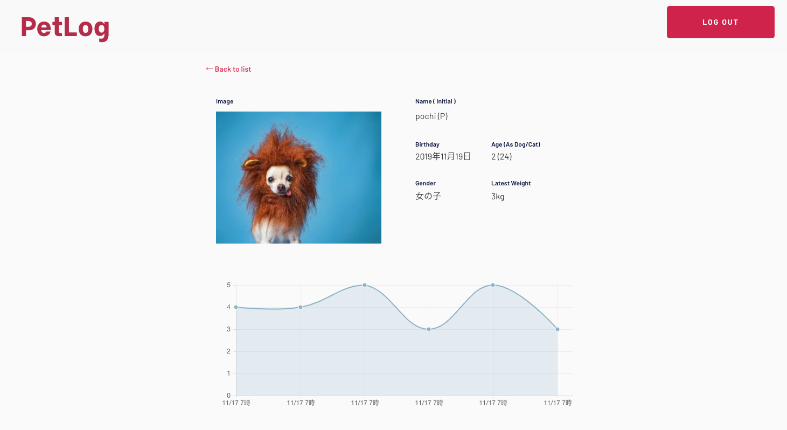

---

### では、さっそくはじめていきましょう。
### まずはデザインを作りこんでいきます

---

### デザインの作り込みでやること

- ディスプレイサイズに合わせた画面をつくろう
  - レスポンシブウェブデザインという手法を使って、ディスプレイサイズに合わせて以下のように見た目を制御します
    - 伸びる／縮む
    - 折り返す／折り返さない
    - 表示する／表示しない　
- Styleを使ってみよう
  - Styleを編集・追加したり、個別にスタイルをあてます

---

## ディスプレイサイズに合わせた画面をつくろう

---

## ディスプレイサイズに合わせた画面をつくろう

- WebアプリケーションはPCやタブレット、スマートフォンといった様々な端末で利用されます。
- 端末毎にディスプレイサイズが違うのですが、それらに対応する手法としてレスポンシブウェブデザインというデザイン手法があります
- 画面サイズに応じて、要素が伸びる／縮む、折り返す／折り返さない、表示する／表示しないといった見た目の切り替えを行うという手法になります。
- Bubbleは標準でレスポンシブウェブデザインの機能をそなえており、意識しなくても対応されていることもあります。

--- 

## レスポンシブウェブデザインの適用の仕方

- レスポンシブウェブデザインを考えるときには、まずはPC画面を作成し、ディスプレイサイズが小さくなっていったときの表示ルールを付け足すことが多いです。
- スマートフォンでの利用場面が主となるような場合には、スマートフォンの画面を先に作成して、PC表示をあとから整えるということもあります。

さっそく体験してみましょう。

---

## （再確認）事前準備

- 本日は前回作成したペットの健康管理アプリに、デザインやロジックを追加していきます
- 本日の講義用に多少手を加えていますので、開始時点をそろえるため、こちら側で用意したアプリケーションを複製したものを利用してもらいます。
- 複製したアプリケーションを配布しますので、`Naotake KYOGOKU` 宛てに、Bubbleのアカウントを作成したメールアドレスを伝えてください。


---

## トップ画面に画像とキャッチを配置します

トップ画面に画像とキャッチを配置して、レスポンシブの伸び縮みの制御をいれていきます。
一緒にやっていきましょう。

　

---

## 画像準備

私はこちらの画像を使います。
https://raw.githubusercontent.com/GuildWorks/titech-2021/master/docs/Bubble2/materials/hero.jpg

好きな画像を利用してもらっていいですが、大きく表示するので解像度の高いものを選んでください。


---

## トップページに画像を配置する

トップページに移動してください。手順は覚えていますか。
- 画面左上のbロゴの右をクリックして、indexページを選ぶ。

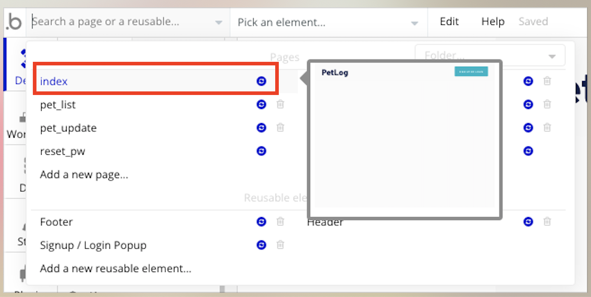

---

- 左メニューから、`Design`>`Image`の順にクリックする。
- 画面の中の真ん中あたりに適当な大きさで配置する。
  - 配置したい場所で配置したい大きさになるように、ドラッグする。
- 画像Elementが置かれたらOK（まだ画像は空の状態）。

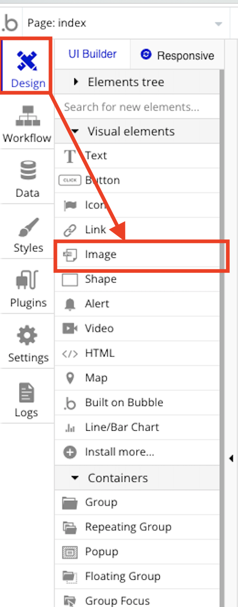

---

- 画像Elementの右側に設定用のポップアップがでているので、設定をいれていく。
- `Static Image`に用意した画像をアップロード。
- 画像を左右いっぱいまで引き伸ばし、上下も好きな具合に整える。
  - 犬ちゃんマンの場合は`W:1080`、`H:645`くらいがよさそう

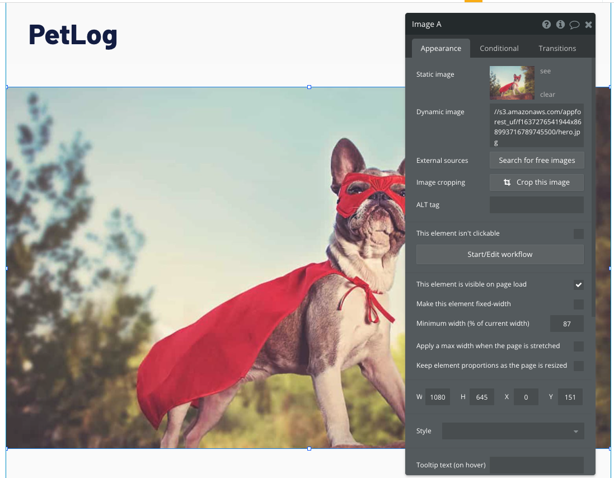

---

次にテキストを配置します。
- 左メニューから`Text`をクリックして、画面に中央に配置。
- テキストElementの右側に設定ポップアップがでているので、設定をいれていく
  - 最上部のテキストエリアに好きなキャッチコピーを入れる。
  - 私は、`Protect your pets! Sign up!!`といれます。
  - Styleに`H1 Heading - Light`を指定する

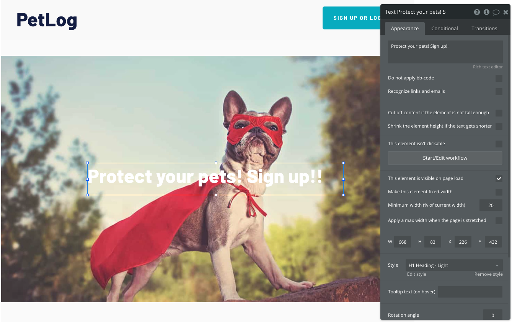

---

ではプレビューしてみましょう.
- 画面右上の`Previewリンク`か、ショットーカット（Windows：`Ctrl+p`、Mac：`Cmd+p`)

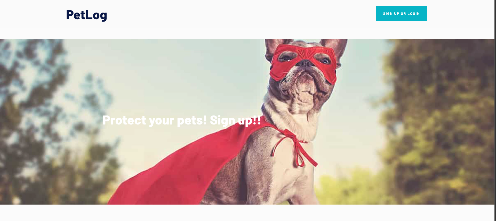　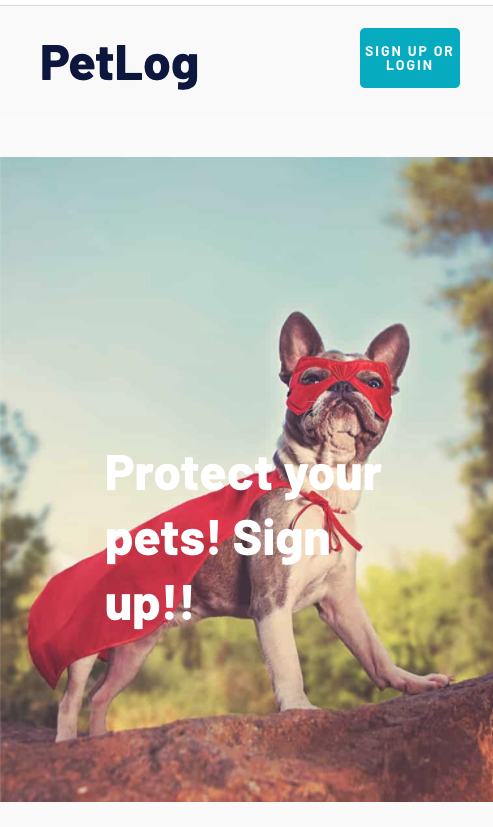

特にレスポンシブ対応をいれていませんが、勝手にいい感じにしてくれていますね。
Bubbleがレスポンシブに標準で対応してくれているためです。

---

少し解説します.
画像やテキストの設定を見てみましょう。中段あたりにこのような設定があります。
- `Make this element fixed width`
- `Minimum width`
- `Apply a max width when the page is streached`

要素毎にこれらの設定を使いながら意図した見た目になるように調整していきます。試しに設定を変えて表示してみます。

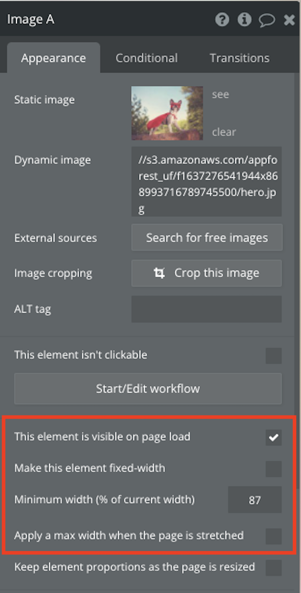

---

`Make this element fixed width`：これはこのelementの横幅を固定するかどうかという設定です。チェックが入っていない場合は、画面幅にあわせて伸び縮みします。
試しに画像の設定で、チェックをつけてプレビューしてみましょう。

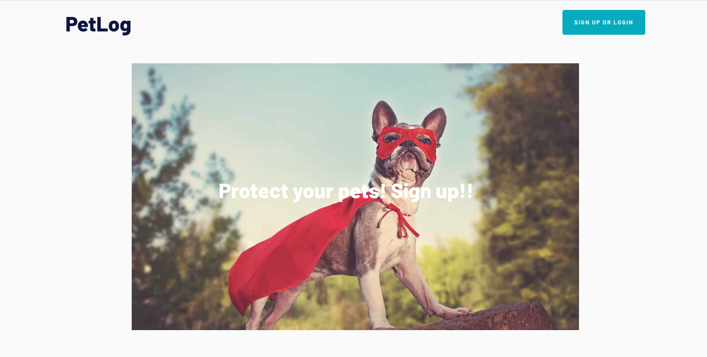　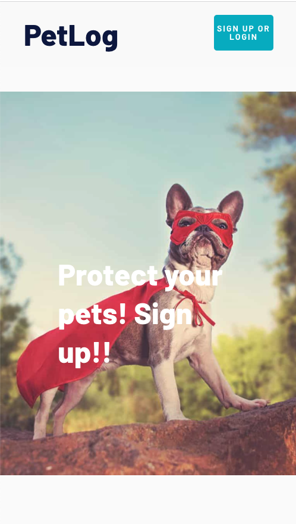

画面幅を大きくしても画像elementの幅は変わらなくなりました。（チェックははずしておいてください。）

---

`Minimum width`：これはelementの最小幅です。画面幅を狭めていくと、合わせてelementも小さくなっていくのですが、ここで指定したサイズ以上には小さくなりません。試しにテキストの設定で80%に指定してみてプレビューしてみてください。

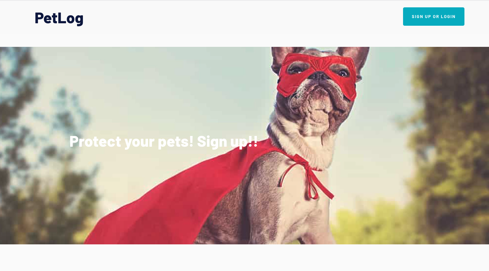　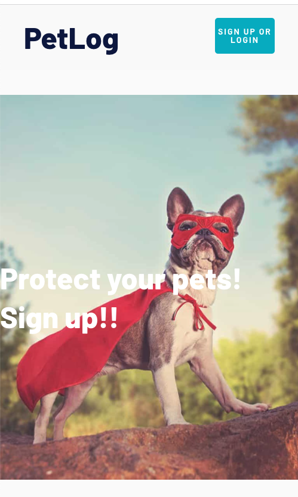
画面幅を小さくしても、変更前ほどテキスト表示に使っている幅が狭まらなくなりました。（20%に戻しておいてください。）

---

`Apply a max width when the page is streached`：これはelementの最大幅です。画面幅を広げていくと、合わせてelementも伸びていきますが、ここで指定したサイズ以上に大きくはなりません。
試しにテキストの設定で、チェックをつけて、100%にしてみください。

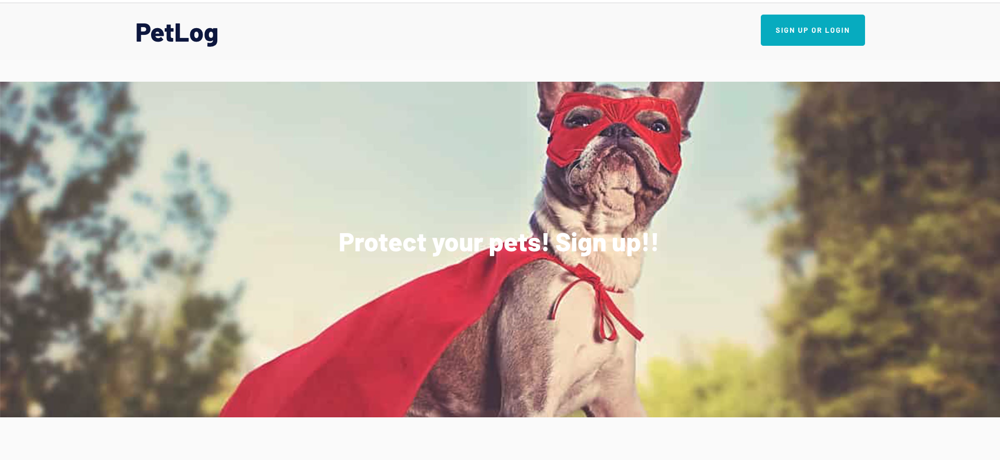　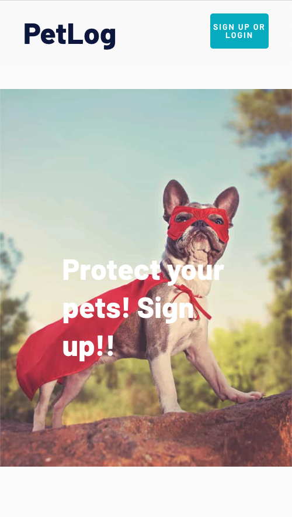
画面を大きくしていくと、elementが伸びないので、文字が左によらなくなりました。
（この設定はそのままにしておきましょう。）

---

次に、画面幅を変えた場合の配置についても解説しておきます。

人によってキャッチコピーは、画面を大きくすると左や右にずれているのではないかと思います。

画面幅が伸びたときのelementの配置は、元の相対位置できまります。
もともと真ん中に見えていて、気にならないくらいでも右や左にずれていると、画面が大きくなったときにそれが目立つようになります。

確実に真ん中に配置したい場合は、先週やった右クリック（もしくは二本指でタップ）して、`Center horizontally`を指定しましょう。

---

ここですね。
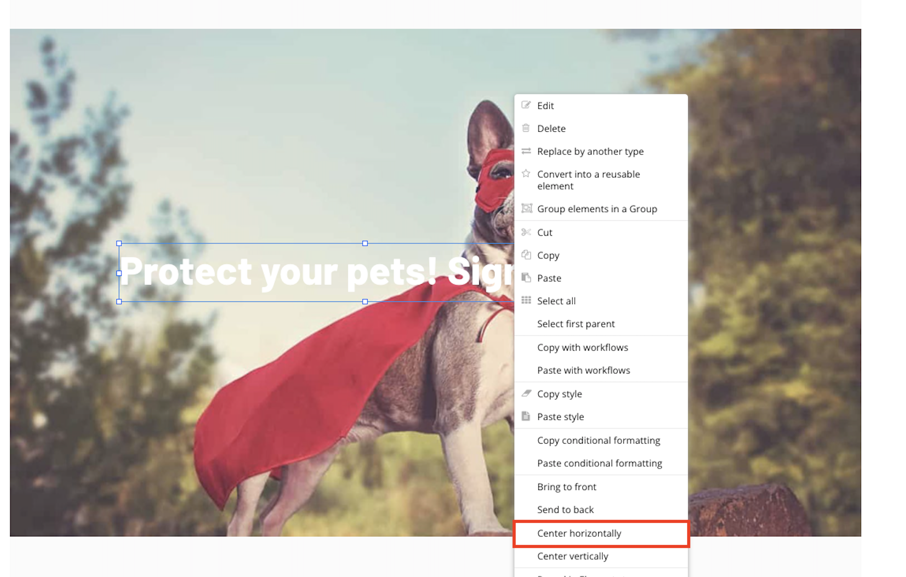

---

## 以上が、伸び縮みの制御の基本になります

要素毎にこれらの設定を使いながら意図した見た目になるように調整していくのでしたね。

- `Make this element fixed width`
- `Minimum width`
- `Apply a max width when the page is streached`

あと、中央寄せなど相対位置には注意が必要というところもお忘れ無く。


---

## 折り返す／折り返さない、表示する／表示しない

続いて、詳細画面で折り返す／折り返さない、表示する／表示しないという制御をいれていきます。

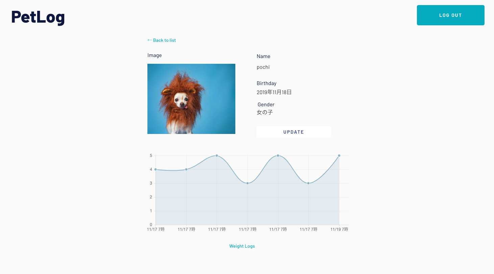　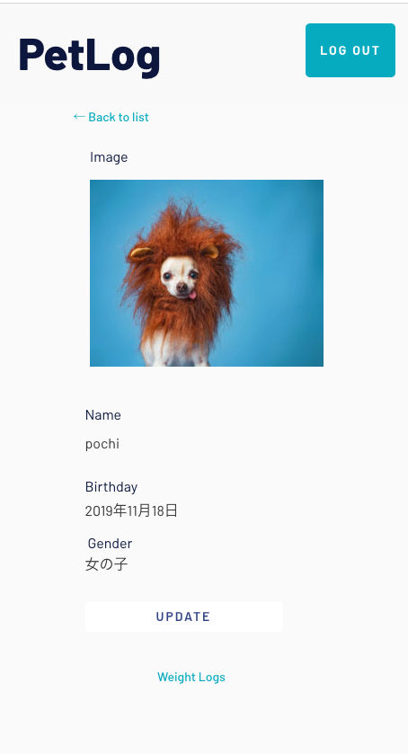

---

現状、pet_detailは画面幅にかかわらず、縦組みで要素が並んでいますが、
PCの画面幅を活かしきれていません。

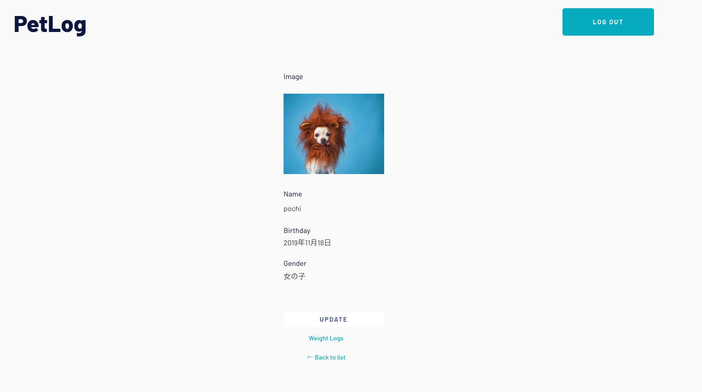

---

## 画像とそれ以外の情報とを列を分けて表示します。

- `Image`のテキストと画像を選んで左側に移動させる
- `Name`のテキストから`UPDATE`ボタンまでを選んで右上に移動させる
  - `Gender`の下に空のテキストボックスがあるのでお忘れなく
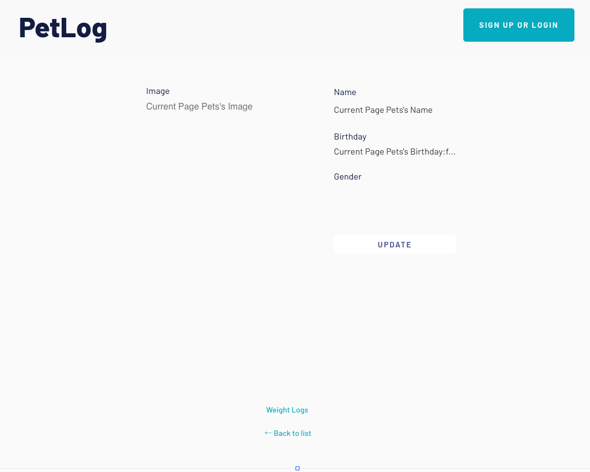

---

## プレビューしてみましょう
配置や折り返し方が、うまくいかないと思います。
各Elementがそれぞれで相対位置を決めたり、折り返したりしてしまうためです。

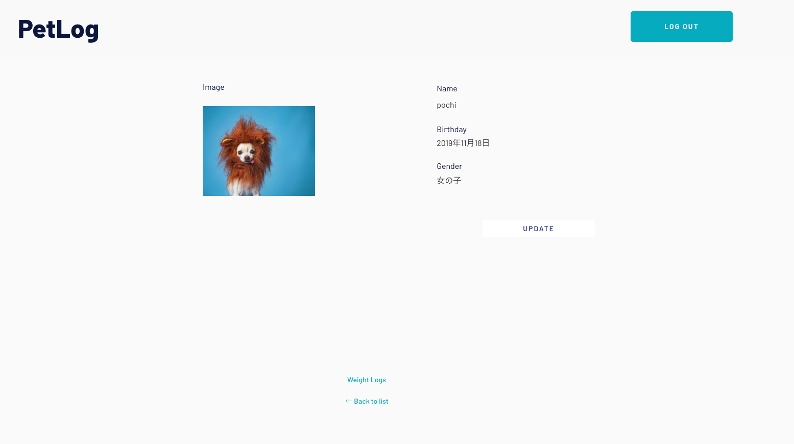　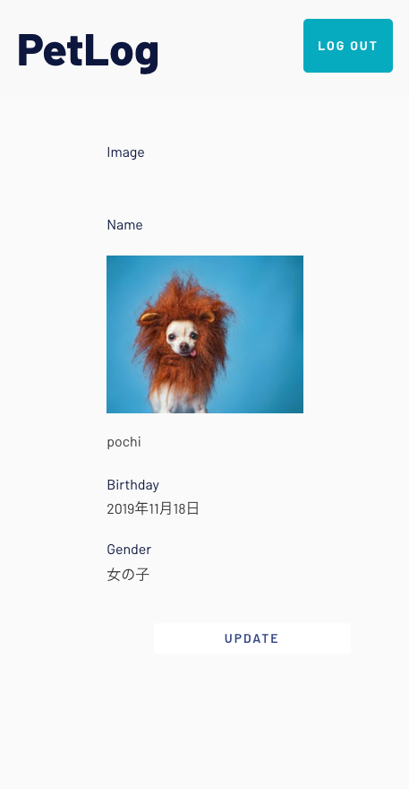

---

## TIPS

詳細画面を何度もプレビューするときは、ブラウザのリロードで表示するとリスト画面で選び直す必要がなくて便利です

---

## グループを作る
折り返しや配置を行いたいまとまりごとにグループをつくることで、うまく制御できるようになります。

- `Image`のテキストと画像を選んで、右クリック（二本指タップ）し、`Group elements in a Group`を選択
- グループのサイズが要素にぴったりくっついていますが、後で選びやすいように少し大きく広げておきましょう。

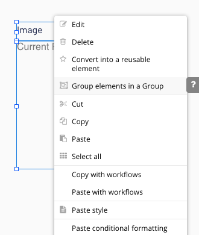

---

`Image`のテキストと画像の両方を囲む四角ができます。

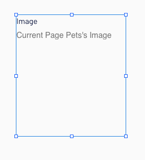

---

ちなみにですが、左側のメニューからGroupを選んで配置するということもできます。
ただ、Groupを配置した後に、その中に要素を置き直すということをしないといけないです。

配置済みの要素をGroupにいれたい場合は先述の方法が楽です。

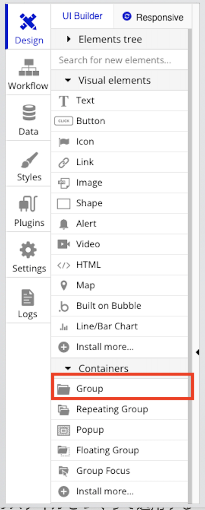

---

- `Name`のテキストから`UPDATE`ボタンまでを選んで、右クリック（二本指タップ）し、`Group elements in a Group`を選択
  - `Gender`の下に空のテキストボックスがあるのでお忘れなく
- グループのサイズが要素にぴったりくっついていますが、後で選びやすいように少し大きく広げておきましょう。

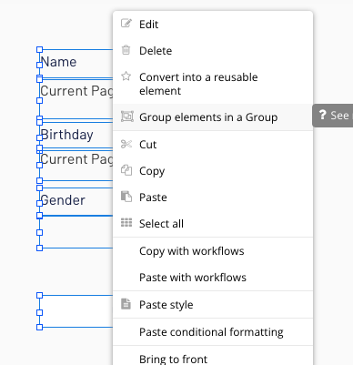

---

`Name`のテキストから`UPDATE`ボタンまでを囲む四角ができます

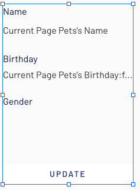

---

## プレビューしてみましょう

配置はまだ微妙ですが、折り返しはまとまって折り返されるようになったと思います。

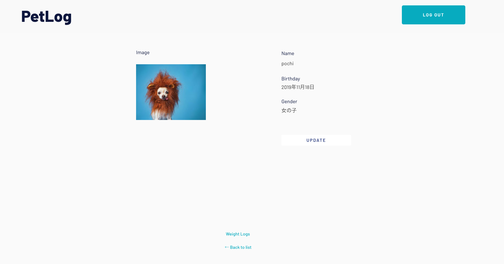　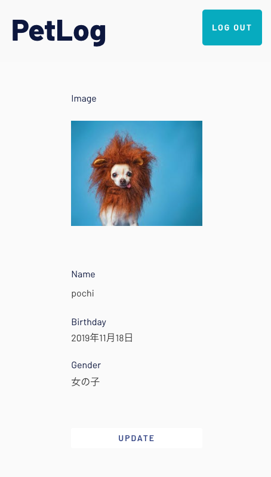

---

画像や名前などは画面は合わせて中央によせたり、画面幅が広がっても離れないようにしたいので、これらもひとまとまりで制御したいです。
ということで、画像のグループと名前などのグループも、さらにグループで囲ってしまいます。

2のグループを選んで、右クリック（二本指タップ）で`Group element in a Group`を指定してください。

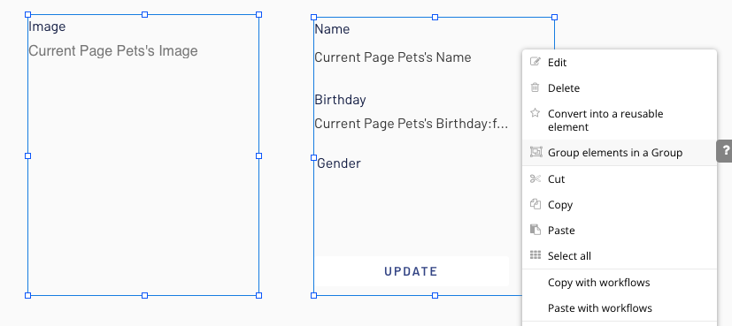

---

ここで伸びる／縮むの制御の時に学んだ知識をつかって、
意図した配置になるように設定します。

- 全体を囲んだグループを選択して、`Apply a max width when the page is stretched`にチェックする
- `Minimum width`に50を指定します。
- `Maximum width`に100を指定します。


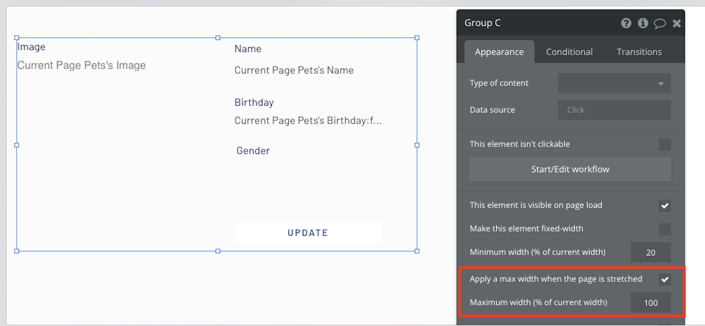

---

さらに、全体を囲んだグループを選んで右クリックして、`center horizontally`を指定しましょう。

これでグループのまとまりとして、画面幅が変わっても、画面中央に配置されるようになります。

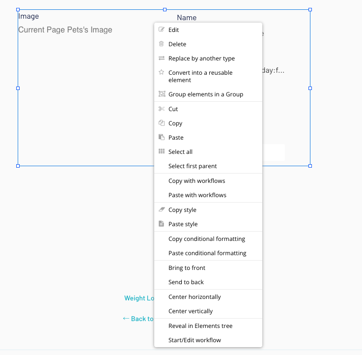

---

## プレビューしてみましょう
いい感じですね。

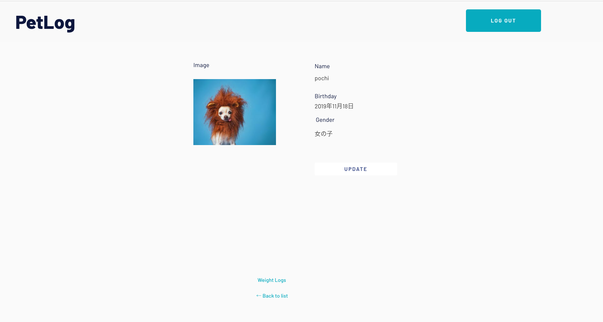　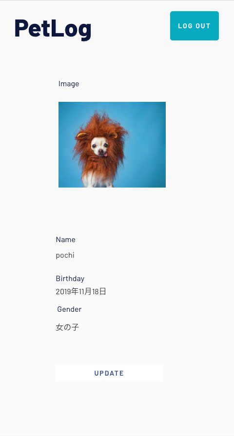

---

画像のグループと名前などのグループのそれぞれに対して、以下の設定をいれましょう。
- `Make this element fixed-width`をはずす
- `Minimum widht`に99を指定

---

## 次に体重のグラフをもってきます

- pet_weight_registerの画面で、グラフをクリックしてコピーする
- pet_detailの画面に貼り付ける
- 画像や名前などの下に配置して、横にひろげる
- 右クリックして、`center horizontally`

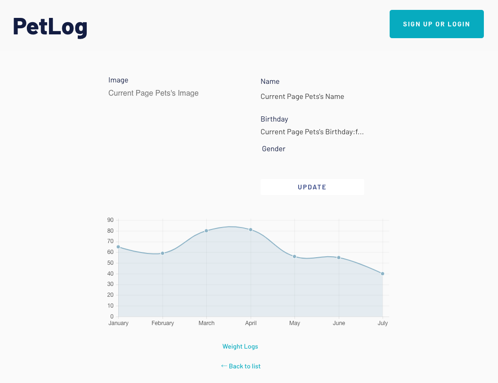

---

## プレビューしてみましょう

スマホで1画面にグラフまで出すと窮屈ですね。

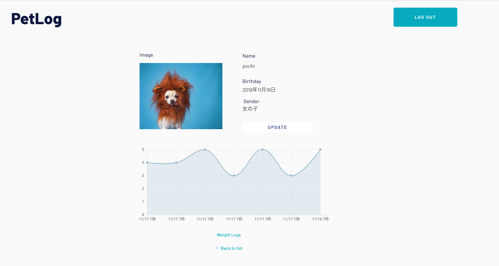　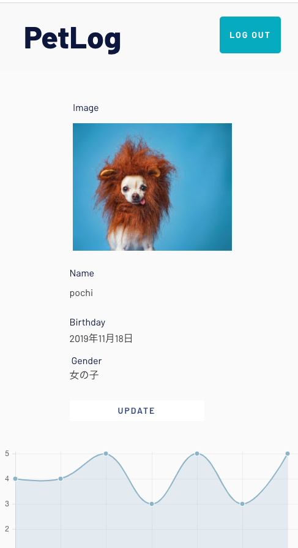

---

## レスポンシブウェブデザイン用のビューを開きます

左側メニューの`Responsive`という部分をクリックしてください

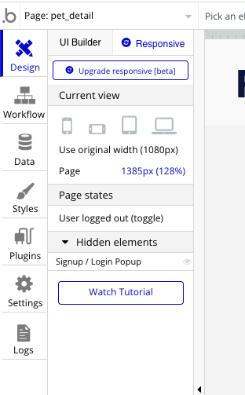

---

画面上部に目盛りがついた画面が表示されます

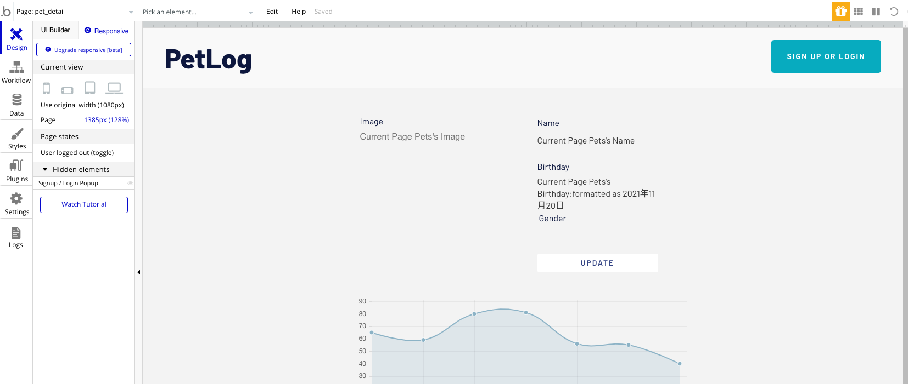

---

目盛りの端をつまんで画面幅を擬似的に小さくすることができます

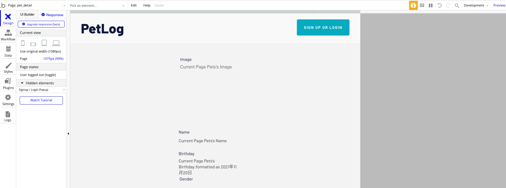

---

名前などが折り返すタイミングでは、グラフは表示されないようにします
- 画面の幅をゆっくり移動させていき、名前などのグループが折り返したところで止める
- その状態でグラフをクリックする
- `Add hiding rule`をクリック
- `Save`をクリック
  - 折り返したタイミングで目盛りを止めていますので、その横幅を条件にしてくれています
- 再度目盛り

---
こんな感じ
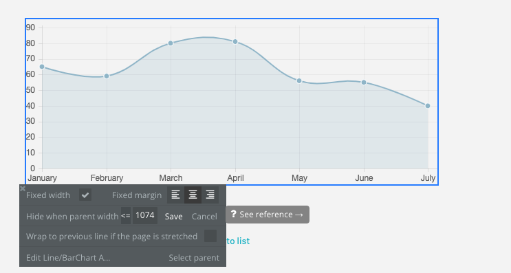

再度目盛りを動かして動作を確認できます。

---

## プレビューしてみましょう

わーい
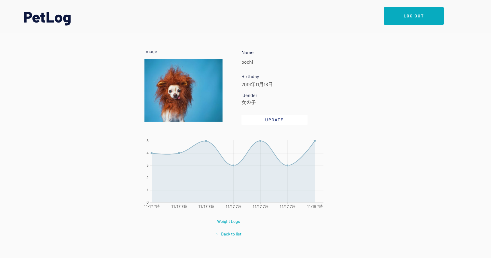　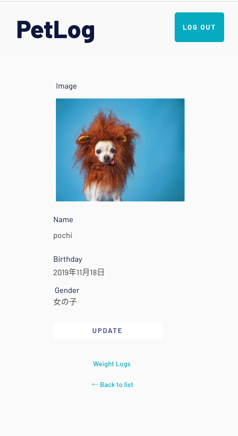

---

細かな調整ですが、戻るリンクが一番下にあるとスマホで使いにくいので、上に持って行きます。

- 全体を囲むグループを少し上にひろげる
- リンクをグループの左上に寄せて配置する
- こうすることで画面を広げた時にも、全体グループに適用した`Max Width`が効いて端によりすぎたりしません

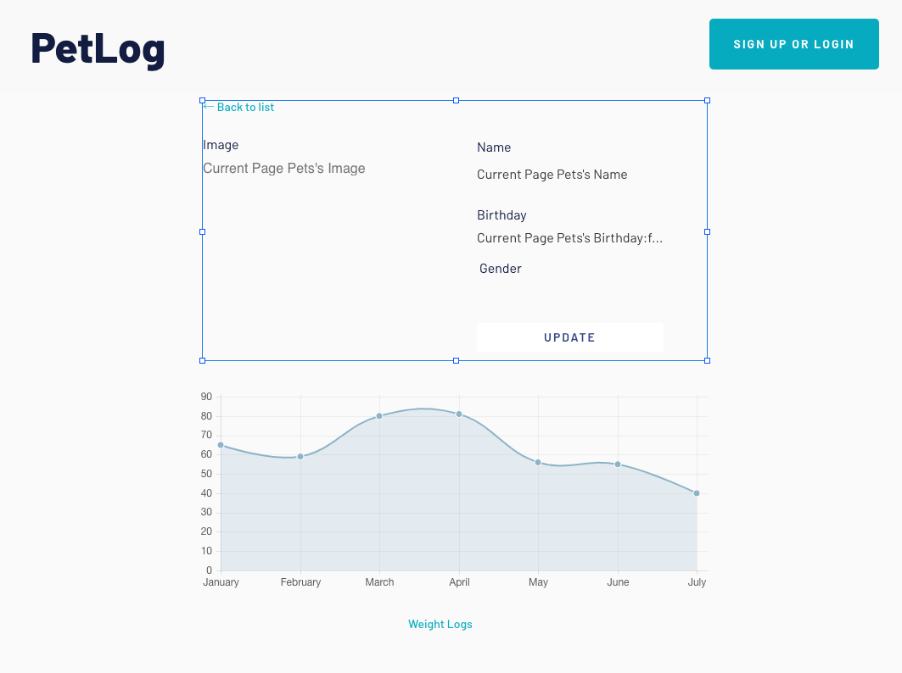

---

## プレビューしましょう

　

以上が、折り返す／折り返さない、表示する／表示しないの制御になります。
延ばす／縮めるの復習にもなりましたね。

---

## Styleを使ってみよう

---

## Styleを使ってみよう

- これまではBubbleが標準で用意してくれていたスタイルを利用してきました
- 実際のプロダクトでは、プロダクトにあったデザインコンセプトを描き適用していきます
- ここからスタイルを変更する方法を説明します

---

## Styleの適用方法には大きく3つあります

- 既存のスタイルを編集する
- 個別でスタイルを適用する
- 新しいスタイルを追加する

順にやっていきましょう

---

# 既存のスタイルを編集する

既存のスタイルを変更して、ボタンやリンクの色を変更したいと思います。
私は犬ちゃんマンのイメージにあわせて、赤にしたいと思います。

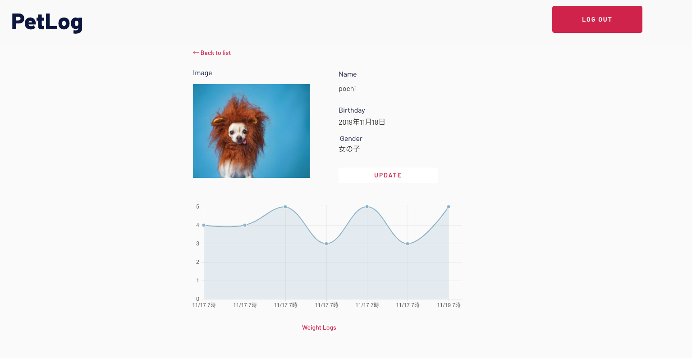

---

# TIPS

Bubbleでは、よく使う色はアプリケーションの設定でパレットに設定できるようになっています。

- 左メニューの`Settings` > 画面上部のタブで`General`と選択
- 画面下側の`Color palette`に移動

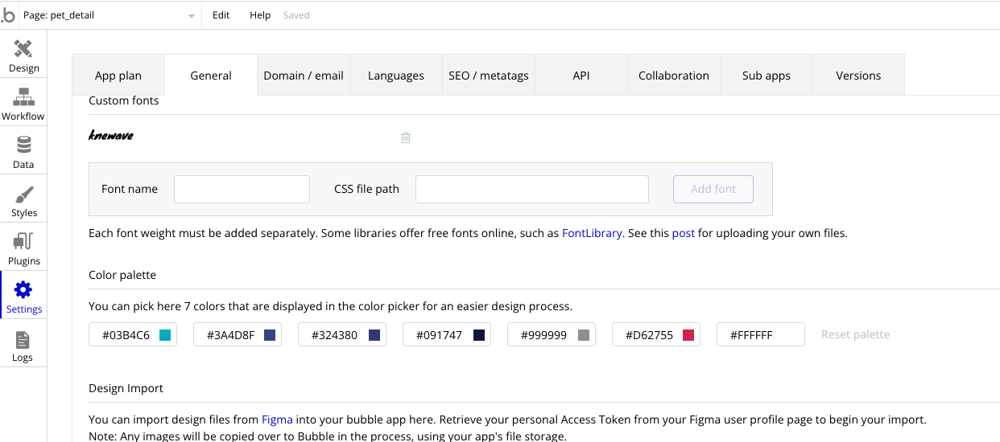

---

私はもともと設定してある`#D62755`の赤でボタンやリンクを変えようと思っています。
後で詳しく説明しますが、ボタンをホバーした時に少し暗い赤も欲しくなるので、ここで少し暗い赤も設定しておきます。私は、`#B32246`の赤をパレットに追加します。

みなさんも、基調にする色とそれを少し暗くした色を追加してみてください。

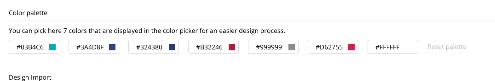

---

では、スタイルを設定します。左メニューの`Styles`を開いてください。

まずはざっとながめてみましょう。今まで使ってきたスタイル設定もちらほらありますね。

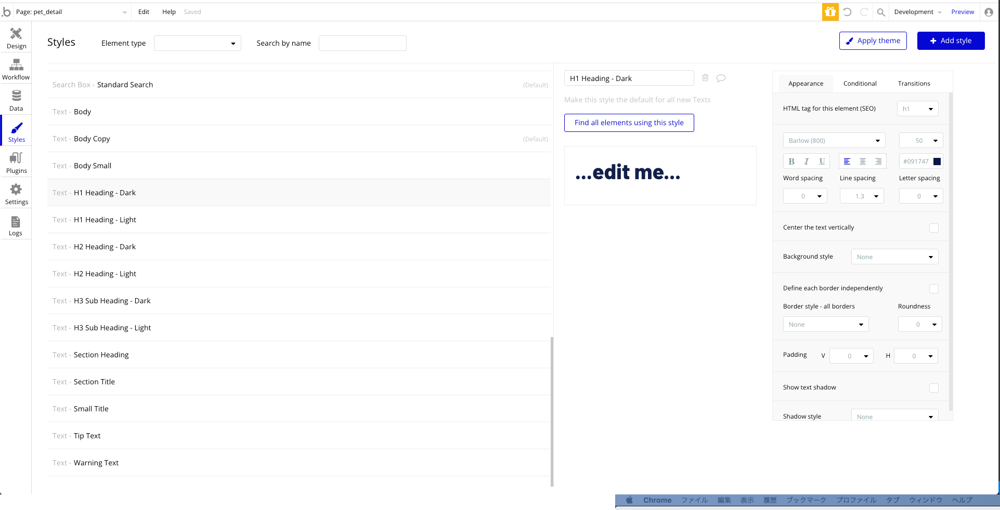

---

ボタンの色を変えます。

- 画面上部のElement typeから`Button`を選択
- `Primary Button`を選択
- 画面右側のColorをクリック
- カラーパレットから自分が決めた基調色を選択

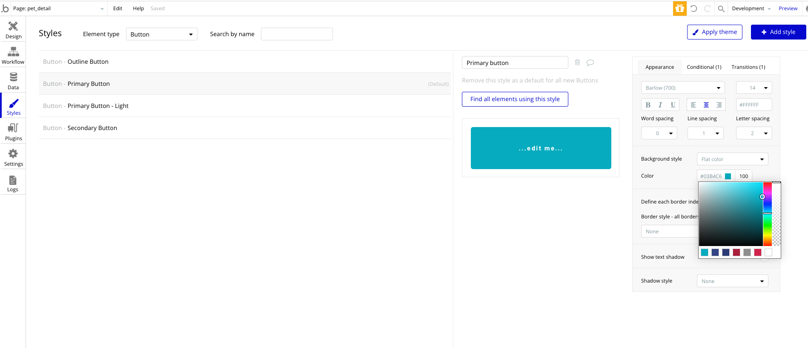

---
### プレビューしましょう

ボタン色が赤になりました。

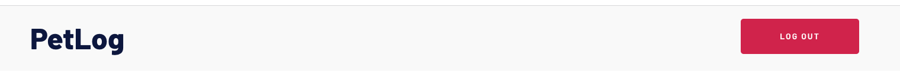

ただ、マウスオーバーすると、緑（青？）になっちゃいますね。
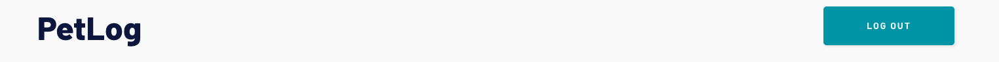

マウスオーバー時の色は別で指定されているためです。

---

- StylesのPrimaryボタンの設定に戻ります
- 画面右側のConditionlを選びます
  - ここに特定の条件を満たした場合に適用されるスタイルが指定されています
  - ホバーされたときに色を変えるという指定がされていますね。
- この色を先ほど決めた基調色を少し暗くしたものを指定します。

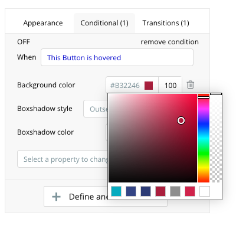

---

### プレビューしましょう

ホバーなし
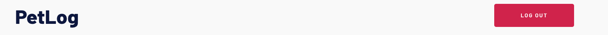

ホバー
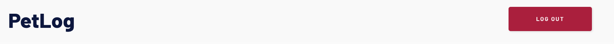

いい感じですね。

---

同様にして、`Primary Button`のフォントカラーも基調色に変えます

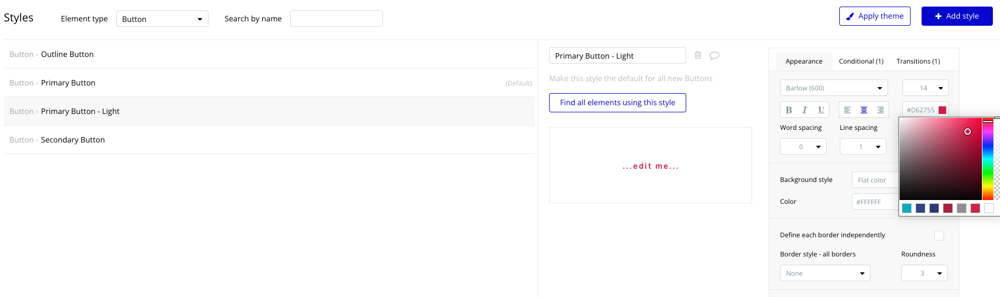

---

さらに、`Standard Link`のフォントカラーも変えちゃいます

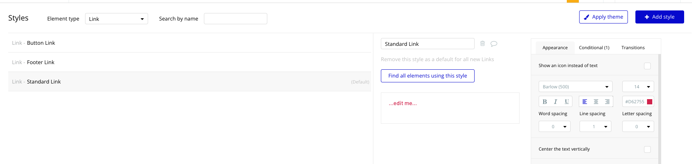

---

## プレビューしましょう


各所に基調色があたっていますね。


---

## 次に、個別でスタイルを指定してみましょう

ヘッダーロゴを基調色にあわせつつ、フォントももう少しかわいらしい感じにしたいと思います。

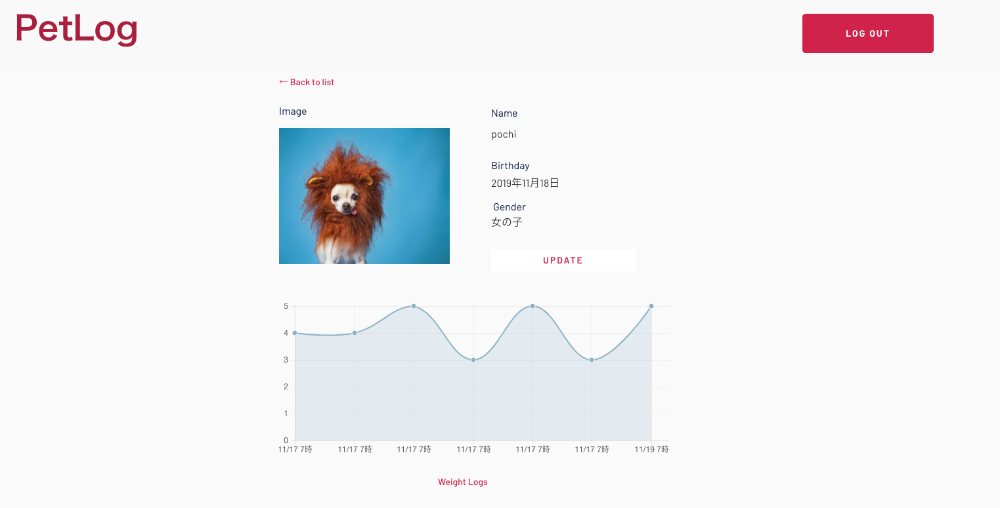

---

bロゴ右のメニューを開いて、Headerを選びます

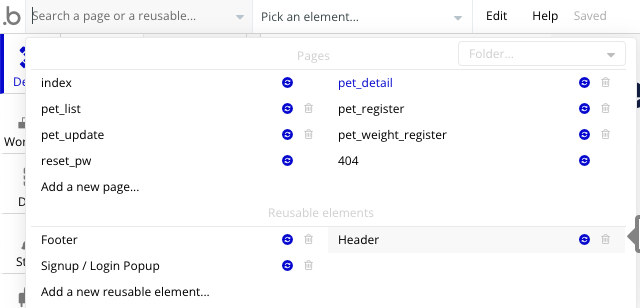


---

- ロゴをダブルクリックして、設定を開く
- 設定中断の`Style`の部分に移動する
- プルダウンの右下あたりの`Remove style`をクリック
  - 定義されたStyleを適用するのではなく、個別で指定できるようになります

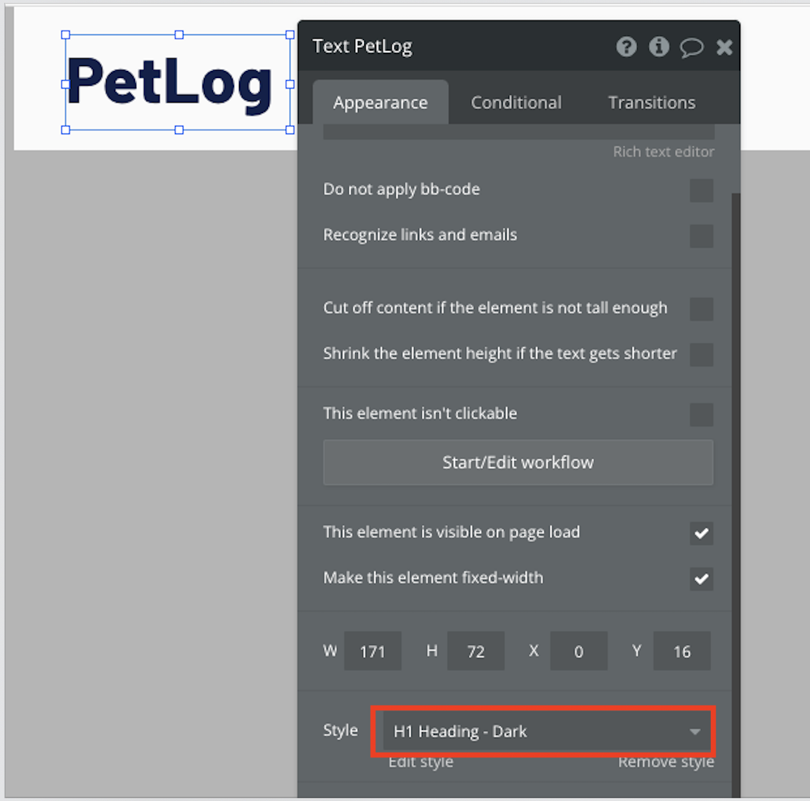

---

好きなスタイルを指定しましょう
- 私はフォントカラーは、パレットにいれておいた基調色を少し暗くした赤
- フォントは`Noto Serif Devanagari(800)`が気に入ったので、それを指定します
- フォントを変えると、ロゴが見切れたりすることがあるので、幅は適宜調整してください

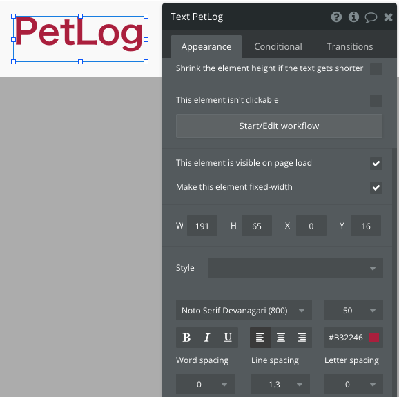

---
## プレビューしましょう

変わりましたね。


---

## 次は、新しいスタイルを追加してみましょう

ラベルと内容が同じスタイルで区別しにくいのが気になるので、
ラベル用のスタイルを作っちゃおうと思います。

TODO：あとで画像を差し込む

---

まずは個別にスタイルを指定します。

- pet_detailを開いて、`Image`テキストをダブルクリックして、設定を開く
- `Style`のプルダウン右下の`Remove style`をクリック

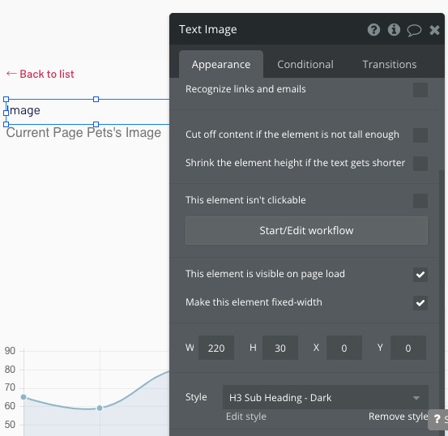

---

以下の設定にします
- フォントは`Barlow(600)`
- フォントサイズは`12`
- `Center the text vertically`にチェック

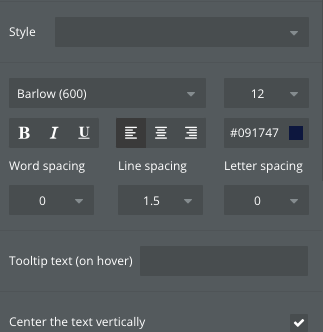

---

続いて、指定した個別のスタイルを共通のスタイルとして定義します

- そのまま`Image`の設定の中で、`Style`のプルダウンを開く
- 一番下の`Create a new style..`をクリック

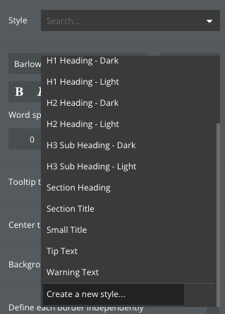

---

- Style名に`Label`と入れる
- Element styleは`Text`のまま、テキストElementのスタイルであることを示しておく
- Use style ofは`Text Image`のまま、`Text Image`の元としてスタイルをつくります

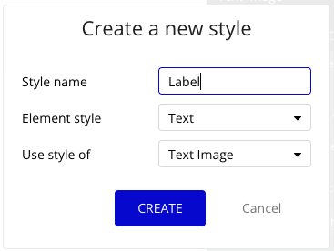

---

スタイルにLabelが指定されるようになっているはずです。

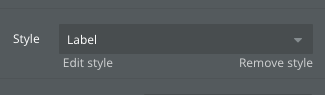


個別に指定したスタイルを共通のスタイルとして定義するのではなく、
先にスタイルを定義する方法もありますが、個別でスタイルを
指定したものを共通のスタイルとして設定する方が
デザインビューでイメージを確認しながらつくれるのでやりやすいです。

---

では、定義したスタイルを他のラベルにも適用していきましょう。

- pet_detail: Name, Birthday, Gender
- pet_register: Image, Name, Birthday, Gender
- pet_update: Image, Name, Birthday, Gender
- pet_update: Image, Name, Birthday, Gender
- pet_weight_register: Weight

ちょっと多くて手間ですね。

最初からスタイルを分けていたら、一カ所のスタイルを変更するだけで済んだので、意味合いが異なる画面要素がでてきたら、スタイル定義しておくということを意識しておくとよいでしょう。

----

## プレビューしましょう

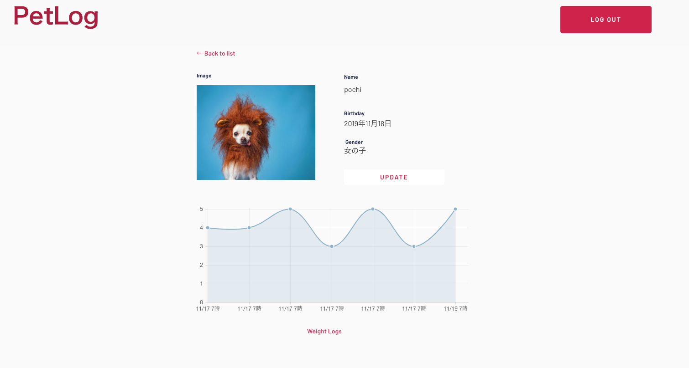

Styleについては以上です。

---

## ロジックを作りこむ

---

## ロジックを作りこむ

アプリケーションには様々なところにロジックが埋め込まれています。

- 画面操作に対するフィードバックを返す
- データを抽出、加工する
- 画面を権限によって切り替える　など様々です

Bubbleでも様々なところにロジックを埋め込めるので一緒にやっていきましょう。

---

## 画面操作に対するフィードバックを返す

---

## 画面操作に対するフィードバックを返す

Bubbleでは画面要素に対してロジックを埋め込めます。
画面操作に対するフィードバックを作り混むのに使えます。

ペットリストにホバーしたら、赤枠が付くような動きをつけてみましょう

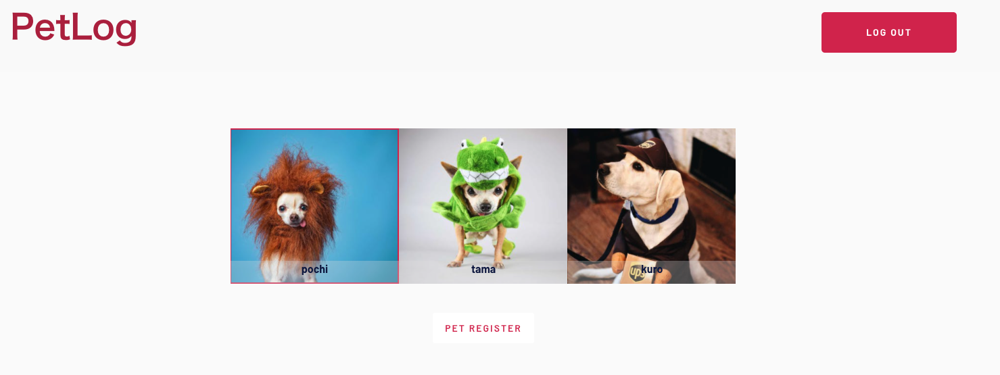

---

画像Elementにロジックを埋め込んでいきます
- pet_listを開く
- ペット画像の画像Elementをダブルクリックして、設定を開く
- タブから`Condition`を指定する
- `Define another condition`ボタンをクリックする

先週も少し触れましたが、ここで条件と条件に合致した場合にプロパティを同変更するかを定義できます。

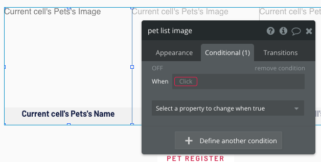

---

まずは何に関する条件が指定できるか見てみましょう。

- 該当の画像Elementやその親要素や画面内の他の要素
- ログインユーザー
- 新規でのデータ検索
- 現在、日付や現在位置、ページ幅、スクロール位置など現在の状態

という具合に、なんかいろいろな条件が指定できそうなのがわかると思います。

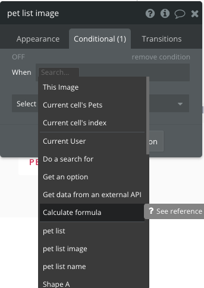

---

今回は単純に該当の画像`This Image`を選択しましょう.

すると、次は画像の状態がならびます。ここもいろいろありますが、今回は`is hovered`を選択してください。

これで、該当の画像がホバーされたらという条件になります。

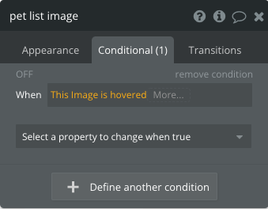

---

次に条件に合致した場合に、どのプロパティをどう変更するかという指定をします。
`Select a property to change when true`をクリックして、中を眺めてみましょう。

- 画像のソース、alt属性
- クリックできるか、ボーダーなど

いろいろ変更出来そうだというのがわかります。
ここに並ぶものはElementの種類によって異なります。

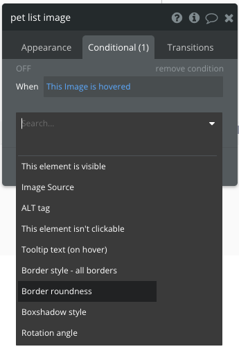

---

今回はホバーされたら、赤の枠線が付くようにします
- `Border style - all borders`をクリックする
- `None`となっている箇所を`Solid`に変更する
- 枠線が`なし`と指定されているのを`実線を表示`に変更しているという意味になります。

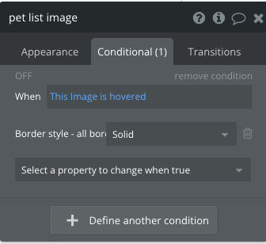

---

- `Select a property to change when true`を選ぶ
- `Border coloer - all borders`をクリックする
- 色を指定できるようになるので、基調色を選ぶ
- 同様にして次は、`Border width - all boarders`を指定し、`2`を設定する

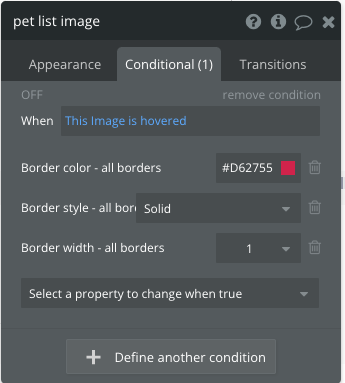

以上で設定完了です。

---

## プレビューしましょう

ホバーしたら、赤枠がでるようになりました。


こうやって、ユーザー操作に対してわかりやすいフィードバックを返したり、画面の装飾を状態によって切り替えたりといったロジックを埋め込んで、プロダクトを作りこんでいくことができます。

---

## データを抽出、加工する

---

## データを抽出、加工する

特定のデータだけを抽出したり、取得したデータを加工や計算して出したりすることができます。
ペットのイニシャル、年齢、最新の体重を表示するようにします。

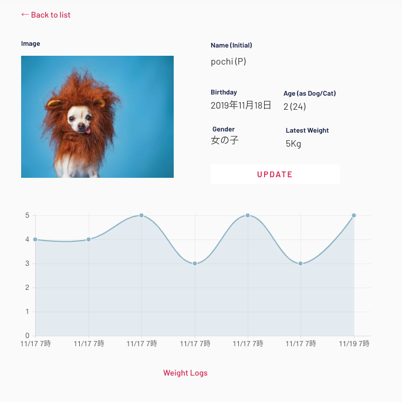

---

## 事前準備

これから要素を追加していくので、Name、Birthday、Genderの幅を縮めておきましょう。
- pet_detailで、Nameをダブルクリックして設定を開く
- Shiftを押しながら、NameのラベルからGenderのテキスト要素までを選ぶ
- W(幅)に`110`を指定する
- `Apply changes to elements`ボタンを押す

画面が崩れてしまっていないか、一応プレビューで確認してください

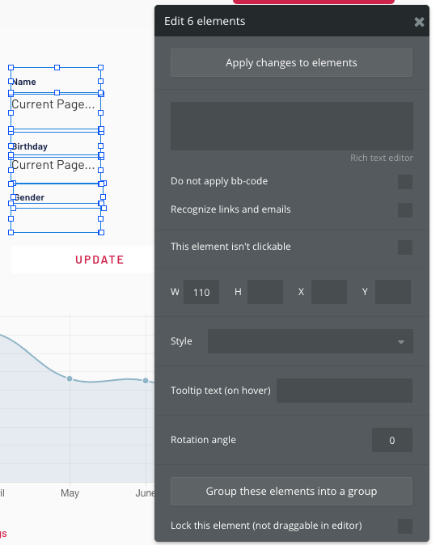

---

## まずはイニシャルを表示します

- Nameのラベルの中身を、イニシャルを含むというのがわかるように`Name (Initial)`に変更する
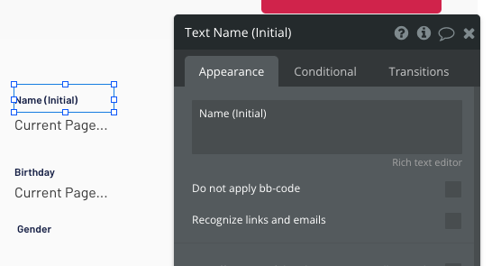

---

- Nameの内容を出しているテキストを選択する
- テキスト入力欄の文字がない部分をクリックして、フォーカスをあてる
- ` (`と入力する
- `Insert dynamic data`を選択する
- `Current Page Pets`>`'s Name`を選択する
- `More...`と薄く出ているはずなので、クリックする

ここで様々な加工方法が選択できます。眺めて見ましょう。

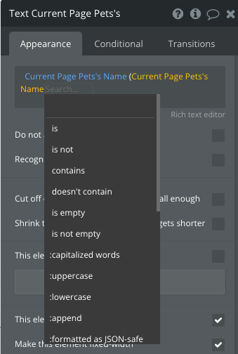

---

- `truncated to`を選択する
  - これは指定された文字数までを切り取るという意味になります
- `1`と入力して、Enterキーで確定する
- また`More`と出るのでクリック
- `:uppercase`を選択する
  - これは大文字に変換するという意味なります
  - （日本語名をつけている方にとっては意味がないですが）
- テキスト入力欄の文字がない部分をクリックして、`)`を入力する

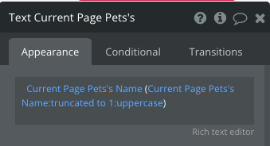

---

## プレビューしましょう

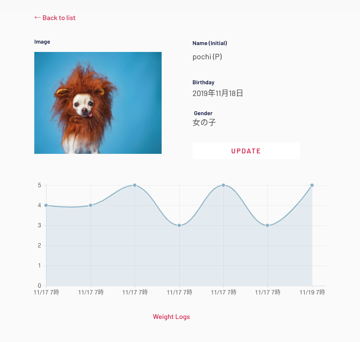

---

## 最新の体重を表示します

- Birthdayのラベルとテキストをコピー＆ペーストして配置しましょう
- ラベルを`Latest Weight`に変更しましょう

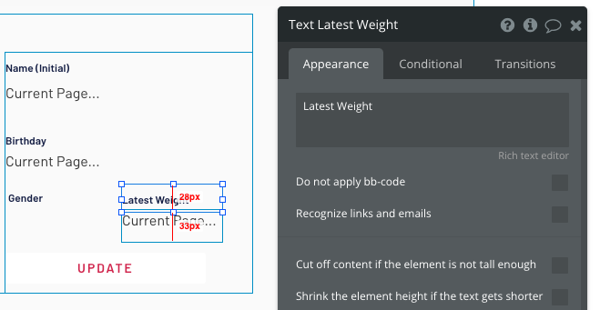

---

- Latest Wightの中身を出すテキストの設定を開いて、テキスト入力エリアを空にします
- フォーカスをあてて、`insert dynamic data`をクリックします
- `Do a search for`をクリックします
  - データを検索するという意味ですね

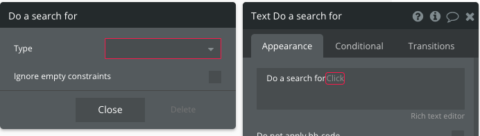

---

現在ページで表示しているペットの体重を取得するという指定をします

- `Type`に`PetWeightLogs`を指定する
- `Add a new constraint`ボタンをクリックする
- 条件入力欄が現れるのでクリックして、`pet`、`=`、`Current Page Pets`の順に指定する

様々な条件で取得ができるので、どんな条件があるのか眺めておきましょう

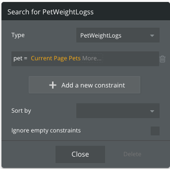

---

作成日の降順、すなわち新しく作られたもの順に並べるという指定をします

- `Sort by`に`Created Date`を指定する
- `Descending`に`yes`を指定する
- Closeする

並び順の指定は忘れがちですが、重要なことが多いです。

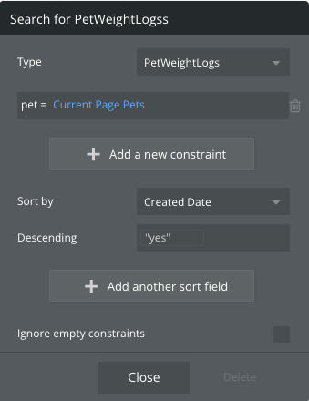

---

最新の1件の体重を表示します
- テキスト入力欄の`More`をクリックして、中身を眺めましょう
- 最初の1件目を取得したいので、`:first item`を指定する
- 続いて、`'s WeightKg`を指定する
- 空白部分をクリックして、`kg`と入力する

以上で、最新の体重の設定は完了です。
データ抽出、リスト加工の方法として覚えて起きましょう。

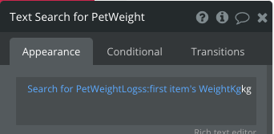

---

## プレビューしましょう。

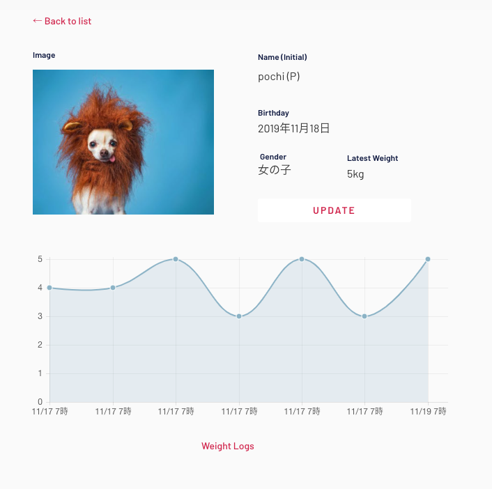

---

## ちょっと横道にそれて、
## 数値のMore、日付のMoreを眺めてみましょう。

Bubbleでは数値や日付についても、様々な加工・計算方法が提供されています。

---

## 年齢を計算する

次は年齢を出します。先ほど見たとおり、数値や日付の加工・計算はできるのですが、ちょっと年齢計算は難しそうなので、直接コードを埋め込んで実現しようと思います。

Bubbleではpluginを導入することで、javascriptというプログラミング言語を使った簡易的な処理を動作させることができます。

---

javascriptのコードを埋め込むためには、`Toolbox`というプラグインを利用します。
インストールしましょう。

- 左メニューの中の`Plugins`を指定
- 検索用のテキストボックスに`tool`と入力（検索には少し時間がかかる）
- 検索結果の一番上にでてくる`Toolbox`の`Install`ボタンを押す

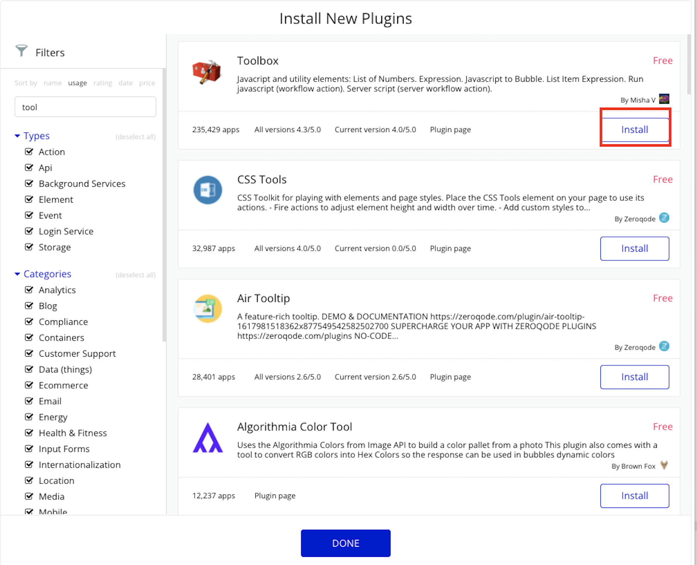

---

Toolboxでのコードの埋め込み方は大きく2つあります、今回は以下の2通りを紹介します

- Workflow上の`Run javascript`で実行／Desing上の`Javascript to Bubble`で受取
  - 複数行にわたるような複雑な処理に使う
- Design上の`Expression`で実行兼受け取り
  - 単発で終わるような処理に使う

--- 

では、年齢を計算します。
`Run javascript`／`Javascript to Bubble`で行います。まずは、pet_detail画面に、`Javascript to Bubble`を仕込んでおきます。

- 左メニューの`Visual elements`から`javascript to Bubble`を選択する
- 画面の最下部など邪魔にならない場所におく
  - javascriptの結果を受け取るためのものなので、プレビューなど実行時には表示されません

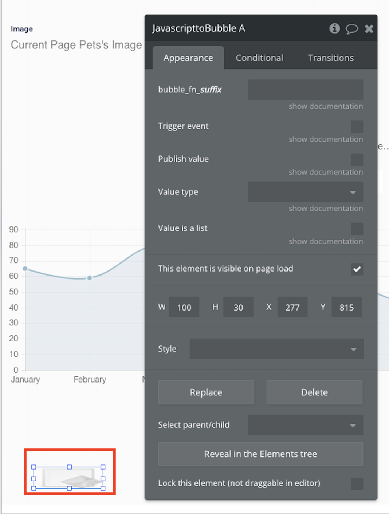

---

- `bubble_fn_suffix`に`age`と指定する
- `Publish value`にチェックする
- `Value type`に`number`と指定する

以上で、`bubble_fn_age`という関数（処理のかたまり）にjavascriptから値を渡すと、この画面要素で受け取れるようになります。

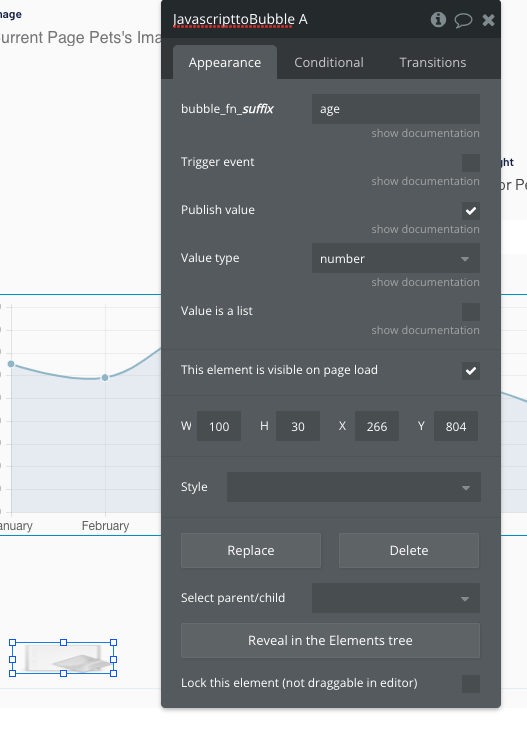

---

次にjavascriptを実行する箇所を定義します。
- 左メニューからWorkflowを選択する
- 正方形がならんでいるが、その一番右の`Click here to an event...`を選択する
- `General`>`Page is loaded`を選択する

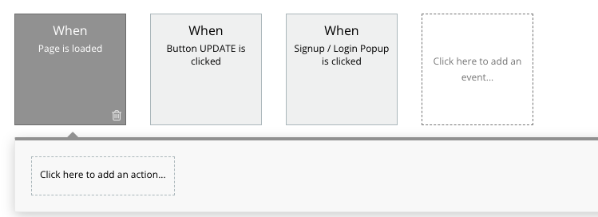

---

- `Click here to add an action...`をクリックする
- `Plugins` > `Run javascript`をクリックする
- 設定が開くので、`Script`の欄に次のページのコードを貼り付ける

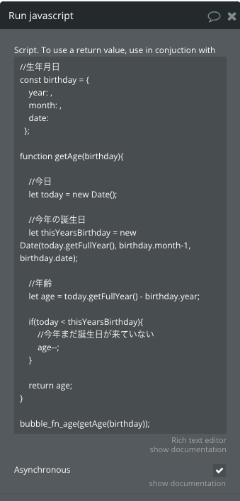

---

```
//生年月日
const birthday = {
    year: ,
    month: ,
    date: 
  };

function getAge(birthday){

    //今日
    let today = new Date();
 
    //今年の誕生日
    let thisYearsBirthday = new Date(today.getFullYear(), birthday.month-1, birthday.date);
 
    //年齢
    let age = today.getFullYear() - birthday.year;

    if(today < thisYearsBirthday){
        //今年まだ誕生日が来ていない
        age--;
    }

    return age;
}

bubble_fn_age(getAge(birthday));
```

---

3行目から5行目の、`year: `、`month: `、`date: `の後ろに`insert dynamic data`で年月日を差し込む
- `year: `の後ろ（`,`の前）にカーソルを置く
  - `insert dynamic data`>`Current Page Pets`>`'s Birthday`
  - `More`>`formatted as 11/20/21`
  - `Format type`に`Custom`を指定する
  - `Custom format`に`yyyy`を指定する
- 同様に`month: `の後ろにも、`Custom format`を`m`にして差し込む
- 同様に`date: `の後ろにも、`Custom format`を`d`にして差し込む

※入力後イメージは次のページ

---

入力後のイメージ
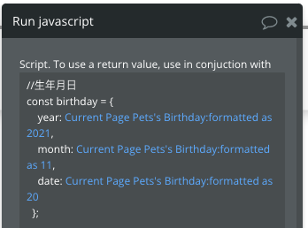

---

表示するための画面要素を配置しましょう
- Birthdayのラベルとテキストをコピー＆ペースト
- ラベルをAgeに変更
- テキストの中身を`JavascripttoBubble A`>`'s value`と指定する

---

## プレビューしてみましょう

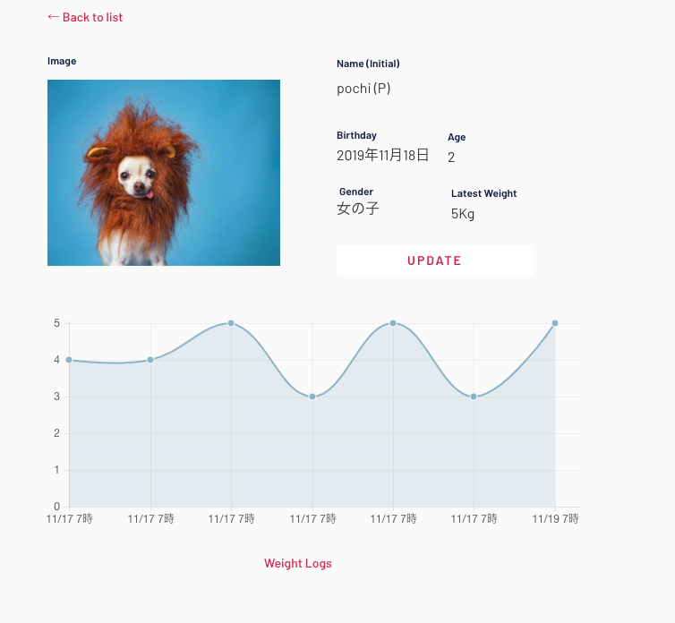

---

次に犬猫年齢に換算したら何歳かも表示しようと思います.
`Expression`を用います。

- Visual elementsから`Expression`を選択して、先ほどの`Javascript to Bubble`の横辺りに配置する
- Expressionに`24 + (`と入力する
- `insert dynamic data`で`JavascripttoBubble A`>`'s value`を差し込む
- 続きに` -2) * 4`と入力する
- Result typeに`number`と指定する

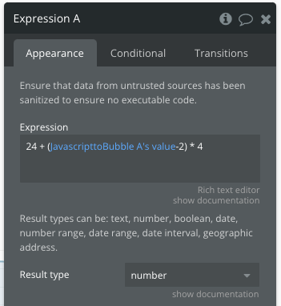

---

表示の設定をします。
- Ageのラベルを犬猫年齢も含むことがわかりやすいように、`Age(as Dog/Cat)`と変更する
- Ageのテキストの中身に元々入力されているものの後ろに` (`と入力する
- `insert dynamic data`で`Expression A`>`'s value`を差し込む
- `)`と入力する


---

## プレビューしてみましょう


---

## 画面を権限によって切り替える

---

## 画面を権限によって切り替える

ここまで、画面操作へのフィードバックやデータの抽出・加工など部分部分でのロジックの組み込みを説明してきました。

次は、もう少し大きな枠でのロジックをいれていこうと思います。

以下のことを行います。
- ユーザーをペットの飼い主（Pet Owner）とペットの飼育アドバイザー（Pet Advisor）に分ける
- 飼い主は今まで作ってきた画面・機能を利用できる
- アドバイザーはアドバイザー専用の画面・機能を利用できる

---

## アドバイザー向けの画面イメージ

TODO

---

機能開発としては以下の順番に作り混んでいきます。
- ユーザー情報に飼い主かアドバイザーかを判別できるフィールドを追加する
- ユーザー登録時に、飼い主かアドバイザーかを選択して登録できるようにする
- アドバイザーの一覧画面、詳細画面を作成する
- 飼い主かアドバイザーかによって、ログイン後・サインアップ後の画面遷移先を切り替える

手順は多くかかりますが、複数のユーザー種別を扱うプロダクトはよくありますので、ぜひ身につけていきましょう

---

## ユーザーを判別できるフィールドを追加する

まずは飼い主かアドバイザーかという役割の違いをデータ上保持できるようにします。

ペットのオスメスの時のようにテキストで保持してもよいのですが、決まった選択肢の中から指定するような値は、選択肢をあらかじめ定義して利用することで扱いやすくなります。BubbleからOption setという仕組みが提供されているので、それを使ってみましょう。

---

Optionsを設定してみましょう

- 左メニューの`Data` > タブの`Option sets`と移動する
- `New Option set`に`Role`と入力して、Createボタンを押す
- 新たなOption setとしてRoleが作成されます

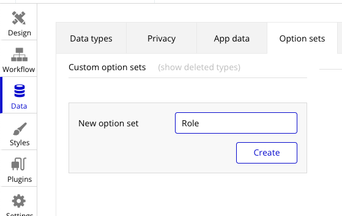

---

RoleというOption set（選択肢のセット）に、具体的なOption（選択肢）を追加していきます。今回は、`Pet Owner`と`Pet Advisor`を作成します。

- 画面右下の`New Option`に`Pet Owner`と入力して、Createボタンを押してください
- 同様に`New Option`に`Pet Advisor`と入力して、Createボタンを押してください

以上で設定完了です

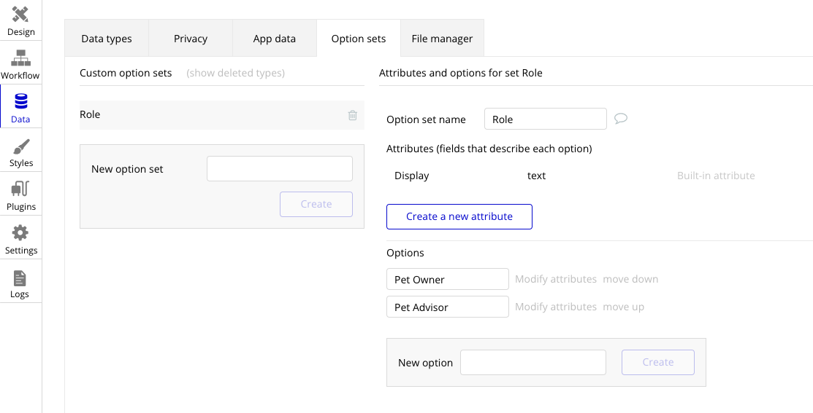

---

次はユーザーの属性として、ロールを追加しましょう

- 左メニューの`Data` > タブの`Data types`と移動する
- `User`を選択する
- 画面右下の`Create a new field`ボタンをクリックする

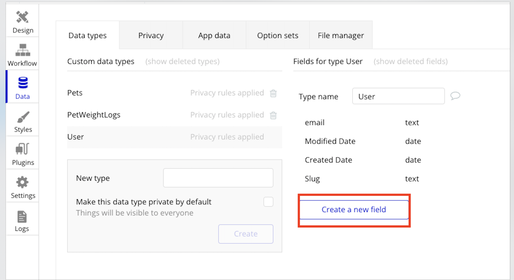

---

- `Field name`に`Role`と入力する
  - これはわかりやすいものであれば、どういう名前でも構いません
- `Field type`に`Role`を選択する
  - ここで指定しているのは先ほど作成した`Option set`としての`Role`になります。
- Createボタンを押す

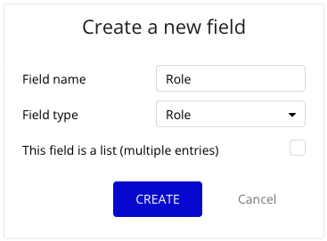

---

新しくフィールドを追加したので、既に作成してしまっているユーザーについてはRoleが空になってしまいます。後々、不整合を招きますので、既存データにパッチ（データ補正）をあてておきましょう。

- `App Data`タブ荷移動して、`All Users`を選択する
- 表が表示されるので、表の左端のペンアイコンをクリックして、1件ずつ編集する
  - 今作成されているユーザーはすべて飼い主のはずなので、`Role`に`Pet Owner`を指定する
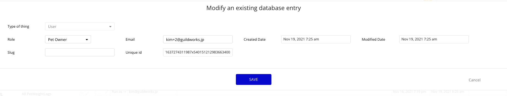

---

Usersの中のすべての行がの`Role`が`Pet Owner`になっていればOK

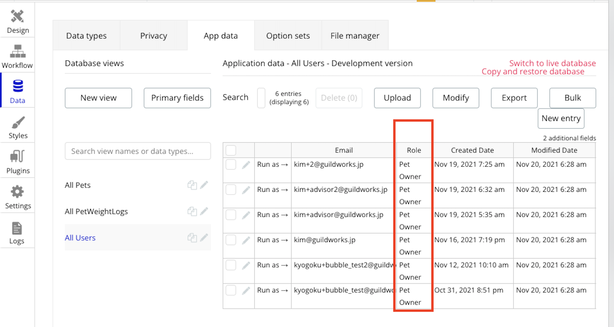

---

## ユーザー登録時にロールを指定できるようにする

では、次はユーザー登録時に飼い主なのかアドバイザーなのか指定して登録できるようにします。

登録画面はBubbleが用意しているものを使い回してきましたが、そこに手を入れます。

---

- bロゴの横のメニューから`Signup / Login Popup`に移動する
- `Design`メニューの`Input forms`の中から`Dropdown`を選択して、パスワード入力欄の下に配置する

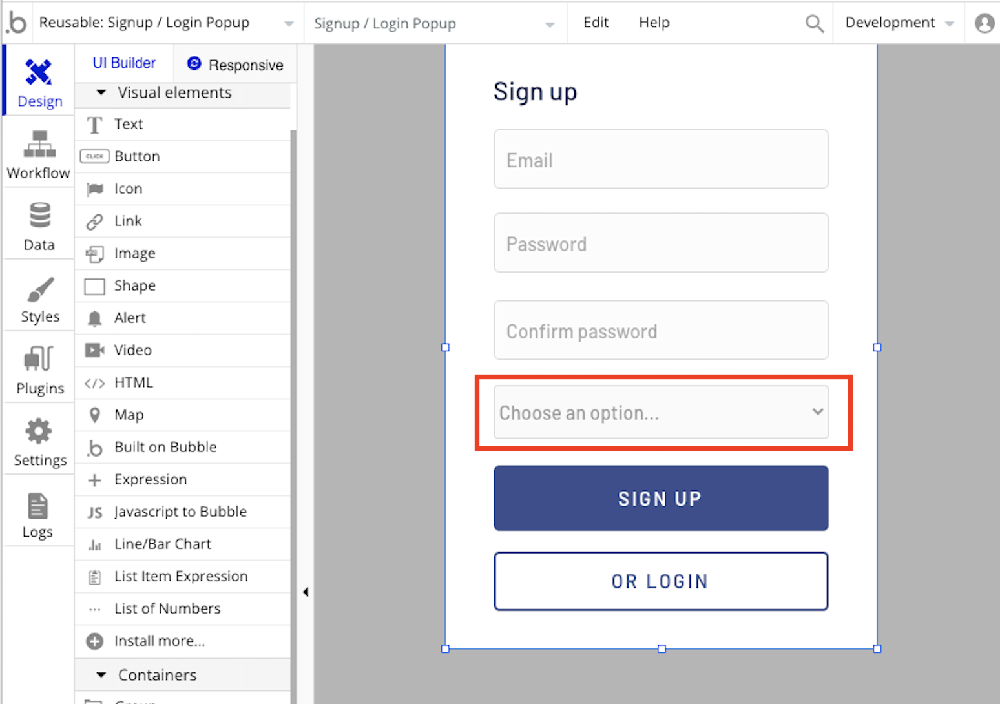

---

- Dropdownの幅は他とそろえて見栄えを整える
- Dropdownの設定は以下のとおりとする
  - Element名：`Dropdown Role`
  - Placeholder: `Choose a role...`
  - `Choice style`：`Dynamic choices`
  - `Type of choices`: `Role`
  - `Choices source`: `All Role`
  - `Option caption`: `Current option`>`'s Display`
  - `Default value`: `Pet Owner`
  - `This input should not be empty`: チェック


※画面イメージは次のページ

---

入力後イメージ
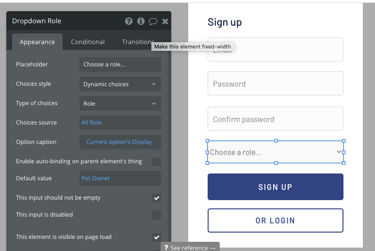

---

つづいて、入力されたRoleがユーザー登録時に設定されるようにします

- 左メニューから`Workflow` > 並んでいる正方形の中から`Button SIGN UP is clicked` > 並んでいるActionから`Sign the user up`の順に移動する
- Actionの設定画面内の`Change another field`ボタンをクリックする
- 入力欄がでてくるので、`Role` = `Dropdown Role``'s value`と選択する

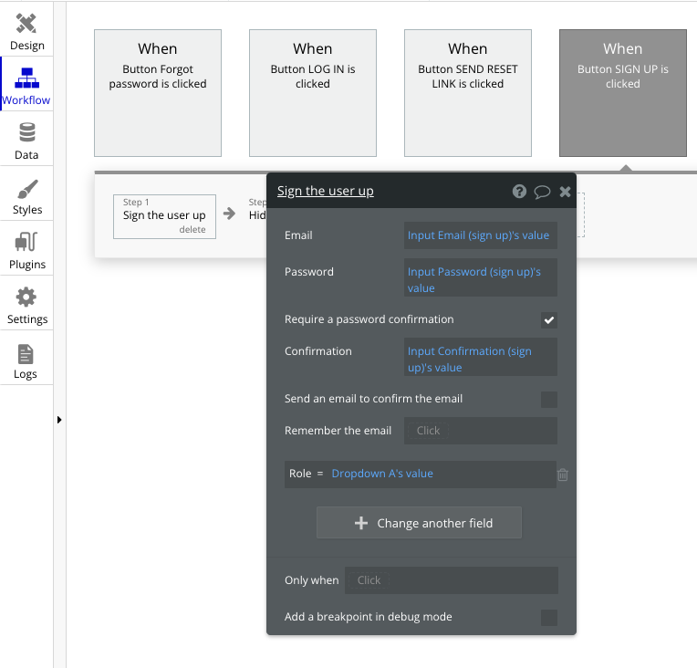

---

## プレビューと動作確認をしましょう

アドバイザーとして、アカウント登録ができた！（まだ専用画面なし）

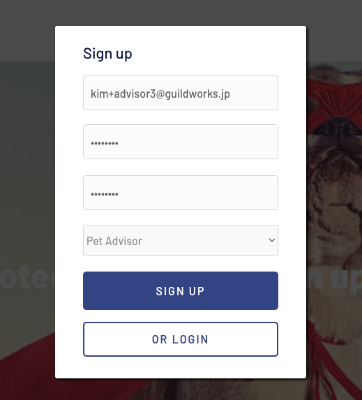
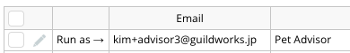

---

## アドバイザーの一覧画面、詳細画面を作成する

アドバイザーの一覧画面、詳細画面を作りましょう

- bロゴ横のメニューを開いて、`Add a new page...`
- `Page name`に`pet_list_for_advisor`と入力する
- `Clone from`で`pet_list`を選ぶ
- 新しく画面が作成される

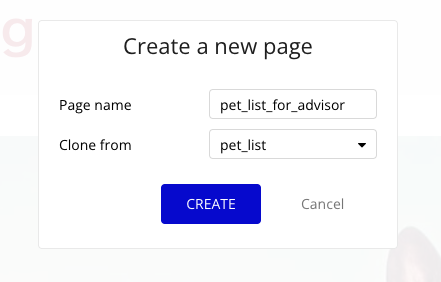

---

アドバイザーは登録されたすべてのペットを参照できるようにします。

- もともとあるリストとボタンは削除する
- `Repeating Group`を配置する
  - Type of content: `Pets`
  - Data source: `Do search for`
    - Type: `Pet`
    - Sort by: `Created Date`
    - Descending: `yes`
  - Layout style: `Full list`
  - This repeating group has fixed width: チェック
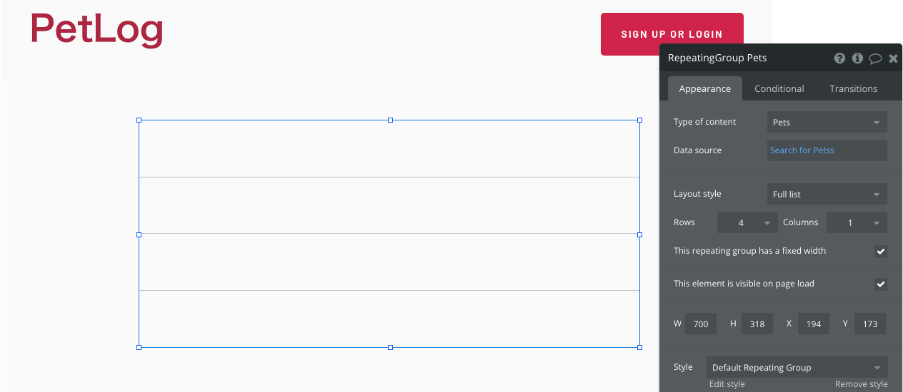

---

便宜上、`Repeating Group`のセルの中を`Group`で囲っておきます

- 左に並んでいる中に`Group`とあるので、画面に配置します。
- `Rpeating Group`の1つのセルの中に入るくらいの大きさにして、RepeatingGroupに入れます。
- 入れたあとにセルの上下左右いっぱいまで引き延ばしておきます。
- Type of contentに`Pets`、Data sourceに`Current cell's Pets`を指定します。

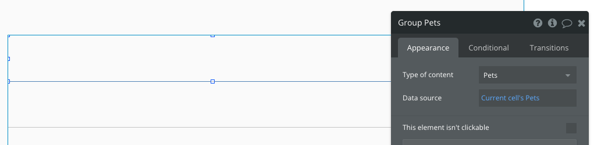

---

リストに要素を置いていきます。
- Image
  - Dynamic image：`Parent group's Pets``'s Image`
  - Run-mode rendering: `Zoom`
- Name
  - テキスト入力欄：`Parent group's Pets``'s Name`
- Birthday
  - テキスト入力欄：`Parent group's Pets``'s Birthday``:formatted ad 2021/11/20`
- Owner
  - テキスト入力欄：`Parent group's Pets``'s Creator``'s email`

※画面イメージは次のページ

---
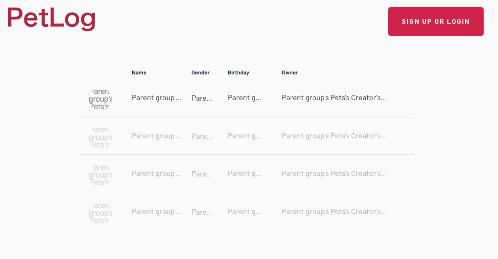 

---

### プレビューしましょう

何も出ない！？なんで？？

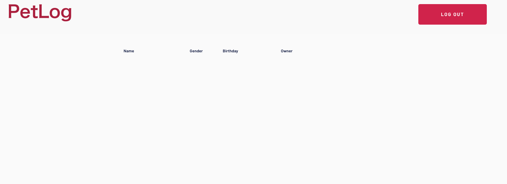

権限がないからです。

---

### Bubbleでの権限制御

今まで意識しなくてよかったですが、BubbleではDataへのアクセスが厳密に制限されています。

左メニューの`Data` > タブの`Privacy`と移動してください。
初期状態では、データは作成者しかアクセスできなくなっています。

当然と言えば当然ですね。

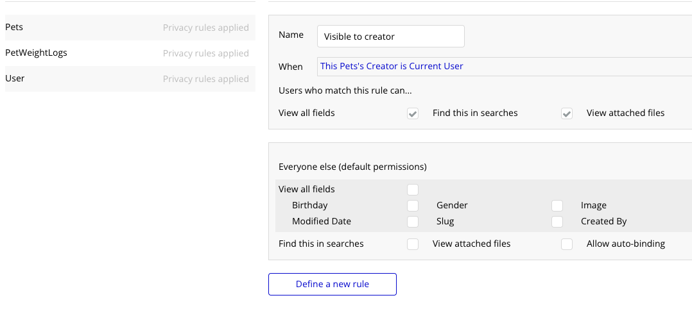

---

では、アドバイザーだったら、すべてのデータを見れるという権限を追加していきます。

- `Privacy`タブの中で、`Pets`を選択する
- `Define a new rule`ボタンをクリックする
- Rule nameに`Visible to advisor`と入力する
- Whenに`Current User``'s Role``is``Pet Advisor`と選択する
  - ユーザーがアドバイザーだった場合という条件です

これでアドバイザーだったら、すべてのペットのデータが見れます。
ルールごとに参照できるフィールドを限定することもできますが、今回は利用しません。

※画面イメージは次のページ

---

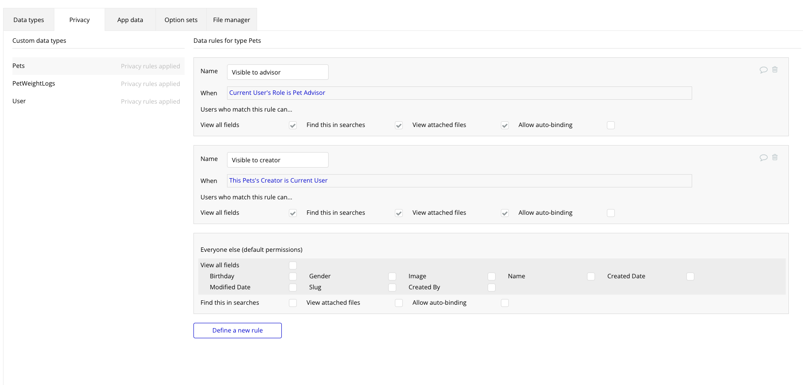

では、同じように`PetWeightLogs`と`Users`にもルールを追加してください。
これでアドバイザーはすべてのデータを見れるようになっているはずです。

---

## プレビューしましょう
わーい


---

アドバイザー用の詳細もつくります。
これはほぼ複製だけでつくれちゃいます。

- 左上のbロゴから`Add a new page...`
- Page nameに`pet_detail_for_advisor`を入力
- Clone fromに`pet_detail`を入力
- Createボタンを押す

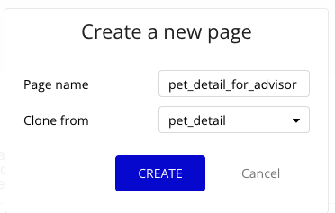

---

このままでもいいのですが、更新への導線は不要なので、`UPDATE`ボタンと`Weight Logs`のリンクは消しておきます。

あと、`Back to list`リンクの戻り先は`pet_list_for_advisor`にしておきます。

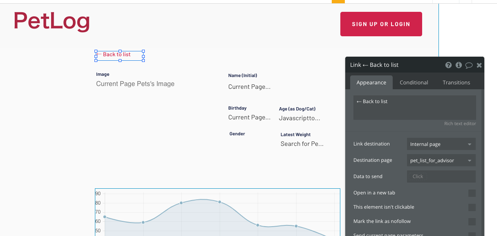

---

次に、pet_list_for_advisorからの導線がないので、つくります。

- pet_list_for_advisorの画面を開く
- `Repeating Group`のセルの中につくった`Group`を選択する
- `Start/Edit workflow`ボタンをクリックする
- `Click here to add an action`>`Navigation`>`Go to page`と選択していく
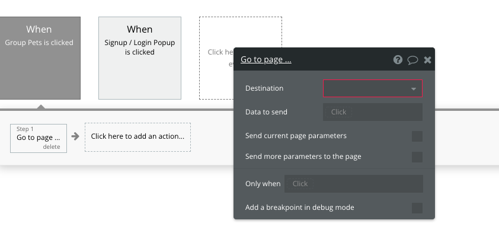

---

- Destinationに `pet_detail_for_advisor`を入力する
- Data to sendに`Current cell's Pets`を選択する

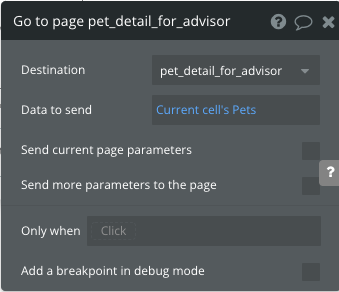

---

## プレビュー＆動作確認してみましょう

行をクリックしたら
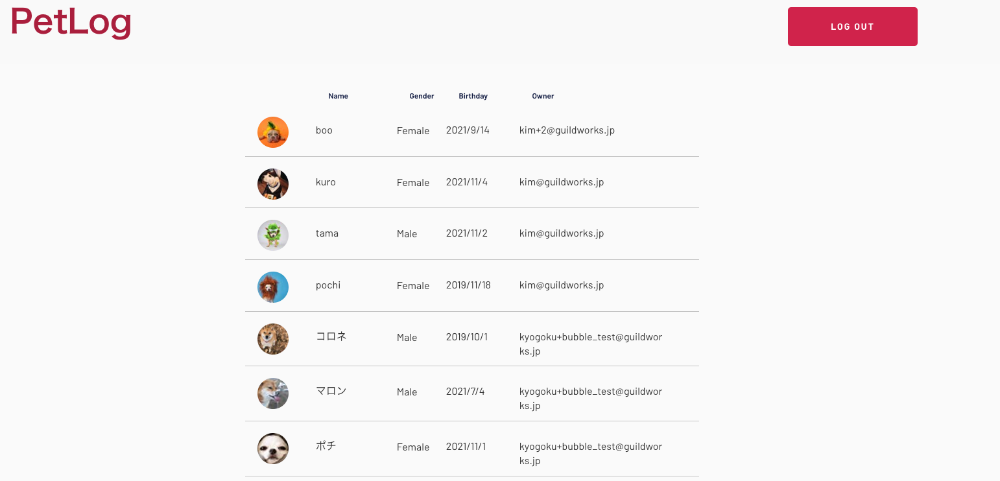

---

でたでた
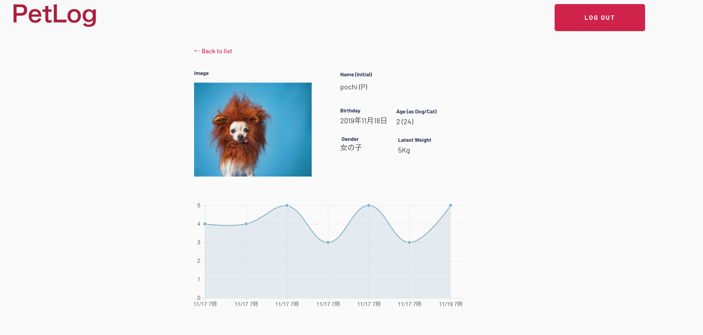

---

次に、ログイン時の遷移先を制御します。
実はすでに、トップページでログイン状態だったら、ペットリストに遷移するという設定をいれています。そこを編集していきます。

- indexページのWorkflowをひらく
- `User is logged in`を選択
- `Go topage pet_list`のActionの設定を開く
- `Only when`に`Current User` `'sRole` `is` `Pet Owner`を選択する

飼い主だけpet_listに遷移します

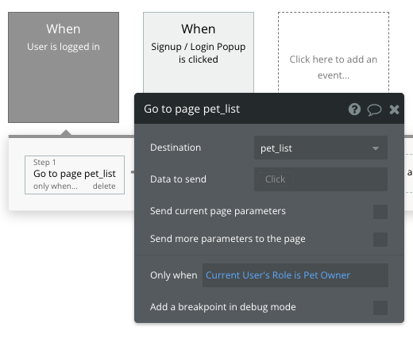

---

次にアドバイザーの場合はpet_list_for_advisorに遷移するというActionを追加します

- `Click here to add an action..`をクリックする
- `Navigation` > `Go to page..`をクリックする
- 設定が開くので、Destinationに`pet_list_for_advisor`を選択する
- `Only when`に`Current User` `'sRole` `is` `Pet Advisor`を選択する

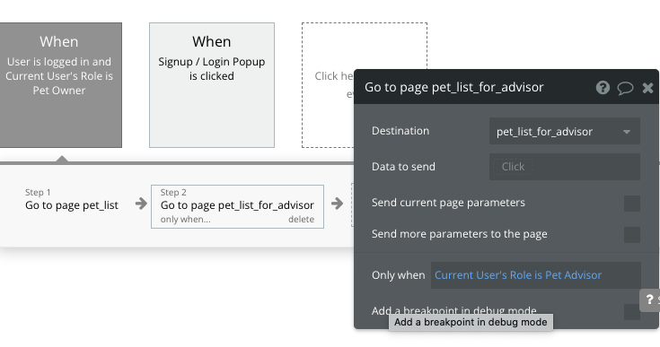

--- 

## プレビュー＆動作確認しましょう

アドバイザーでログインしたら
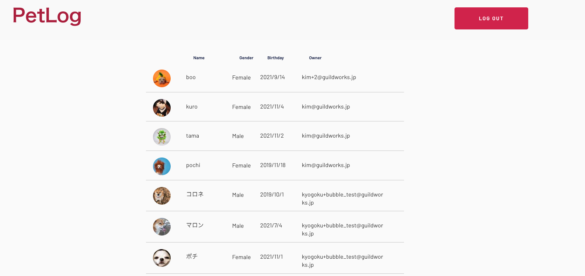

--- 

飼い主でログインしたら
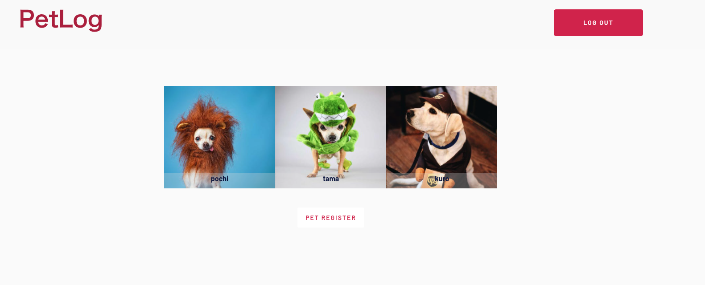

よしよし

---

## アドバイザーで勝手にアカウント作られて、
## 勝手に情報見られていいの？

---

## システム管理者が承認しないと、利用開始出来ないようにしよう

---

## 以下をやっていきます

- ユーザー情報にアドバイザーとして承認されているかを示すフィールドを追加する
- データへのアクセス権限はアドバイザーであることと同時に、承認されていることを条件に加える
- アドバイザー用のペットリストには、未承認だったら審査中ですというメッセージをだす

---

## ユーザー情報にアドバイザーとして承認されているかのフィールドを追加する

- 左メニューから`Data`>タブの`Data types`>中の`User`とクリックしていく
- 画面右下の`Create a new field`ボタンをクリックする
- Field nameに`Approved As Advisor`と入力する
- Field typeに`yes/no`を選択する
- Createボタンをクリック

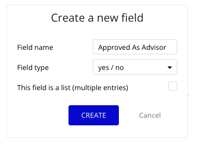

---

追加されたフィールドに`default`という欄があるので、`no`を設定しておく。
作成されたタイミングでは、未承認状態となる。
 
 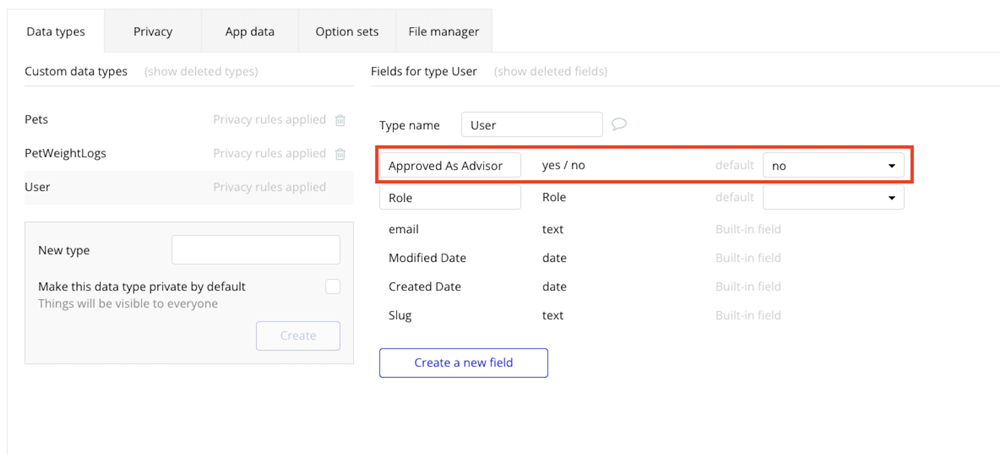

---

既存のユーザーについては、`Approved As Advisor`はすべて`no`にしておく
(めんどうで、しょんぼり。。。だけど、大事！)

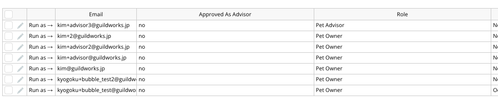

---

## データへのアクセス権限は承認されているかも見る

- 左メニューから`Data`>タブの`Privacy`>中の`Pets`とクリックしていく
- `Visible to advisor`のWhenの条件が記載されている部分の末尾の`Pet Advisor`をクリックする
- `More`があらわれるので`More`をクリックする
- `and` `Current User` `'s Approved As Advisor` `is "yes"`と選択する
- `User`と`PetWeightLogs`も同様にする

---

動作確認してみよう
`Approved As Advisor`が`no`のユーザーでログインしてみる

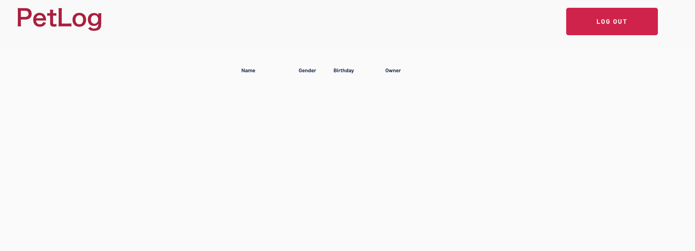
よし

---

`Approved As Advisor`が`yes`にしたら？

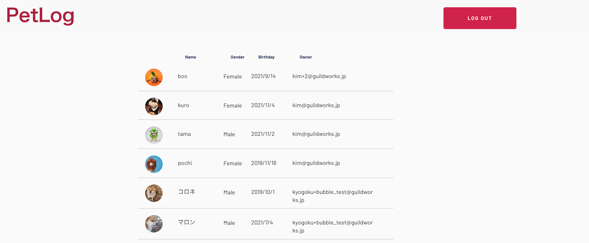
よし

---

## 未承認だったら審査中ですというメッセージをだす

- pet_list_for_advisorの画面で`Design`メニューを開く
- `Popup`を追加する
- `Popup`の上にテキストElementを追加して、審査中である旨のメッセージを記載する
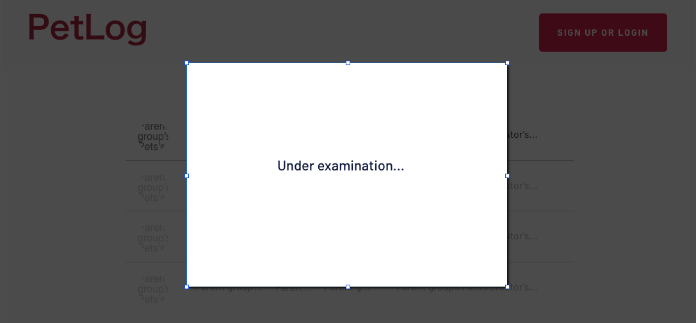

---

- メニューからWorkflowに移動する
- `Click here to add an event..`>`Page is loaded`とクリックする
- `Click here to add an action..`>`Element Actions`>`Show`とクリックする
- Elementに`Popup A`を指定する
- Only whenに、`Current User` `'s Approved As Advisor` `is "no"`を指定する

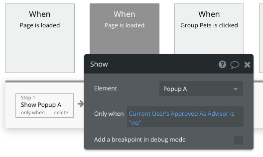

---

## 動作確認してみよう

yesのアドバイザーなら
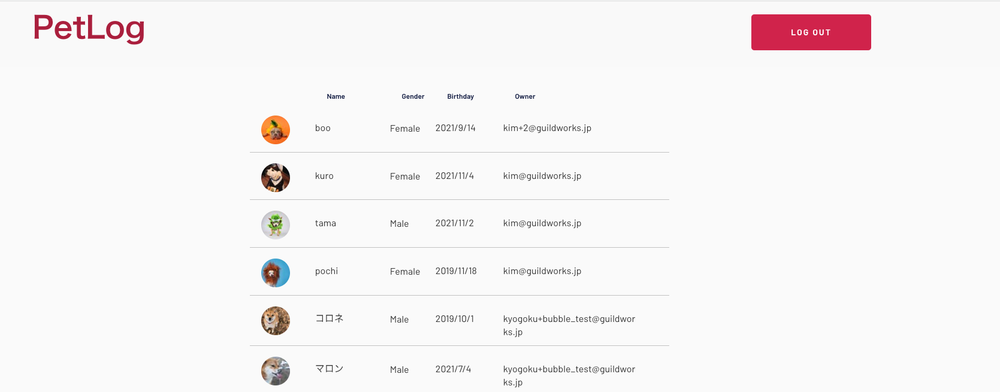

よし

---

noなら
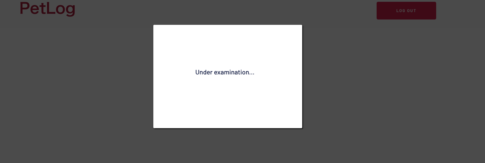

よし

---

## システム管理者はどうやって気づくの？

---

## アドバイザーの登録がされたら、システム管理者にメール通知されるようにしょう

---

## システム管理者にメール通知されるようにしょう

- `Signup / Login Popup`ページを開く
- メニューからWorkflowに移動して、`Button SIGN UP is clicked`を選ぶ
- `Click here to ad an action...`> `Email`>`Send Email`とクリックする

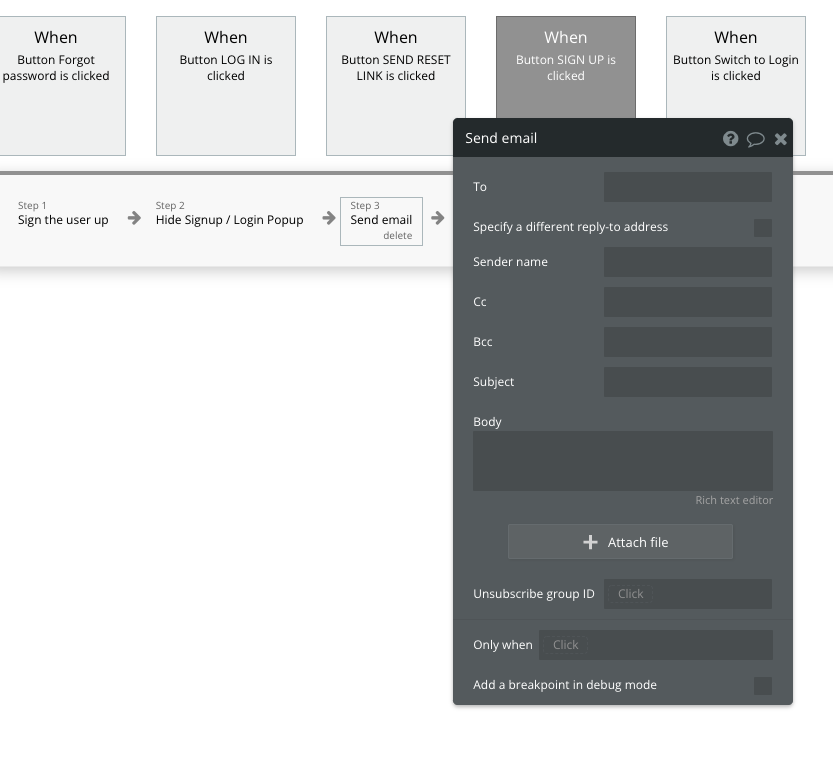

---

- Toに自分のメールアドレスを設定する
- Sender nameは`PetLog`
- Subjectは `New Advisor Registered`
- Bodyは以下に`dynamic data isert`で`Input Email(sign up)` `'s value`を選択
```
New Advisor has been Registered.
Please check it.

Email: 
```
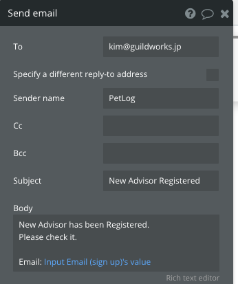

---

- Only Whenに`Dropdown Role` `'s value` `is` `Pet Advisor`を選択

---

## 動作確認してみよう
アドバイザーでサインアップしたら
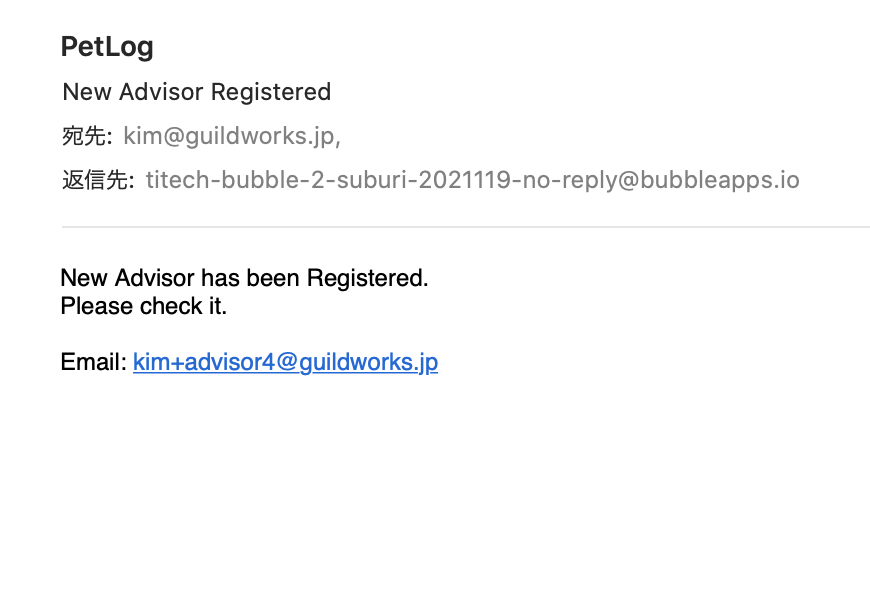
きたきた

---
飼い主なら

うん、こない。やったー

---