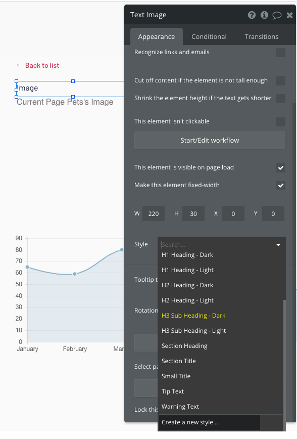

Programming Boot Camp Learning Phase #4

# Bubble Basic #2

2021/11/20

---

## 事前準備

- 本日は前回作成したペットの健康管理アプリに、デザインやロジックを追加していきます
- 本日の講義用に多少手を加えていますので、開始時点をそろえるため、こちら側で用意したアプリケーションを複製したものを利用してもらいます
- 複製したアプリケーションを配布しますので、`Naotake KYOGOKU` 宛てに、Bubbleのアカウントを作成したメールアドレスを伝えてください。

---

## 今日やること

  - 前回のおさらい
  - デザインを作りこむ
  - ロジックを作りこむ

---

## 前回のおさらい

- [Bubble](https://bubble.io/) はビジュアルプログラミングツールとうたっており、画面からポチポチと操作して、見た目や動きをプログラミングできるツールです。
- Webアプリケーション前提であり、ディスプレイサイズにあわせた対応をいれスマホやPCに対応させます。

- 前回お休みの方はこちらの資料でキャッチアップしましょう
  - https://github.com/GuildWorks/titech-2021/tree/master/docs/Bubble1

---

## 前回のおさらい

ペット管理アプリケーションのペットの登録、一覧、詳細、体重記録の画面を
作りながら、Bubbleの基本である、Design/Workflow/Dataの使い方を学びました。

   

今回はここに対して、デザインやロジックを作り込んでいきます

---

### 最終的にはこんな感じになります

トップページ

　

---

ペットリスト

　

---

ペット詳細

　

---

アドバイザー用ペットリスト

---

アドバイザー用ペット詳細

---

### では、さっそくはじめていきましょう。
### まずはデザインを作りこんでいきます

---

### デザインの作り込みでやること

- ディスプレイサイズに合わせた画面をつくろう
  - レスポンシブウェブデザインという手法を使って、ディスプレイサイズに合わせて以下のように見た目を制御します
    - 伸びる／縮む
    - 折り返す／折り返さない
    - 表示する／表示しない　
- Styleを使ってみよう
  - Styleを編集・追加したり、個別にスタイルをあてます

---

## ディスプレイサイズに合わせた画面をつくろう

---

## ディスプレイサイズに合わせた画面をつくろう

- WebアプリケーションはPCやタブレット、スマートフォンといった様々な端末で利用されます。
- 端末毎にディスプレイサイズが違うのですが、それらに対応する手法としてレスポンシブウェブデザインというデザイン手法があります
- 画面サイズに応じて、要素が伸びる／縮む、折り返す／折り返さない、表示する／表示しないといった見た目の切り替えを行うという手法になります。
- Bubbleは標準でレスポンシブウェブデザインの機能をそなえており、意識しなくても対応されていることもあります。

--- 

## レスポンシブウェブデザインの適用の仕方

- レスポンシブウェブデザインを考えるときには、まずはPC画面を作成し、ディスプレイサイズが小さくなっていったときの表示ルールを付け足すことが多いです。
- スマートフォンでの利用場面が主となるような場合には、スマートフォンの画面を先に作成して、PC表示をあとから整えるということもあります。

さっそく体験してみましょう。

---

## （再確認）事前準備

- 本日は前回作成したペットの健康管理アプリに、デザインやロジックを追加していきます
- 本日の講義用に多少手を加えていますので、開始時点をそろえるため、こちら側で用意したアプリケーションを複製したものを利用してもらいます。
- 複製したアプリケーションを配布しますので、`Naotake KYOGOKU` 宛てに、Bubbleのアカウントを作成したメールアドレスを伝えてください。

---

## トップ画面に画像とキャッチを配置します

トップ画面に画像とキャッチを配置して、レスポンシブの伸び縮みの制御をいれていきます。
一緒にやっていきましょう。

　

---

## 画像準備

私はこちらの画像を使います。
https://raw.githubusercontent.com/GuildWorks/titech-2021/master/docs/Bubble2/materials/hero.jpg

好きな画像を利用してもらっていいですが、大きく表示するので解像度の高いものを選んでください。

---

## トップページに画像を配置する

トップページに移動してください。手順は覚えていますか。
- 画面左上のbロゴの右をクリックして、indexページを選ぶ。

---

- 左メニューから、`Design`>`Image`の順にクリックする。
- 画面の中の真ん中あたりに適当な大きさで配置する。
  - 配置したい場所で配置したい大きさになるように、ドラッグする。
- 画像Elementが置かれたらOK（まだ画像は空の状態）。

---

- 画像Elementの右側に設定用のポップアップがでているので、設定をいれていく。
- `Static Image`に用意した画像をアップロード。
- 画像を左右いっぱいまで引き伸ばし、上下も好きな具合に整える。
  - 犬ちゃんマンの場合は`W:1080`、`H:645`くらいがよさそう

---

次にテキストを配置します。
- 左メニューから`Text`をクリックして、画面に中央に配置。
- テキストElementの右側に設定ポップアップがでているので、設定をいれていく
  - 最上部のテキストエリアに好きなキャッチコピーを入れる。
  - 私は、`Protect your pets! Sign up!!`といれます。
  - Styleに`H1 Heading - Light`を指定する

---

ではプレビューしてみましょう.
- 画面右上の`Previewリンク`か、ショットーカット（Windows：`Ctrl+p`、Mac：`Cmd+p`)

　

特にレスポンシブ対応をいれていませんが、勝手にいい感じにしてくれていますね。
Bubbleがレスポンシブに標準で対応してくれているためです。

---

少し解説します.
画像やテキストの設定を見てみましょう。中段あたりにこのような設定があります。
- `Make this element fixed width`
- `Minimum width`
- `Apply a max width when the page is streached`

要素毎にこれらの設定を使いながら意図した見た目になるように調整していきます。試しに設定を変えて表示してみます。

---

`Make this element fixed width`：これはこのelementの横幅を固定するかどうかという設定です。チェックが入っていない場合は、画面幅にあわせて伸び縮みします。
試しに画像の設定で、チェックをつけてプレビューしてみましょう。

　

画面幅を大きくしても画像elementの幅は変わらなくなりました。（チェックははずしておいてください。）

---

`Minimum width`：これはelementの最小幅です。画面幅を狭めていくと、合わせてelementも小さくなっていくのですが、ここで指定したサイズ以上には小さくなりません。試しにテキストの設定で80%に指定してみてプレビューしてみてください。

　
画面幅を小さくしても、変更前ほどテキスト表示に使っている幅が狭まらなくなりました。（20%に戻しておいてください。）

---

`Apply a max width when the page is streached`：これはelementの最大幅です。画面幅を広げていくと、合わせてelementも伸びていきますが、ここで指定したサイズ以上に大きくはなりません。
試しにテキストの設定で、チェックをつけて、100%にしてみください。

　
画面を大きくしていくと、elementが伸びないので、文字が左によらなくなりました。
（この設定はそのままにしておきましょう。）

---

次に、画面幅を変えた場合の配置についても解説しておきます。

人によってキャッチコピーは、画面を大きくすると左や右にずれているのではないかと思います。

画面幅が伸びたときのelementの配置は、元の相対位置できまります。
もともと真ん中に見えていて、気にならないくらいでも右や左にずれていると、画面が大きくなったときにそれが目立つようになります。

確実に真ん中に配置したい場合は、先週やった右クリック（もしくは二本指でタップ）して、`Center horizontally`を指定しましょう。

---

ここですね。

---

## 以上が、伸び縮みの制御の基本になります

要素毎にこれらの設定を使いながら意図した見た目になるように調整していくのでしたね。

- `Make this element fixed width`
- `Minimum width`
- `Apply a max width when the page is streached`

あと、中央寄せなど相対位置には注意が必要というところもお忘れ無く。

---

## 折り返す／折り返さない、表示する／表示しない

続いて、詳細画面で折り返す／折り返さない、表示する／表示しないという制御をいれていきます。

　

---

現状、pet_detailは画面幅にかかわらず、縦組みで要素が並んでいますが、
PCの画面幅を活かしきれていません。

---

## 画像とそれ以外の情報とを列を分けて表示します。

- `Image`のテキストと画像を選んで左側に移動させる
- `Name`のテキストから`UPDATE`ボタンまでを選んで右上に移動させる
  - `Gender`の下に空のテキストボックスがあるのでお忘れなく

---

## プレビューしてみましょう
配置や折り返し方が、うまくいかないと思います。
各Elementがそれぞれで相対位置を決めたり、折り返したりしてしまうためです。

　

---

## TIPS

詳細画面を何度もプレビューするときは、ブラウザのリロードで表示するとリスト画面で選び直す必要がなくて便利です

---

## グループを作る
折り返しや配置を行いたいまとまりごとにグループをつくることで、うまく制御できるようになります。

- `Image`のテキストと画像を選んで、右クリック（二本指タップ）し、`Group elements in a Group`を選択
- グループのサイズが要素にぴったりくっついていますが、後で選びやすいように少し大きく広げておきましょう。

---

`Image`のテキストと画像の両方を囲む四角ができます。

---

ちなみにですが、左側のメニューからGroupを選んで配置するということもできます。
ただ、Groupを配置した後に、その中に要素を置き直すということをしないといけないです。

配置済みの要素をGroupにいれたい場合は先述の方法が楽です。

---

- `Name`のテキストから`UPDATE`ボタンまでを選んで、右クリック（二本指タップ）し、`Group elements in a Group`を選択
  - `Gender`の下に空のテキストボックスがあるのでお忘れなく
- グループのサイズが要素にぴったりくっついていますが、後で選びやすいように少し大きく広げておきましょう。

---

`Name`のテキストから`UPDATE`ボタンまでを囲む四角ができます

---

## プレビューしてみましょう

配置はまだ微妙ですが、折り返しはまとまって折り返されるようになったと思います。

　

---

画像や名前などは画面は合わせて中央によせたり、画面幅が広がっても離れないようにしたいので、これらもひとまとまりで制御したいです。
ということで、画像のグループと名前などのグループも、さらにグループで囲ってしまいます。

2のグループを選んで、右クリック（二本指タップ）で`Group element in a Group`を指定してください。

---

ここで伸びる／縮むの制御の時に学んだ知識をつかって、
意図した配置になるように設定します。

- 全体を囲んだグループを選択して、`Apply a max width when the page is stretched`にチェックする
- `Minimum width`に50を指定します。
- `Maximum width`に100を指定します。

---

さらに、全体を囲んだグループを選んで右クリックして、`center horizontally`を指定しましょう。

これでグループのまとまりとして、画面幅が変わっても、画面中央に配置されるようになります。

---

## プレビューしてみましょう
いい感じですね。

　

---

画像のグループと名前などのグループのそれぞれに対して、以下の設定をいれましょう。
- `Make this element fixed-width`をはずす
- `Minimum widht`に99を指定

---

## 次に体重のグラフをもってきます

- pet_weight_registerの画面で、グラフをクリックしてコピーする
- pet_detailの画面に貼り付ける
- 画像や名前などの下に配置して、横にひろげる
- 右クリックして、`center horizontally`

---

## プレビューしてみましょう

スマホで1画面にグラフまで出すと窮屈ですね。

　

---

## レスポンシブウェブデザイン用のビューを開きます

左側メニューの`Responsive`という部分をクリックしてください

---

画面上部に目盛りがついた画面が表示されます

---

目盛りの端をつまんで画面幅を擬似的に小さくすることができます

---

名前などが折り返すタイミングでは、グラフは表示されないようにします
- 画面の幅をゆっくり移動させていき、名前などのグループが折り返したところで止める
- その状態でグラフをクリックする
- `Add hiding rule`をクリック
- `Save`をクリック
  - 折り返したタイミングで目盛りを止めていますので、その横幅を条件にしてくれています
- 再度目盛り

---
こんな感じ

再度目盛りを動かして動作を確認できます。

---

## プレビューしてみましょう

わーい
　

---

細かな調整ですが、戻るリンクが一番下にあるとスマホで使いにくいので、上に持って行きます。

- 全体を囲むグループを少し上にひろげる
- リンクをグループの左上に寄せて配置する
- こうすることで画面を広げた時にも、全体グループに適用した`Max Width`が効いて端によりすぎたりしません

---

## プレビューしましょう

　

以上が、折り返す／折り返さない、表示する／表示しないの制御になります。
延ばす／縮めるの復習にもなりましたね。

---

## Styleを使ってみよう

---

## Styleを使ってみよう

- これまではBubbleが標準で用意してくれていたスタイルを利用してきました
- 実際のプロダクトでは、プロダクトにあったデザインコンセプトを描き適用していきます
- ここからスタイルを変更する方法を説明します

---

## Styleの適用方法には大きく3つあります

- 既存のスタイルを編集する
- 新しいスタイルを追加する
- 個別でスタイルを適用する

順にやっていきましょう

---

# 既存のスタイルを編集する

既存のスタイルを変更して、ボタンやリンクの色を変更したいと思います。
私は犬ちゃんマンのイメージにあわせて、赤にしたいと思います。

---

# TIPS

Bubbleでは、よく使う色はアプリケーションの設定でパレットに設定できるようになっています。

- 左メニューの`Settings` > 画面上部のタブで`General`と選択
- 画面下側の`Color palette`に移動

---

私はもともと設定してある`#D62755`の赤でボタンやリンクを変えようと思っています。
後で詳しく説明しますが、ボタンをホバーした時に少し暗い赤も欲しくなるので、ここで少し暗い赤も設定しておきます。私は、`#B32246`の赤をパレットに追加します。

みなさんも、基調にする色とそれを少し暗くした色を追加してみてください。

---

では、スタイルを設定します。左メニューの`Styles`を開いてください。

まずはざっとながめてみましょう。今まで使ってきたスタイル設定もちらほらありますね。

---

ボタンの色を変えます。

- 画面上部のElement typeから`Button`を選択
- `Primary Button`を選択
- 画面右側のColorをクリック
- カラーパレットから自分が決めた基調色を選択

---
### プレビューしましょう

ボタン色が赤になりました。

ただ、マウスオーバーすると、緑（青？）になっちゃいますね。

マウスオーバー時の色は別で指定されているためです。

---

- StylesのPrimaryボタンの設定に戻ります
- 画面右側のConditionlを選びます
  - ここに特定の条件を満たした場合に適用されるスタイルが指定されています
  - ホバーされたときに色を変えるという指定がされていますね。
- この色を先ほど決めた基調色を少し暗くしたものを指定します。

---

### プレビューしましょう

ホバーなし

ホバー

いい感じですね。

---

同様にして、`Primary Button`のフォントカラーも基調色に変えます

---

さらに、`Standard Link`のフォントカラーも変えちゃいます

---

## プレビューしましょう

各所に基調色があたっていますね。

---

## 次に、新しいスタイルを追加してみましょう

ラベルと内容が同じスタイルで区別しにくいのが気になるので、
ラベル用のスタイルを作っちゃおうと思います。

TODO：あとで画像を差し込む

---

- pet_detailを開いて、`Image`テキストをダブルクリックして、設定を開く
- `Style`のプルダウンを開く
- 一番下のCreate a new styleを選択する

---

- Style名に`Label`と入れる
- Element styleは`Text`のまま、テキストElementのスタイルであることを示しておく
- Use style ofは`Text Image`のまま、`Text Image`の元としてスタイルをつくります

---