**Programming Boot Camp**

# 応用編

**東京工業大学 2021/11/27**
　
　
　
　
　
　　　　　　　　　　　　　　　　　　　　　　　　**Ryo Imahashi**

---
## 目次
  - 今回やることの確認
  - 外部連携
  - ノーコードツールでの共同作業のTips
  - Adaloでの共同作業演習
  - Bubbleでの共同作業演習
  - ふりかえり

---
## 今回やることの確認

---
## 外部連携

---
### 外部連携とは
AdaloやBubbleだけで実現できないことがある場合、外部サービスと連携することでそれを実現できるかもしれません。

---
### 外部連携の方法
Adalo
- Zapier
- API
- データソース？
Bubble
- Zapier
- API

---
- Zapierというサービスを使えば、案内に従って操作することで、簡単に外部サービスを連携させられます。試してみましょう。
  https://zapier.com/apps/adalo/integrations

---
ZapierでAdaloと連携させることが可能な外部サービスの例
- Google Spreadsheet
- Google Calender
- Slack
- Zoom
- Twitter
- Instagram
- Spotify
- Bubble
- Google Meet
- Strava

---
外部連携で作るものの
- Instagramの投稿(Adalo)
- Twitterの投稿(Bubble)
- +α ベストエフォートで、複数サービスとの連携?

その他の候補
- Youtube連携
- Spotifyのプレイリストなど、自分の考えや好きなものを集約したページを作る(ユーザーごとに連携先サービスへの認証をさせる必要がある)
- 超調整さん(Adaloで作ったフォームで入力したイベントの出欠情報をGoogle Spreadsheetで一覧表示させる。Calendlyに負けそうではある。)
<!-- - 会議室予約管理システム(インターフェースはAdalo,データはGoogleCalender)
 -->
- Zoom or meetの会議参加者管理システム
- facebook-groupsからポストを抽出して山田道場ホームページ？
- stravaで運動ログを ?

---
bubbleとのzapier連携
- notion

---
#### Adaloでの外部連携
以下4種類の外部連携の方法を紹介します。
- Marketplaceの外部連携コンポーネント
- Custom Action
- External Collection
- 連携サービス
---
##### Marketplaceの外部連携コンポーネント
Marketplaceから外部連携を可能にするコンポーネントを追加できます。

---
まずはアプリを新規作成しましょう。
- Adaloにログイン
https://app.adalo.com/login
- CREATE NEW APPをクリック

---
- PlatformはNative Mobile Appを選択

---
- TemplateはBlankを選択

---
- App NameにはMarketplaceComponentTrialを入力
- Colorは自由に設定してください

---
###### Twitter Timeline コンポーネント
- +ボタンを押してADD COMPONENTの中のExplore Marketplaceをクリック

---
- Twitter TimelineコンポーネントをINSTALL
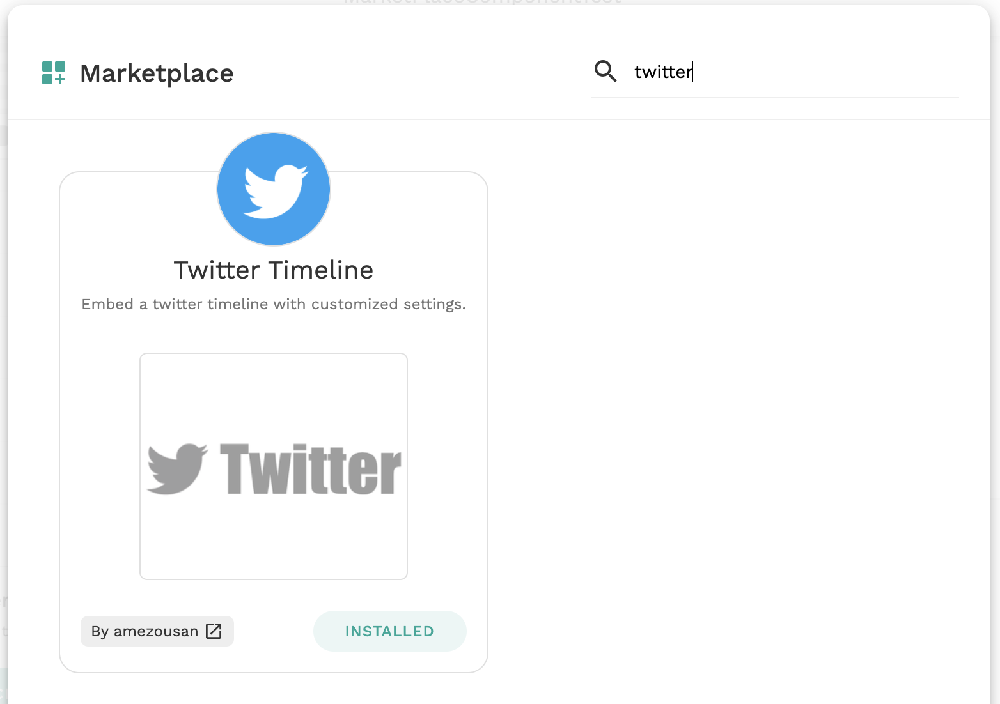

---
Twitter Timelineコンポーネントを配置します。
- Home ScreenにTwitter用画面へのLinkボタンを追加

---
- ADD ACTIONからNew ScreenへのLinkを追加

---
- Templateで"App Bar"を選択し、"Twitter Timeline" 画面を作成

---
- Twitter Timelineコンポーネントを配置

---
- Twitter Handle Nameに "tokyotech_jp" と入力

---
- Preview機能でSignupして、Twitterボタンをクリック

---
- 東京工業大学公式Twitterアカウントの投稿が一覧表示されます

---
ログインしたユーザー自身のTwitterアカウントの投稿が一覧表示されるように修正しましょう。
- Users CollectionにTwitterHandleName Propertyを追加
  - TypeはTextを選択

---
- Signup画面のFormをクリック
- Fields > ADD VISIBLE FIEDLD > TwitterHandleName
- Not Requiredに変更

---
- "ALREADY HAVE AN ACCOUNT?"というリンクがフォームに重なってしまっていたので、下に移動

---
登録済のユーザーにTwitterHandleNameを設定しておきましょう
- Users Collectionの "1 Record" ボタンをクリック

---
- 登録済のユーザーのレコードをクリック
- TwitterHandleNameを入力(自分のアカウントでも、好きなアカウントでもOK)

---
- Twitter TimelineコンポーネントのTwitter Handle Nameを"Logged In User's TwitterHandleName"に変更

---
理論上はこれでログインユーザー自身が設定したTwitterアカウントの投稿一覧が表示されるはずです。

Preview機能で確認してみましょう。

---
エラーが起きると思います。
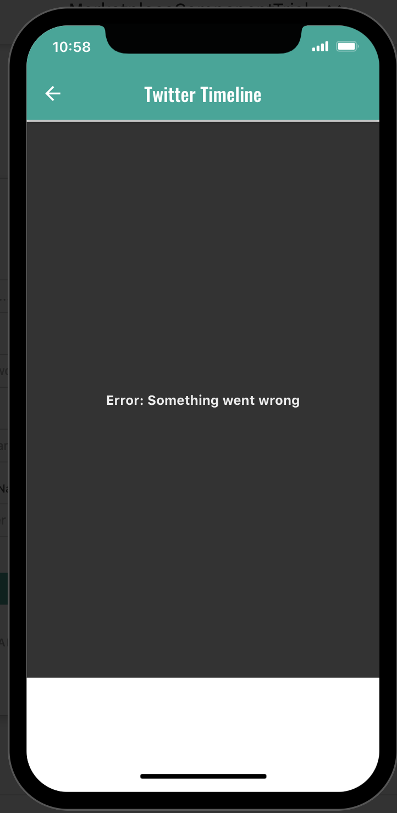

---
Twitter Timelineは有志の方が無償公開してくれているコンポーネントです。

誰かが作ってくれているものが、いつも自分の思い通りに動くとは限りません。
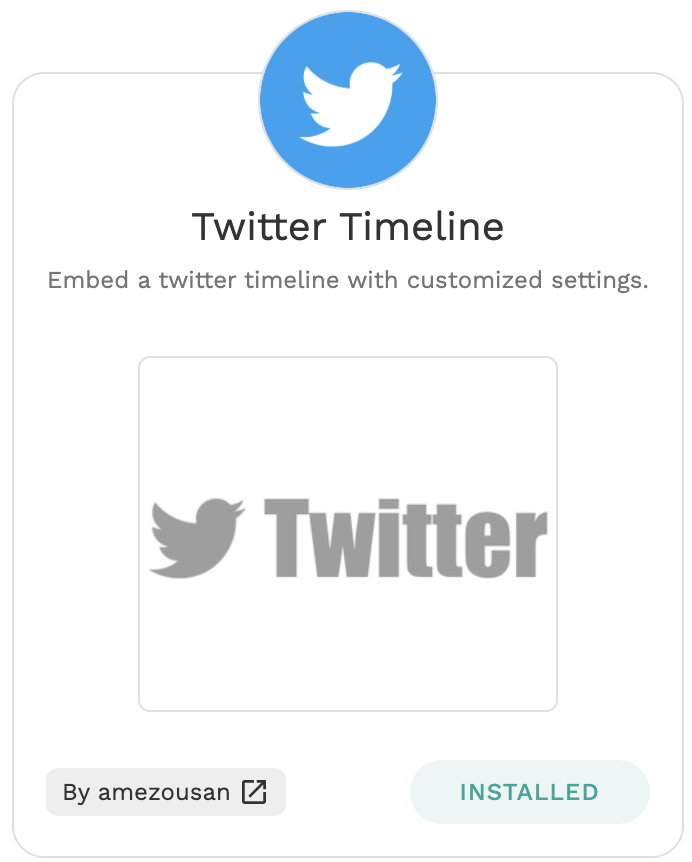

---
「できないなら紹介しないでよ」と思った方もいるかもしれませんね。ごめんなさいmm

試行錯誤をして「エラーを回避する方法を見つけた！」と思ったので資料に書いたのですが、後からそれが勘違いだったことに気づきました。。(ブラウザにはキャッシュという仕組みがあって、時々幻のようなものを見せてきます)

「そんなこともあるんだな」くらいは覚えておいてもらえると嬉しいです。

<!-- ---
試行錯誤の結果、エラーを回避する方法を見つけたので、紹介しますね。

---
- Text InputコンポーネントをTwitter Timeline画面に配置
- Nameに "Invisible Input for TwitterHandleName" と入力
- Default Valueに "Logged In User's TwitterHandleName" を設定

---
- Twitter TimelineコンポーネントのTwitter Handle Nameを "Invisible Input for TwitterHandleName"に変更

---
"Invisible Input for TwitterHandleName" は画面上に表示する必要はないので、非表示にします
- Canvas上で画面名"Twitter Timeline"をクリックして、"Invisible Input for TwitterHandleName"の右側の目のアイコンをクリック

---
もう一度Preview機能で確認してみましょう。

# エラー回避できたと思ったら、できてなかった！キャッシュのせいで幻を見ていただけだった！

--- -->

---
参考: Twitter Timelineコンポーネントのコードは公開されているので、修正して使うこともできそうです。(今回はやりません)
https://github.com/amezousan/adalo-twitter-timeline/

---
- Twitter TimelineコンポーネントのTwitter Handle Nameは直接値を入力した状態に戻しておきましょう

---
##### Video Calling
次に、ビデオ通話コンポーネントを紹介します。

---
- Marketplaceで "No-Code Video Calling"コンポーネントをINSTALL

---
ビデオ通話コンポーネントを配置するための新しい画面を作りましょう。
- Home画面にビデオ通話用画面へのLinkボタンを追加
- ADD ACTIONからNew ScreenへのLinkを追加
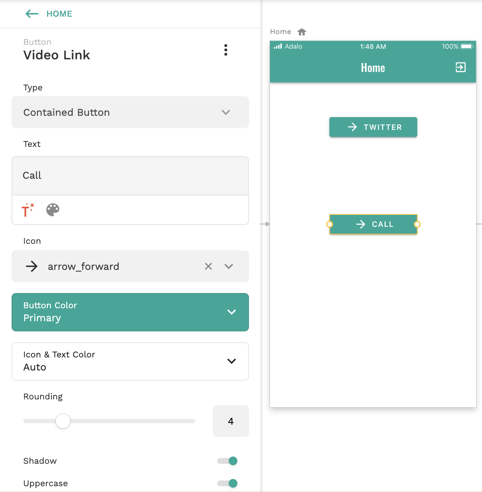

---
- Templateで"App Bar"を選択し、"Video Calling" 画面を作成

---
- Video Callingコンポーネントを画面上に配置
- Unique Conversation IDに "all-in-one" と入力
  - これは、全ユーザーを一つのビデオ通話に参加させる設定です
- Unique User id に "Logged In User's Email" を設定

---
補足

今回は全ユーザーを一つのビデオ通話に参加させる設定にしましたが、複数のユーザーが所属するグループを作ってグループメンバーだけで通話することも可能だと思います。

興味があれば、挑戦してみてください。

---
Preview画面で確認してみると、"register your Adalo App ID to your Garlick.io accout for free" というメッセージが表示されます。案内に従いましょう。

- "Click to Register Adalo App" をクリック

---
ログイン画面が表示されますが、まだアカウントを作成していません。
- "Or, Sign Up"をクリック

---
- Development Planを選択(無料です)

---
- Emailを入力して "Continue to checkout" をクリック
  - Googleアカウントを持っていれば、Sign in with GoogleをクリックしてもOKです。

---
- 3つのチェックボックスにチェックをつけて、"Complete sign up" をクリック
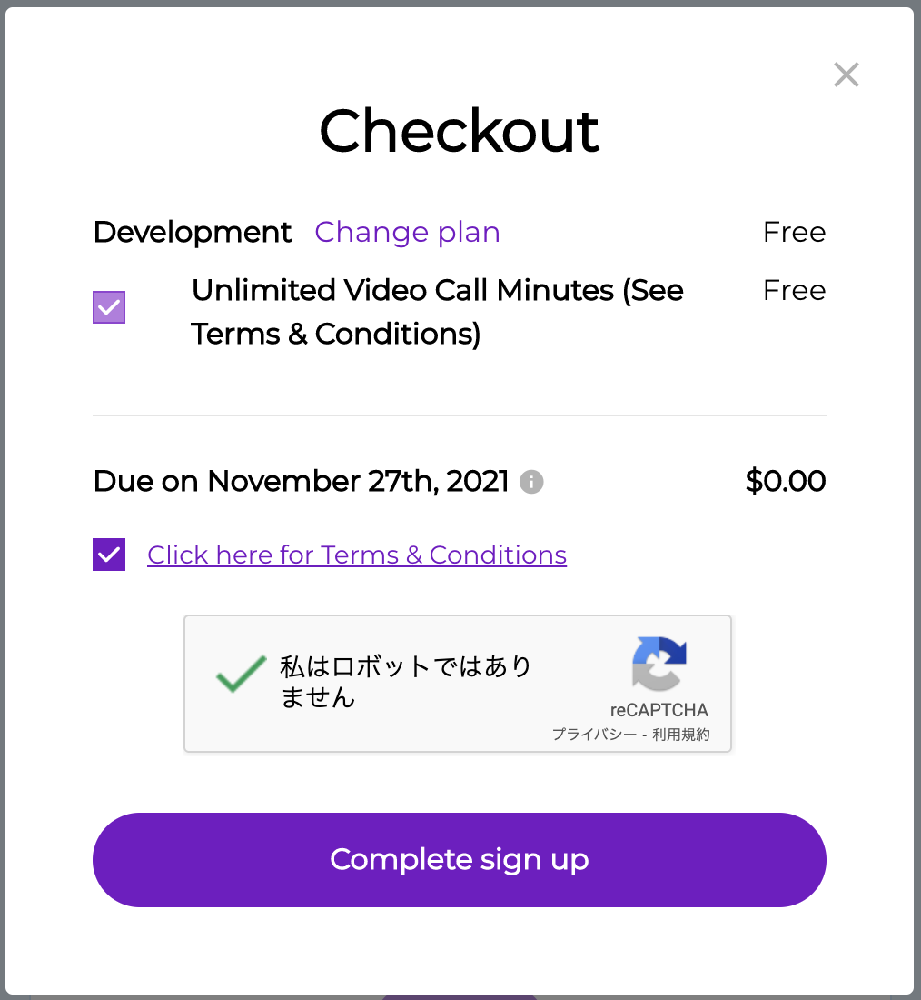

---
- 届いたメールを開いて、 "Confirm your account" をクリック
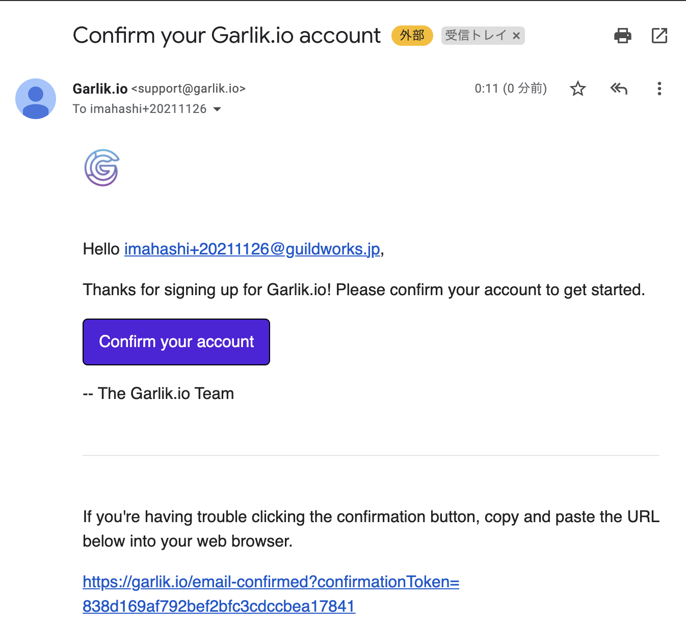

---
- Passwordを設定

---
アカウント登録が完了しました。
次は、Adalo App IDを登録します。

---
- Adaloの管理画面を開いて、URLに含まれるApp IDをコピー
  - 以下のURLの "xxx..." の部分です。
  https://app.adalo.com/apps/xxxxxxxx-xxxx-xxxx-xxxx-xxxxxxxxxxxx/screens/preview

---
- Garlick.ioの管理画面でAdalo App IDを入力して、 "Register App" をクリック

---
AdaloのPreview画面をリロードして再度ビデオ通話画面を表示すると、ビデオ通話の参加者待ちの状態になります。
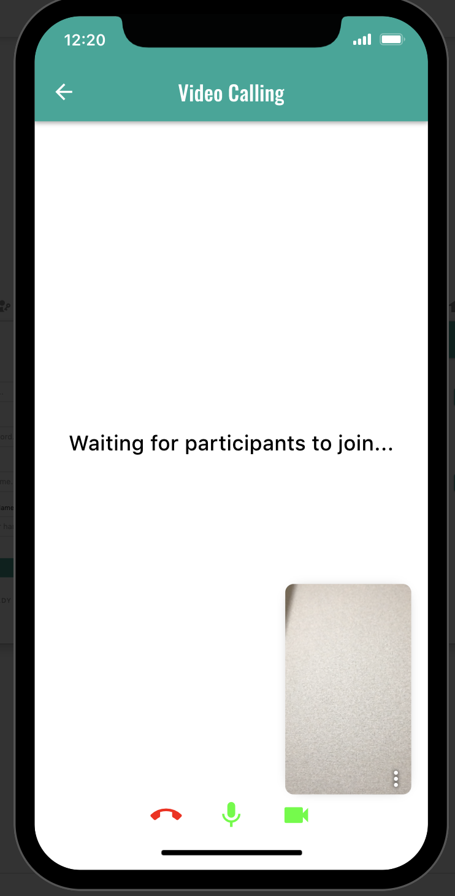

---
他のユーザーがログインしてビデオ通話画面を表示すると、通話ができます。

---
# 質問: ビデオ通話を試してみますか？

試してみたいというリアクションがもらえたら、実験用のアプリのURLをシェアします。
<!-- 
 -->

---
無料プランだと合計通話時間が1440分に到達したら通話ができなくなるようですが、開発時のテストには十分だと思います。
<!-- また、一度の通話の時間は5分までに制限されているようです。 -->
ビデオ通話機能が必要になったら、活用してください。

---
この他にも外部サービスと連携するためのコンポーネントがいくつか提供されています。興味があれば、試してみましょう。

例: 
- Youtube(無料)
- Google Map(フリートライアルが使える)
- Google Signin($25)

---
##### Custom Action
外部連携コンポーネントの次は、APIから取得したデータをAdaloの画面上で扱う方法を紹介します。

---
参考
>アプリケーションプログラミングインタフェース（API、英: Application Programming Interface）とは、広義ではソフトウェアコンポーネント同士が互いに情報をやりとりするのに使用するインタフェースの仕様である。

https://ja.wikipedia.org/wiki/%E3%82%A2%E3%83%97%E3%83%AA%E3%82%B1%E3%83%BC%E3%82%B7%E3%83%A7%E3%83%B3%E3%83%97%E3%83%AD%E3%82%B0%E3%83%A9%E3%83%9F%E3%83%B3%E3%82%B0%E3%82%A4%E3%83%B3%E3%82%BF%E3%83%95%E3%82%A7%E3%83%BC%E3%82%B9

---
まずは、API連携を試してみましょう。
無料で試せるThe Cat APIを使います。以下のURLにアクセスしてください。
https://thecatapi.com/

---
参考: 犬派の人のために、The Dog APIもあります。おそらくThe Cat APIと同様のことができると思います。(試せていないので、まずは一緒にThe Cat APIを使うことをおすすめします)
https://www.thedogapi.com/

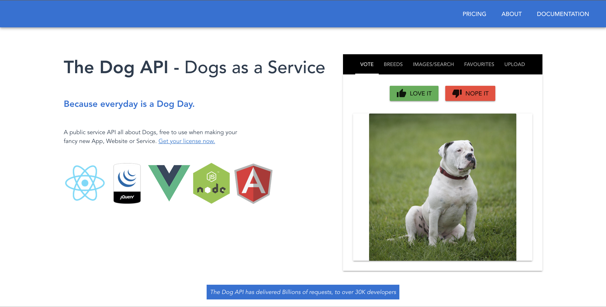

---
APIを使用する際には、APIの提供者からAPIキーを発行してもらう必要がある場合が多いです。
The Cat APIでもAPIキーが必要になりますので、発行してもらいましょう。
- 下にスクロールしてPricingの欄の "SIGNUP FOR FREE" をクリック
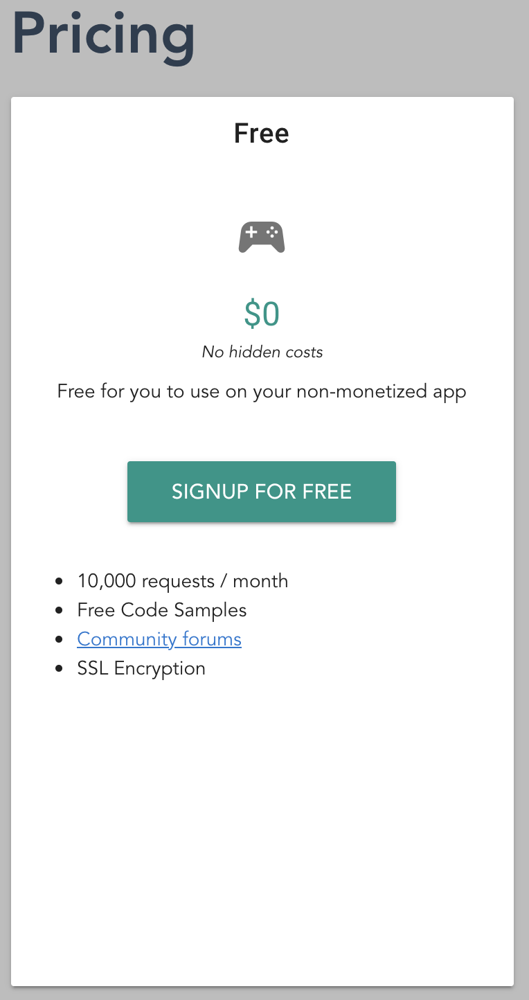

---
- E-mail、App Description、type of projectを入力し、 "SIGNUP" をクリック
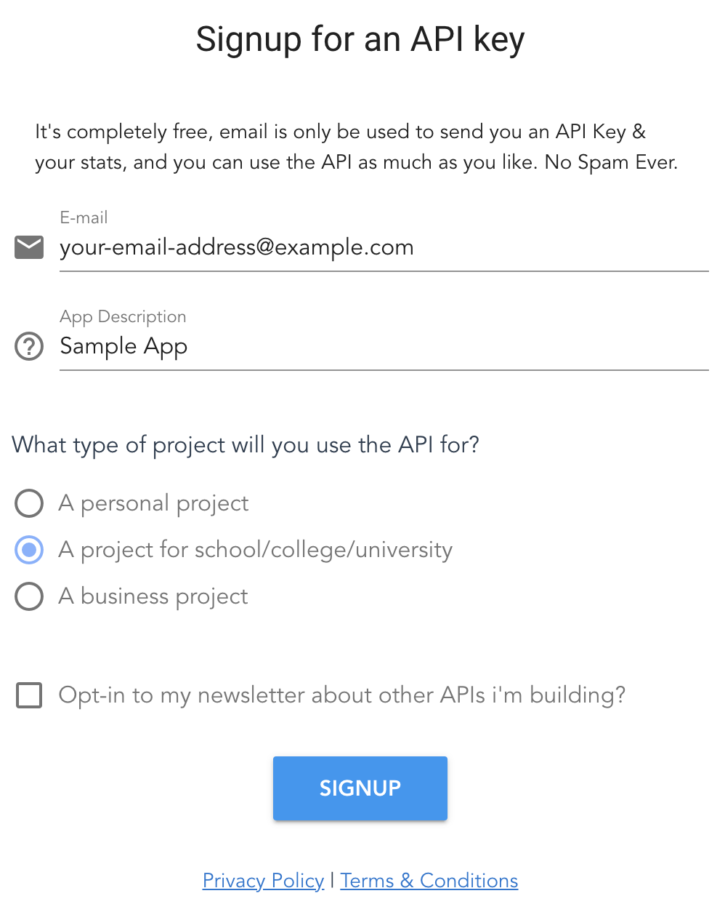

---
- メールで送られてきたAPIキーを確認(後で使います)

---
次に、APIドキュメントでAPIの使い方を確認しましょう。
- 以下のURLへアクセス(先程のメールにも"API Documentation"というリンクが記載されています)
https://docs.thecatapi.com/

---
トップページに記載されている、ランダムな子猫の画像を取得するAPIを使います。

Exampleと同じように、ボタンを押すと画像が切り替わるようにしましょう。

---
- Adaloの管理画面でCREATE NEW APP
- 設定は以下の通り
  - Platform: Native Mobile App
  - Template: Blank
  - App Name: ApiIntegrationTrial

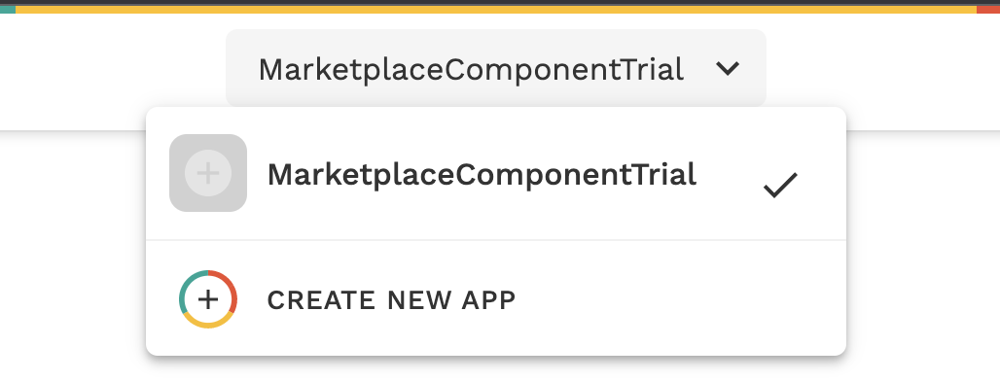

---
- Home画面に子猫画像表示画面へのリンクボタンを追加
- ADD ACTIONからNew ScreenへのLinkを設定

---
- TemplateにApp Barを選択し、Kittens画面を作成

---
- Imageコンポーネントを画面上に配置
- コンポーネントの設定はそのままにしておく(後で設定します)

---
- Change Kitten Image Buttonを追加
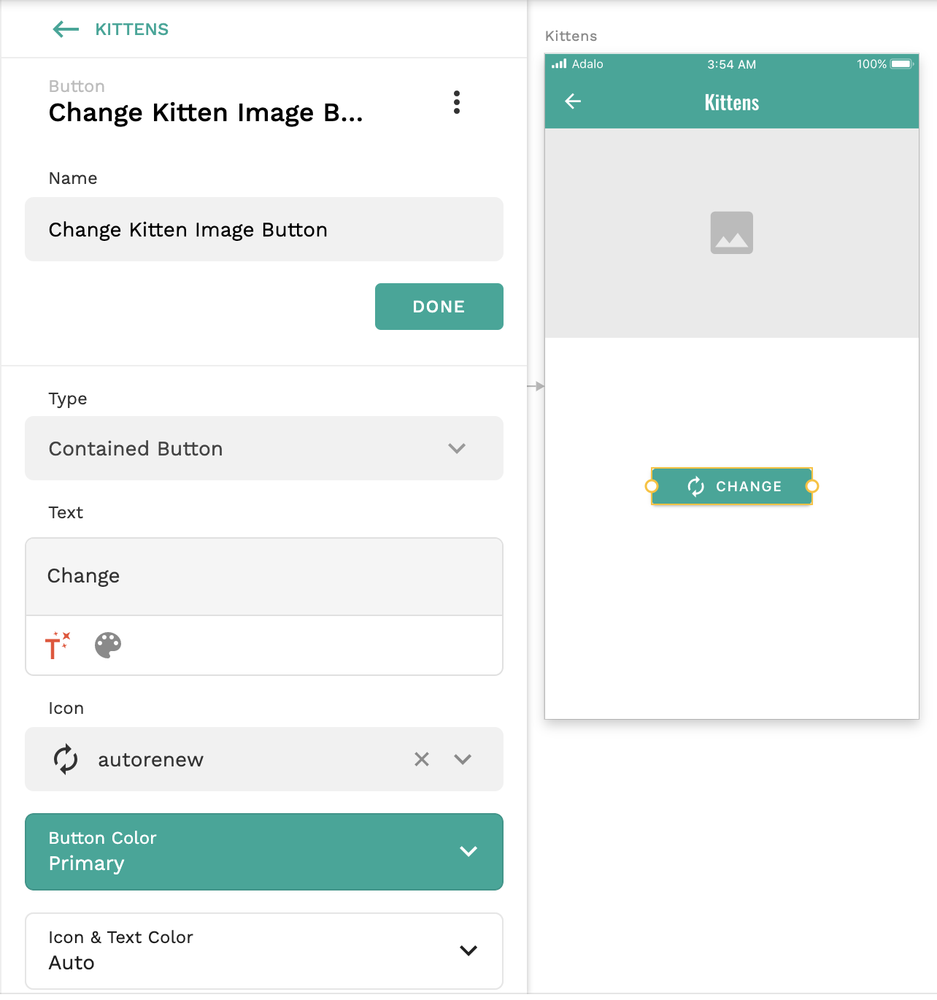

---
- ADD ACTIONからNew Custom Actionを選択

---
14日間のIntegration Pack Trial(無料)の開始を促されます。
- "START INTEGRATION PACK TRIAL" をクリック

---
トライアルが開始しました。
- "CREATE NEW CUSTOM ACTION" をクリック

---
- 以下を入力してNEXTをクリック
  - Name: GetRandomKitten
  - Type: Create

---
次に、送信するAPI Requestを設定していきます。

<!-- そもそもなんでこのドキュメントが使用するAPIのものだと分かるのか は口頭で補足したい -->
---
以下のURLにアクセスして、使用するAPIのドキュメントから設定項目を確認します。
https://docs.thecatapi.com/api-reference/images/images-search
- API Base URLは https://api.thecatapi.com/v1/images/search
- MethodはGET
- Headerに x-api-keyというNameでAPI keyを設定

---
- 確認した結果を踏まえてAPI Requestを設定
  - API Base URLは https://api.thecatapi.com/v1/images/search
  - MethodはGET
  - Headerに x-api-keyというNameでAPI keyを設定
- "RUN TEST REQUEST" をクリック
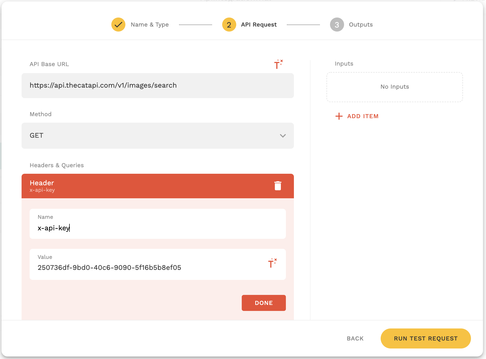

---
Testが成功すると、APIから取得したデータ(Magic Text Output Properties)が表示されます。これらは、後続のアクションで使用できます。
- "SAVE CUSTOM ACTION" をクリック
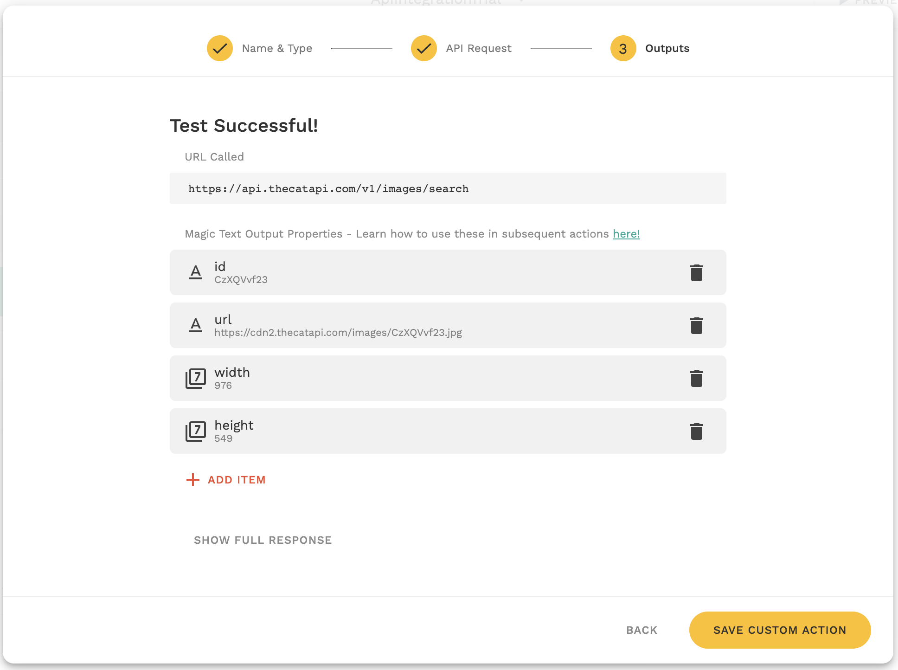

---
次に、APIから取得した子猫の画像のURLをImageコンポーネントのImage Sourceに設定します。

そのままでは、選択肢の中にAPIから取得したデータは出てきません。

---
- Text Inputコンポーネントを画面上に追加
- Nameを "Invisible Kitten Image URL Input" に変更
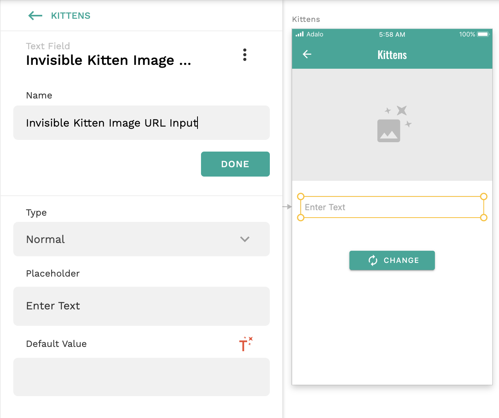

---
- "Change Kitten Image Button" をクリック
- ADD ANOTHER ACTION から Change Input Value を選択

---
- Inputに "Invisible Kitten Image URL Input" を設定
- Valoueに "GetRandomKitten > url" を設定
- "DONE" をクリック

---
- Imageコンポーネントをクリック
- URLに "Invisible Kitten Image URL Input" を設定

---
- 画面名 "Kittens" をクリック
- "Invisible Kitten Image URL Input" の右側の目のアイコンをクリックして非表示にする
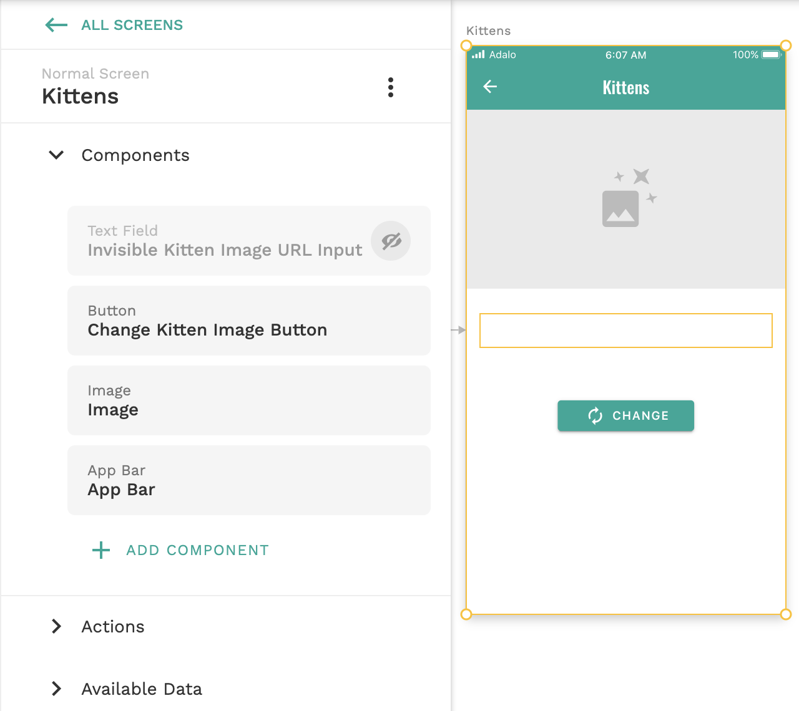

---
Preview機能で確認します。

CHANGEボタンをクリックすると、子猫の画像が表示されました。
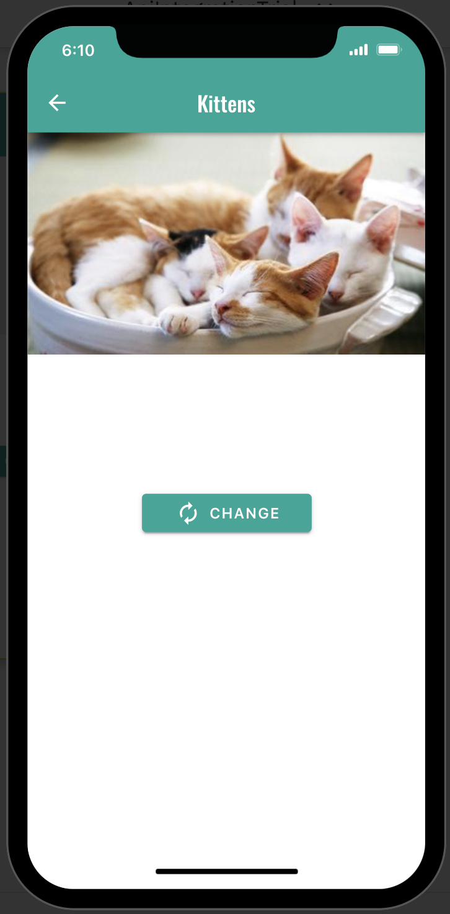

---
補足

- Custom ActionでAPIから取得したデータは、後続のActionで使用できます。そのデータをコンポーネントで使いたい場合は、以下のいずれかの方法を使いましょう。
  - 今回のように、後続のActionのChange Input Valueで同一画面上のText InputのValueにデータを設定し、それを読み込みましょう。
  - あるいは、そのデータを後続のActionでデータベースに保存して、それを他のコンポーネントから読み込むことも可能です。この場合、画面遷移後にもアクセスできます。
    - 例: https://help.adalo.com/integrations/custom-actions

<!--  -->

---
注意事項

現状、Custom Actionにはいくつかの制限があります。
- Custom ActionはFormコンポーネントのSubmitボタンでは動作しません。
- Custom Actionが画面全体のActionとして使用されている場合、APIのレスポンスとして取得したデータは皇族のActionで使用できません。
- アプリをCloneしてもCustom Actionはコピーされません。Custom Actionを含むアプリをCloneしたら、手動で作成し直してください。
<!-- https://help.adalo.com/integrations/custom-actions -->

---
\>アプリをCloneしてもCustom Actionはコピーされません。Custom Actionを含むアプリをCloneしたら、手動で作成し直してください。

14日間のIntegration Pack Trialは、Development Phaseの真っ只中で終了すると思われます。

Custom Actionを多用する可能性がある場合、Development Phaseの作業開始前に新しくAdaloのアカウントを作成し、Integration Pack Trialを新たに開始することをおすすめします。

---

##### External Collection
APIから取得したデータをAdaloのCollectionとして扱う方法を紹介します。

複数のデータを一括取得してそれらを画面上に一覧表示するような場合はCustom Actionではなく、External Collectionを使います。

---
このAPIを使って、猫の品種の一覧を取得&表示しましょう。
https://docs.thecatapi.com/api-reference/breeds/breeds-list#send-a-test-request
<!--  -->
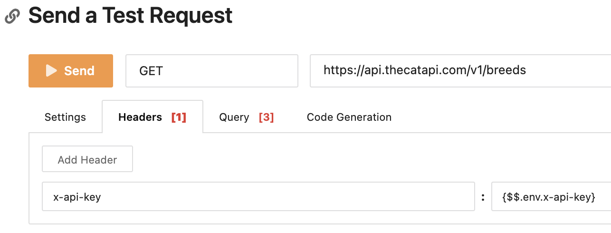

---
- DatabaseのExternal Collectionsで "ADD COLLECTION" をクリック

---

- Collection Name: Breeds
- Base URL: https://api.thecatapi.com/v1/breeds
- Method: GET
- Auth Setup
  - Header x-api-key: 発行したAPI Key

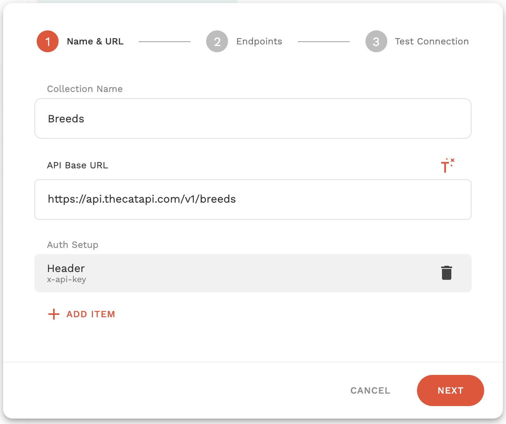

---
Adaloでは、APIでアクセスするリソース(この例ではbreeds)毎に5つのEndpoints(アクセス方法)が設定できます。

APIの仕様によってはそれに合わせるための修正が必要になりますが、今回はそのままNEXTをクリックしてOKです。
<!-- (使用するEndpointである Get All はデフォルトでAPIの仕様を満たす設定になっています) -->

---
- テストを実行して成功したら、"CREATE COLLECTION" をクリック
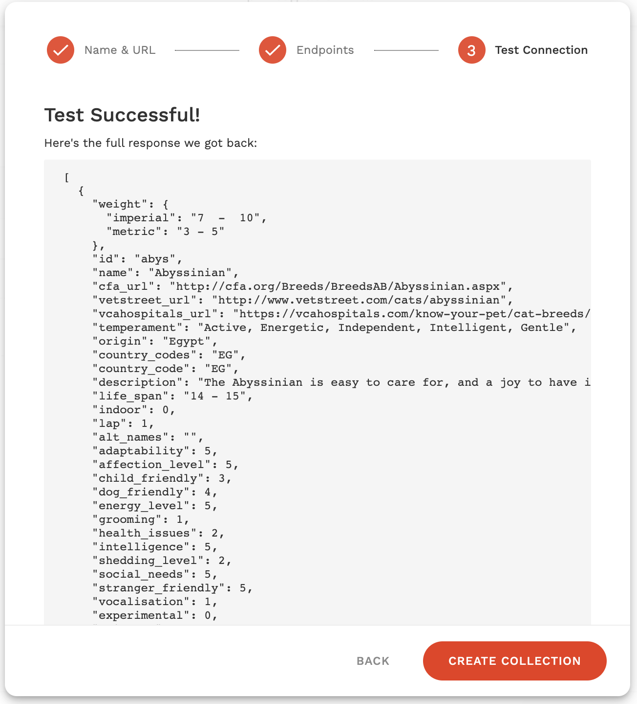

---
External Collectionが作成されました。

APIから取得するデータが全てプロパティとして設定されています。

---
取得したデータを一覧表示しましょう。
- Home画面に "Breeds Link" ボタンを追加
- ADD ACTIONからNEW SCREENヘのLINKを追加
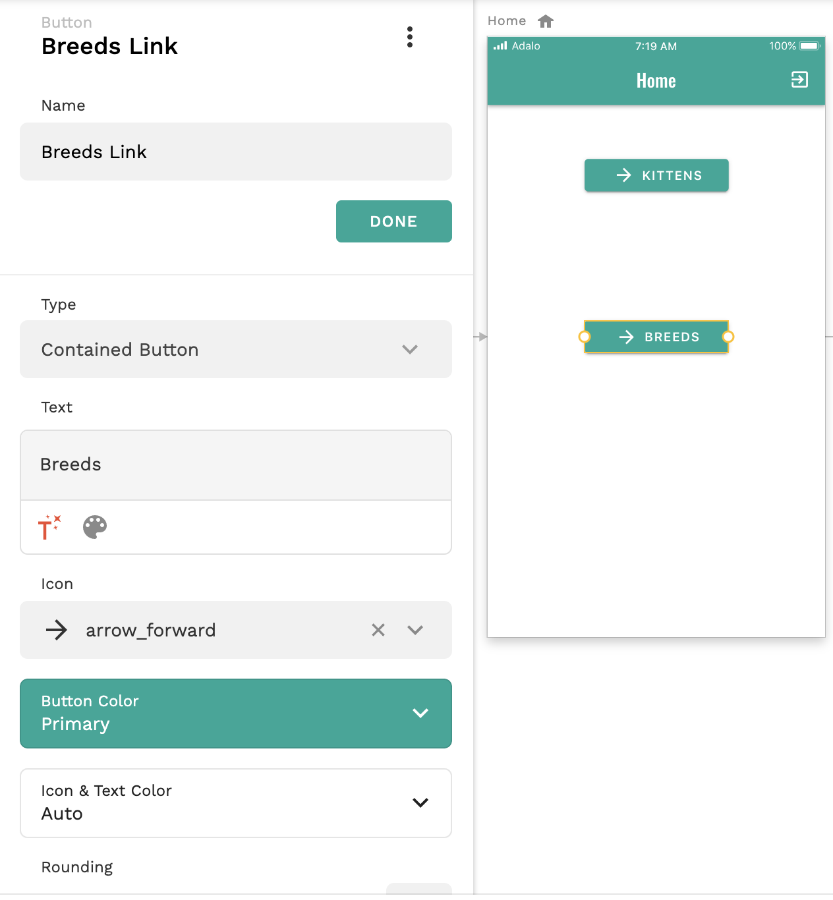

--- 
- Nameに "Breeds"と入力
- TemplateでImage Listを選択
- CREATE SCREEN をクリック

---
- List TitleのTextを"Cat Breeds"に変更
- Image ListをBreeds Collectionのリストとして設定
- ImageのURLに "Breed Image > url" を設定
- "If there's no image..." に "Don't show anything" を設定
- 右下の+ボタンは不要なので削除
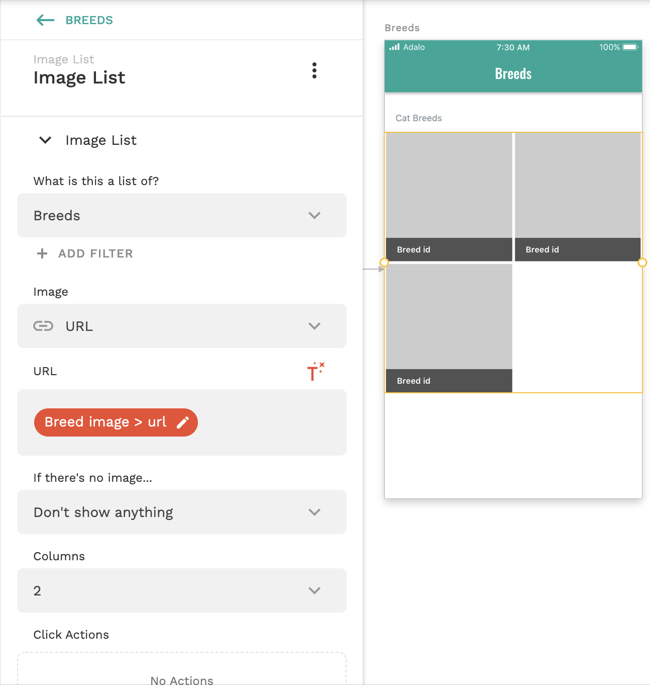

---
- Textを "Breed name" に変更
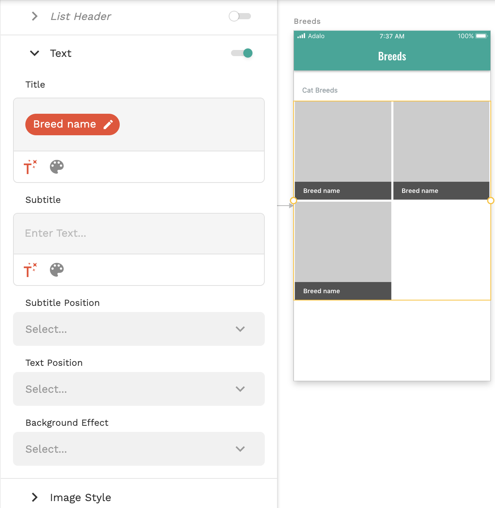

---
戻るアイコンが非表示になっているので、表示します。
- App Barをクリック
- Left IconのトグルをONに変更
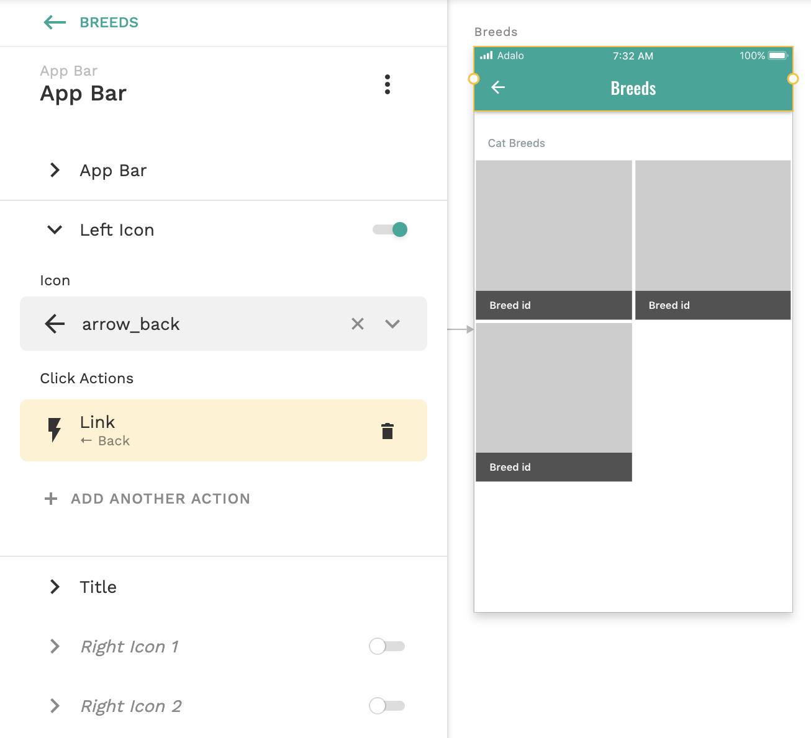

---
Preview機能で確認すると、猫の品種の一覧が表示されました。

---
###### 追加コンテンツ
TODO: 時間に余裕があれば資料化。難しければ、資料なしで時間が余った時に実演。

- 子猫画像表示画面で選択した品種だけを表示できるようにする
- 表示した子猫の画像をお気に入りに登録して、お気に入り一覧画面に表示されるようにする
  - お気に入りから削除もできるようにする

<!-- TODO: お気に入りの猫の画像URLをユーザー毎に保存したい -->
<!-- TODO: 猫詳細で受け取ったCurrent Catのデータをそのまま使わず、ID指定?でAPIから取得する(Inputを使う例になる) -->

<!-- ---

API連携先のデータのCRUDを実演したかったから選んだテーマだけど、The Cat APIでCRDは教えられる(Uはないけど)し、SpreadSheetにデータを保持する意味もあまりないので、こちらは割愛。
###### APIから取得したGoogle SpreadSheetのデータをAdaloのCollectionとして扱う
API連携先のデータは取得するだけではなく、登録、更新、削除することもできます。
Google SpreadSheetを使ってそれを試してみましょう。

---
Googleアカウントを作成します。
既に持っていればそのアカウントを使えば良いので、作成は不要です。
持っていない人は、一緒に作成してください。
https://accounts.google.com/signup/v2/webcreateaccount?continue=https%3A%2F%2Faccounts.google.com%2FManageAccount%3Fnc%3D1&dsh=S50453738%3A1637917137418951&biz=false&flowName=GlifWebSignIn&flowEntry=SignUp

---
Google SpreadSheetのデータをAPIで操作できるようにするために、SheetDBというサービスを使います。
https://sheetdb.io/

---
補足
連携サービスで、Adaloとは直接連携させられなくても、Google SpreadSheetとであれば連携させられるという場合が多いかと思います。そのような場合は、今回ご紹介したようにGoogle SpreadSheetをデータのハブとして活用すると良いかもしれません。 -->

---
##### 連携サービス
Custom ActionやExtenal Collectionでは、連携先のサービスのAPIの仕組みをドキュメントから理解するのが大変かもしれません。

次は、そんなことをしなくても簡単に連携の設定ができるサービスをご紹介します。

---
連携サービスにも色々なものがあります。

---
元々はZapierを紹介しようと思っていたのですが、数日前からAdaloとのアカウント連携ができないトラブルが起きてしまっています。(焦りました。。。)
参考: [Bad request error when connecting to Adalo](https://community.zapier.com/general-questions-3/bad-request-error-when-connecting-to-adalo-12739)

---
そのため、今回はIntegromatを紹介します。
https://www.integromat.com/en

---

---
やること
  - Video Calling
    - 通話できた。1440 Minutesまで無料らしい。 https://app.garlik.io/

<!-- - IFTTTという選択肢もある？→ Adaloなかった -->
<!-- - pipedreamも使える？https://pipedream.com/apps/adalo/integrations/google-sheets
  - AdaloのアクションがGet all collection recordsしかない(Adaloのトリガーは0)ので断念 -->
- External CollectionでのCRUD(5 endpoint actions) 
  - 参考: https://qwerty.work/blog/2021/06/adalo-sheetdb-googlespreadsheet.php
  - SheetDB API Doc: https://docs.sheetdb.io/#sheetdb-api
  - 作ったアプリ: https://previewer.adalo.com/434969fa-d5c1-4a08-87a1-1fba0027073b
  - メモ
    - Current xxx のページ間の受け渡し後の詳細画面、編集画面等ではGet One RecordのAPIは呼ばれていない(受け渡されているので)
      - Adaloではリストの選択や絞り込みで1リソースを表示するので、Get One Recordは不要っぽい
    - id以外のColumnを使ってもAPIコールできる? -> {{}}で指定できそうだけど、エラーになるのでダメみたい。idを使うことにしよう。
    - External Collection のEdit Settingsを開くと毎回EndPointsが初期値になるので、要注意
<!-- Get All Records
Get One Record
Create a Record
Update a Record
Delete a Record -->
  <!-- - AirTableの説明は流石に盛り込めないので、GoogleSpreadSheetにしよう -->
- External CollectionでマスタデータをGET(CRUD全部を必要としない場合もあるよね)
  - 参考: https://qiita.com/wakiwaki/items/5016404ce0c15a755188
  - メモ
    - Auth(api-key)のセットアップも紹介する

- Custom Action
  - 郵便番号からの住所入力 https://www.youtube.com/watch?v=7k4x2CaAbCI

- API Documentを読み込んで設定をするのは大変なので、便利なツールを使いましょう
  - zapierは断念 https://community.zapier.com/general-questions-3/bad-request-error-when-connecting-to-adalo-12739
  - 使うツール: Integromat https://www.integromat.com/en/integrations/google-sheets
    - GoogleSpreadSheet連携 https://www.integromat.com/en/integration/8256-add-new-adalo-records-to-google-sheets
      - TODO: Googleアカウント作成
      - 15分に一回連携される
      - 一度Runしないと、Collection内のプロパティが選択できない
      - 空行を入れると、その上にレコードが挿入される
      - レコードの更新はWatch対象をUpdatedAtにすると連携されるが、新たな行が挿入されて重複してしまう
      - 手動でのスプレッドシート側の行挿入とか更新とかどうなるかは要検証
    - Slack連携 https://www.integromat.com/en/integration/8257-get-slack-messages-for-new-adalo-records
      - 管理者権限を持つSlackのワークスペースが必要(そこから教える？)
    <!-- - Twitterは有料プラン限定なので断念 -->
    - メール送信
      - HTMLなら改行を で入れる
    - Zoomは後でもう一度試す
    - TODO: Google Map
    - TODO: Webhook

External Collections -> Custom Action -> Integromat の流れが良い？

※ Adaloの変更が反映されなかったり、連携先のツールが動かなくなったりするタイミングがあります。

--- 
参考
https://help.adalo.com/integrations/external-collections-with-apis

https://andd.live/7970/adalo-resource%E3%83%BBapi%E3%81%AB%E3%82%88%E3%82%8B%E5%A4%96%E9%83%A8%E3%82%B3%E3%83%AC%E3%82%AF%E3%82%B7%E3%83%A7%E3%83%B3%E3%80%81%E5%A4%96%E9%83%A8%E3%82%B3%E3%83%AC%E3%82%AF%E3%82%B7%E3%83%A7/

https://qwerty.work/blog/2021/06/adalo-sheetdb-googlespreadsheet.php

https://qiita.com/sakuraya/items/6f1030279a747bcce648#%E3%83%A1%E3%82%BF%E6%83%85%E5%A0%B1%E3%81%AF%E3%83%98%E3%83%83%E3%83%80%E3%81%A7%E3%81%BE%E3%81%8B%E3%81%AA%E3%81%88%E3%82%8B%E3%81%93%E3%81%A8%E3%81%8C%E5%A4%9A%E3%81%84

Instagramは大変なわりに開発者の投稿しか表示できないっぽい(ユーザー自身で認証して投稿を取得させるには、アプリレビューが必要)ので、断念 
https://www.e-pokke.com/blog/instagram-basic-display-api.html
>テストユーザーとして登録したご自身のInstagramアカウントについては、追加の権限の設定が不要なため、アプリを公開（ライブモード）する際に 「アプリレビュー」が不要 となっています。

Micro API https://m3o.com/

---
## ノーコードツールでの共同作業のTips
---
#### (再掲)
- チームメンバーと一つのアプリを共同編集するには、Settings > AppAccess > Add Team Member > Invite New Team Memberを選択してチームメンバーのメールアドレスを入力しましょう。

---
※ 他のメンバーと同時に一つのアプリを編集する際、他の人が行った編集は自分の画面にリアルタイムで反映されません。(リロードが必要なようです)

※ 同時に複数人が同じ画面を編集すると、先に行われた編集が後から行われた編集に上書きされてしまいます。それぞれが別の画面を編集するか、みんなで同じPCを見ながら一緒に編集しましょう。

---
- Bubbleは複数人が同じアカウントで同じ画面を同時編集しても、もう1人の画面にリアルタイムで反映される
- 同じエレメントに対する編集は、後勝ち
- 画面さえ分ければ、難なく開発できそう
- データベースもWorkflowも他の人の操作がリアルタイムで反映されるので、消えてしまうことはなさそう。 

---
- Adaloだと、同じ画面を同時編集したら、リアルタイムでは反映されないし、最後に編集した人の画面の状態になる。(別コンポーネントを編集していても、その編集は取り消される)
- 別画面の同時編集なら、どちらも保存される。
- 画面ごとの分担は必須になるけど、共同編集もできなくはなさそう。
- 他の人の担当画面をうっかり触ってしまわないように、画面を話して開発する　といったコツは必要になりそう。
- DatabaseへのCollection追加も、同時編集したら、最後に編集した人の状態で上書きされる(先に追加したCollectionは消える)
- Actionも同じ画面に同時に追加すると、後の方だけが保存される。 (edited) 

---
TODO: 共同編集について検証した内容を実演して見せられるようにする
Bubbleはほぼ問題ないので、実演はAdaloだけで良さそう

---
###### 共同編集のルール
Bubbleは、同じエレメントの同時操作はダメなので、それを起こさないために、同じ画面の同時編集はやめましょう。
Adaloは、同じ画面を同時操作すると消えてしまうので、同じ画面の同時編集はやめましょう。データベースも、誰か1人が更新するようにしましょう。

---
モブプログラミングの紹介?
- ドライバーとナビゲーターみたいなお話を盛り込む？
---
## 共同作業演習
DevelopmentPhaseのチームで、新たに一つアプリを開発してみてください。
DevelopmentPhaseで開発予定のアプリとは異なるアプリにしましょう。
AdaloかBubbleのどちらを使うかは自由です。
DevelopmentPhaseで使う予定の方を選んでも良いですし、両方を選んでも良いです。
全員が手を動かすようにしましょう (画面を分担する、ドライバーとナビゲーターは15分毎に交代するなど)

---
分担のやり方の例
- データベース設計は最初にみんなでやろう
- 登録画面担当、一覧画面担当、詳細画面担当を決めよう
など

---
## ふりかえり

---
# 以上です！
# お疲れさまでした！
