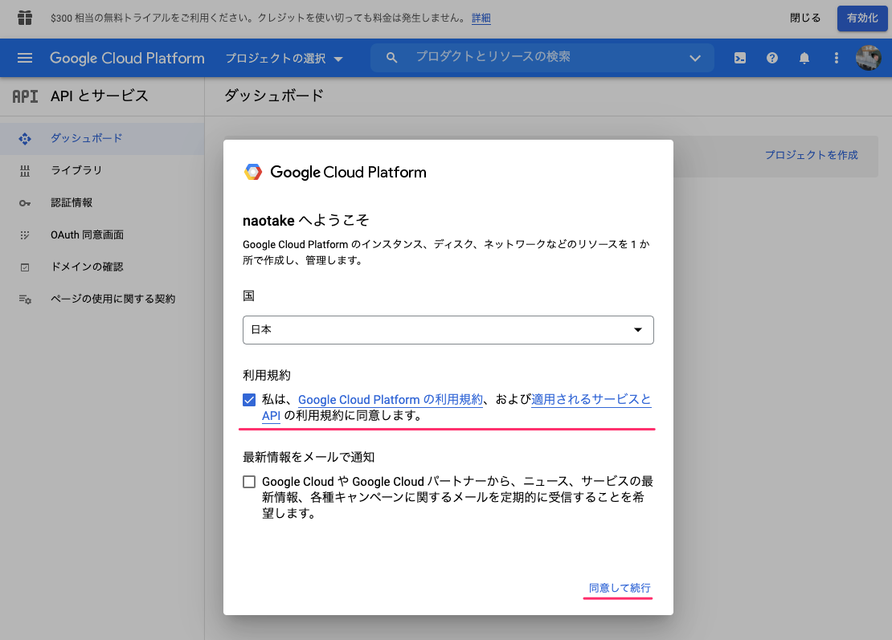
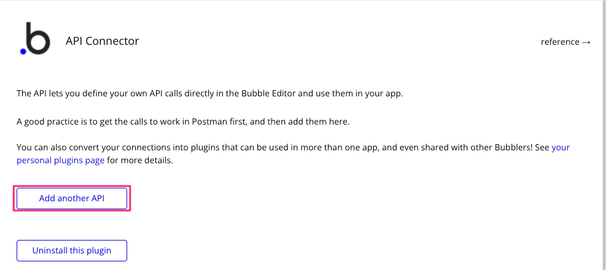
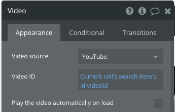
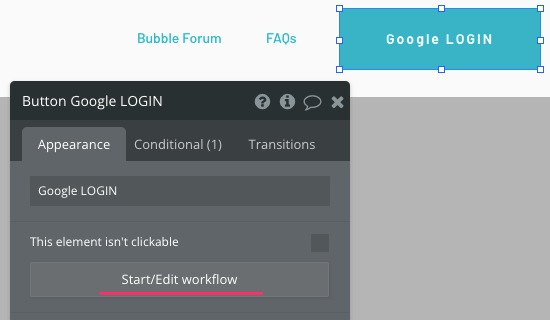
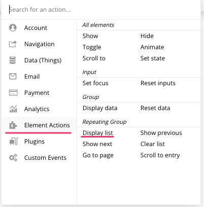
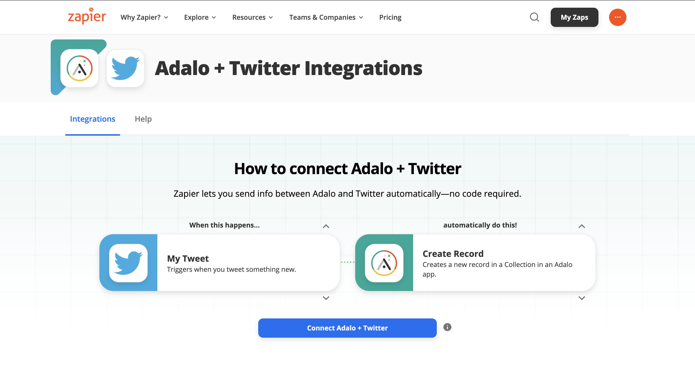
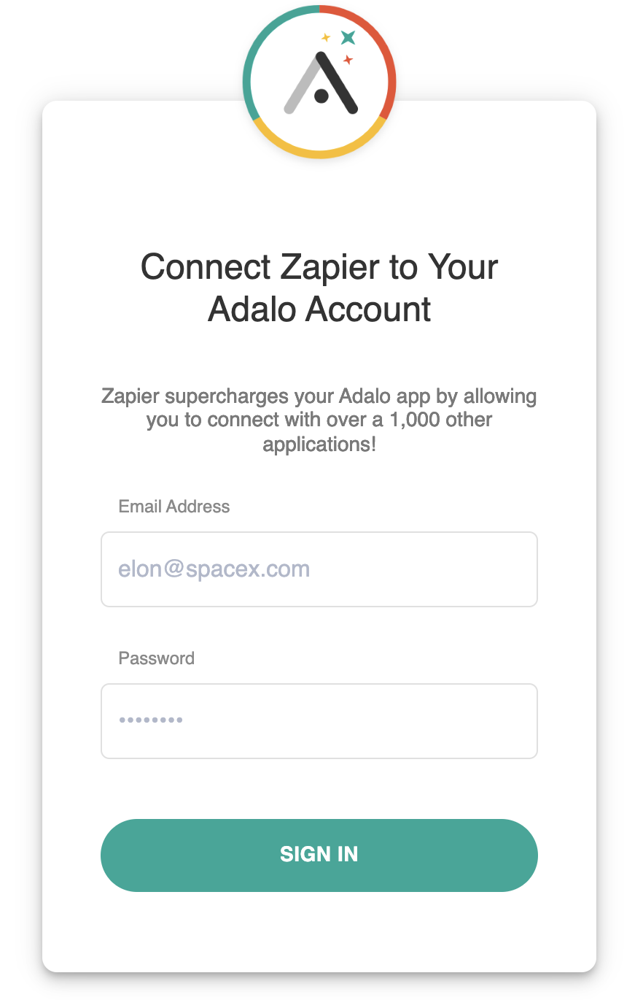

**Programming Boot Camp**

# 応用編

**東京工業大学 2021/11/27**
　
　
　
　
　
　　　　　　　　　　　　　　　　　　　　　　　　**Ryo Imahashi**


---
## 目次
  - 今回やることの確認
  - 外部連携
  - ノーコードツールでの共同作業のTips
  - Adaloでの共同作業演習
  - Bubbleでの共同作業演習
  - ふりかえり

---
## 今回やることの確認

---
## 外部連携

---
### 外部連携とは
AdaloやBubbleだけで実現できないことがある場合、外部サービスと連携することでそれを実現できるかもしれません。

---
### 外部連携の方法
Adalo
- Zapier
- API
- データソース？
Bubble
- Zapier
- API

---
- Zapierというサービスを使えば、案内に従って操作することで、簡単に外部サービスを連携させられます。試してみましょう。
  https://zapier.com/apps/adalo/integrations

---
ZapierでAdaloと連携させることが可能な外部サービスの例
- Google Spreadsheet
- Google Calender
- Slack
- Zoom
- Twitter
- Instagram
- Spotify
- Bubble
- Google Meet
- Strava


---
外部連携で作るものの
- Instagramの投稿(Adalo)
- Twitterの投稿(Bubble)
- +α ベストエフォートで、複数サービスとの連携?

その他の候補
- Youtube連携
- Spotifyのプレイリストなど、自分の考えや好きなものを集約したページを作る(ユーザーごとに連携先サービスへの認証をさせる必要がある)
- 超調整さん(Adaloで作ったフォームで入力したイベントの出欠情報をGoogle Spreadsheetで一覧表示させる。Calendlyに負けそうではある。)
<!-- - 会議室予約管理システム(インターフェースはAdalo,データはGoogleCalender)
 -->
- Zoom or meetの会議参加者管理システム
- facebook-groupsからポストを抽出して山田道場ホームページ？
- stravaで運動ログを ?

---
bubbleとのzapier連携
- notion


---
#### Adaloでの外部連携

---
#### Bubble での外部連携

つづいて Bubble での外部連携を試していきます。
今回作る画面はこんな感じです。


---

機能としては下記を盛り込んだ画面となります

- YouTube の動画一覧を表示
- Google アカウントを使ったソーシャルログイン
- YouTube の動画一覧を動的に検索

---

##### まずは土台となるアプリケーションを新たに用意

- Advanced-bubble-{ご自身の名前} というアプリを新たに作成


---

- 第 3 回の時と同様、ヘッダーを除いてすべての要素を削除してください
  - 一度すべて削除した後にヘッダーコンポーネントを再配置でも OK


---

##### 続いて Google アカウント側の事前準備

- YouTube の動画一覧を表示するために必要な下準備を行います
- Google アカウントにログインしていただき、下記 URL にアクセスします
  https://console.developers.google.com/

---

- はじめて Google Cloud Platform(GCP) の画面にアクセスするとこのようなダイアログが表示されますので、国を選択し、利用規約にチェックを入れて「同意して続行」



---

- 同意すると、API とサービスのダッシュボードが表示されると思いますので、プロジェクトを作成のリンクを押下して今回の講義用のプロジェクト（箱）を作成します


---

- 新しいプロジェクトの作成画面が表示されるのでプロジェクト名に適当な名前を指定して作成


---

- 作成が完了すると、作成したプロジェクトのダッシュボードが表示されます
  - 画面上部の Google Cloud Platform の左隣に作成したプロジェクト名が表示されていれば OK


---

- 続いて YouTube の動画一覧を表示するために必要な認証キーを発行します
- 左メニューから「認証情報」を選択
- 右パネルが認証情報に変わるので、画面上部の「＋ 認証情報を作成」をクリック
- ポップアップから「API キー」を選択


---

- すると API キー作成完了のポップアップが表示されるので、その値を控えておきます
- キーを制限しろと言われますが、講義の最後にこれらのキーを削除しますので一旦このまま行きます


---

- これで Bubble から YouTube の一覧を取得するためのキーが発行できたので Bubble 側の設定を行っていきます
- まずは Bubble から YouTube の一覧を API を介して取得するための準備を行います

---

##### Bubble の API 連携の準備

- 左メニューから Plugins を選択し、Add plugins ボタンをクリック
- `API` で検索し、 `API Connector` というプラグインをインストールします


---

- このプラグインは Bubble のアプリから、世の中で公開されている API を使って、API の向こう側の情報と Bubble を繋げるためのプラグインとなります
- いくつかの Bubble のプラグインの中には、特定の API に特化させたものもあり、それらのプラグインはこの API Connector よりも設定が単純なものもあります
- 今回は一番の基本形となる API Connector プラグインを介して YouTube API を使い、動画の一覧を表示してみましょう

---

- それでは YouTube API を使うための設定を行っていきます
- まず "Add another API" をクリックし、新しい API 連携の設定を開始します



---

- "Add another API" をクリックすると、このような API 設定部品が表示されると思います


---

- 各項目を簡単に説明します
- 1 と 2 については合わせて設定を行ってください

---

1. API Name: この API 連携のグループ名
  - 今回は YouTube


---

2. Authentication: このグループ配下の API で行う共通の認証方式
  - 今回は "None or self-handled"


---

3. Shared headers for all calls: このグループ配下の API すべてで指定する共通のヘッダー情報
  * 今回は特に指定しません


---

4. Shared parameters for all calls: このグループ配下の API すべてで指定する共通のパラメータ情報
  * 今回は特に指定しません


---

- 続いて、このグループに対して具体的な API の内容を設定していきます
- 先ほどの画面で "API Call" となっているブロックの右側に expand というリンクがあるのでそれをクリック
- すると、具体的な API の設定項目が表示されますので、簡単に説明します


---

1. Name: 具体的な API の名前
  * 今回は "search" と入力します


---

2. Path: 具体的な API の URL
  * 今回は `https://www.googleapis.com/youtube/v3/search` を入力します


---

3. Headers: この API 固有のヘッダー情報
  * 今回は特に指定しません


---

4. Parameters: この API 固有のパラメータ情報
  * 今回は下記 2 つのパラメータを指定します。Private / Allow blank / Optional は添付の通り
    1. Key: `key`、 Value: 先ほど Google アカウント側で発行した API キー
    2. Key: `q`、Value: YouTube で動作検索をする際のキーワード（ご自由に指定ください）

---

- すべて設定するとこんな感じです


---

- 設定が終わったら、設定内容が正しいかを確認します
- 下部にある "Initialize call" ボタンをクリック

---

- おそらく Status code 403 のエラーメッセージが返ってきたはずです
- 内容は書いてある通りですが、要約するとこんな感じです

```
YouTube Data API v3 はあなたのプロジェクトで無効になっています。
この URL にアクセスして有効にしてから再試行してください。
```


---

- どうやら今回利用した YouTube Data API が各人の Google アカウント上で有効になっていないようです
- これは Google さんが全員が使わないであろう機能は最初から OFF にしていて、必要ある人だけ自分で ON にしてね、という状態になっています
- なので今回は YouTube Data API を使いたいので、メッセージに記載されている URL にアクセスして有効化しましょう
  https://console.developers.google.com/apis/api/youtube.googleapis.com/overview?project={各人のプロジェクトID}

---

- すると親切に今回利用したい "YouTube Data API v3" の画面へ遷移したはずです
- 画面にあるとおり「有効にする」をクリックして有効にします


---

- しばらくするとこんな画面に遷移するはずです
- 画面上部の赤線部分が「API を無効にする」となっていれば有効化は成功です


---

- YouTube Data API が有効化できたので、再度 Bubble の画面に戻り "Initialize call" ボタンをクリック
- 成功すると "Returned values - search" というポップアップが表示されるはずです


---

- これは今回設定した `https://www.googleapis.com/youtube/v3/search` の API を実行した結果の情報を表しています

---

詳しくは割愛しますが、ポイントとしては

- `items(list)` となっている部分が検索結果の動画一覧が格納されている一覧になります
- その型となるのが `search item` という型となり、検索結果に含まれる複数系のデータであることを表しています
- そして、この後の設定で特に重要なのが `id videoId` となっている項目です

---

- YouTube を見たことがある人なら分かると思いますが、この VideoId というのが、それぞれの動画を一意に識別する動画となっており、画面表示するときにもこの Id が必要となります
- その他、特に参照しない項目については紛らわしいのでプルダウンの中から `Ignore field` を選択しておきます
- こうすることで、Dynamic data として扱う時に、選択肢の中に表示しないようになり、設定項目を選ぶ際に悩まずに済みます

---

- すべて設定するとこんな感じです
- 設定が完了したら "SAVE" をクリックして、設定内容を保存しておきます


---

##### 画面表示の準備

- Bubble の API 連携の準備が出来たので、いよいよ画面の設定をしていきます
- 画面の設定は第 3 回、4 回の講義でマスターしていると思いますので、概要だけお伝えして画面レイアウトを組み立ててみてください

---

- index ページで Repeating Group を使って一覧を組み立てます
- Repeating Group の各セルの中には Video を配置
- こんな感じですね


---

- レイアウトが出来たので実際に YouTube の一覧表示を設定していきます
- まず Repeating Group の Type of content は、先ほど API 実行時に確認した `search item` 型となります


---

- 次に Data source ですが、今回は API から取得した YouTube の動画一覧を対象とします
- Click から候補を見てみると `Get data from an external API` という項目があると思うのでそちらを選択


---

- 隣に Get data From an external API のポップアップが表示されるので、API provider のプルダウンを選んでください
- すると、プルダウンの中に先ほど設定した `YouTube - search` の候補があると思いますのでそれを選択してください
  - ハイフンの前が API のグループ名で、後ろが具体的な API の名前です


---

- 次に各セルの設定をしていきますが、まずは皆さん設定してみましょう

- Video source は YouTube
- すると Video ID という項目が表示されるので、先ほど API 設定をしたときにみた `Video Id` を参照すればよさそうですね


---

- こんな感じですね



---

- これで設定完了です！さっそくプレビューしてみましょう！
- 事前に API で指定したキーワードの動画一覧が表示されましたか？

---


---

##### Google ログインを試してみよう

- 続いて Bubble アプリへのログインを Google アカウントを使ってログインしてみましょう！
- まずは Google のプラグインをインストール


---

- インストールした Google プラグインを選択
- 右パネルに表示されている `Use a generic redirect URL` の欄にチェックを入れる
  - この URL もメモしておくのですが、画面上で選択ができないため、下記 URL のアプリ名部分だけご自身のアプリに読み替えてメモしておいてください
  - `https://advanced-bubble-{Your Name}.bubbleapps.io/api/1.1/oauth_redirect`

---


---

##### Google へのログイン後にアプリに戻ってくるための認証準備

- Google Cloud Platform 画面にアクセス

https://console.developers.google.com/

---

- プロジェクトを選択し、左メニューから OAuth 同意画面を選択


---

- User Type に "外部" を選択して「作成」
- 必要事項を入力したら、保存して次へ


---

- アプリ情報
  - アプリ名: bubble で作成したアプリ名
  - ユーザーサポートメール: ご自身の Google アカウントのメールアドレス


---

- 承認済みドメイン
  - bubbleapps.io
- デベロッパーの連絡先情報
  - ご自身の Google アカウントのメールアドレス


---

- スコープは特に設定変更せず、保存して次へ

---

- テストユーザにはご自身の Google メールアドレスを入力しておく
- 設定したら保存して次へ


---

- これで登録は完了したので続いて認証情報を発行します
- 左メニューから認証情報を選択して、「＋ 認証情報を作成」をクリック
- サブメニューから OAuth クライアント ID を選択


---

- OAuth クライアント ID の作成画面が表示されるので下記の通り入力し「保存」

- アプリケーションの種類: ウェブアプリケーション
- 名前: Bubble OAuth


---

- 承認済みのリダイレクト URI: Bubble 側で Google プラグインインストール時に控えた URL
  https://advanced-bubble-{Your Name}.bubbleapps.io/api/1.1/oauth_redirect


---

- すると「OAuth クライアントを作成しました」というポップアップが表示され、そこにクライアント ID とクライアントシークレットが表示されているので、それをメモしておく
  - メモだと忘れるかもしれない場合は JSON をダウンロードしても OK
- メモしたら OK でクローズ


---

##### 発行した認証情報を Bubble 側に設定

- Bubble の Google プラグイン画面に戻り、先ほど取得したキーをそれぞれの項目へ入力する
  - クライアントID → AppID/API Key
  - クライアントシークレット → App Secret


---

- これで事前設定は完了
- 続いてログイン機能を作り込んでいきます

---

##### ログイン機構を Google に置き換える

- ヘッダーコンポーネントを開き、SIGN UP OR LOGIN ボタンを選択してワークフロー画面へ遷移
  - ついでにボタンのラベルを "Google LOGIN" に変更



---

- ワークフロー画面へ遷移すると Button Google LOGIN に対して 2 つの When に対する振る舞いが設定されていると思います


---

- When: Button Google LOGIN is clicked and Current User is logged in
- これは文字通り、カレントユーザがログイン済み状態で「Google LOGIN」ボタンを押された場合、のワークフローとなります

---

- When: Button Google LOGIN is clicked and Current User is logged out
- これも文字取り、カレントユーザがログアウト済み状態で「Google LOGIN」ボタンを押された場合、のワークフローとなります

---

- まずはログイン時のワークフローを設定していきたいので、Current User is logged out のワークフローを設定していきます
- 既存ですでに「Show Sign up / Login Popup A」のステップが定義されているので、そちらを delete します


---

- 続いて Google ログインのワークフローを設定していきます
- Click here to add an action... を選択
- Account から Signup/login with a soccial network を選択


---

- Signup/login with Google のポップアップが表示されます
- OAuth provider に Google を選択
- 事前に Google と Bubble のプラグインに設定を行ったので、これだけで Google 認証が行えるようになりました 🙌


---

- 折角なのでログイン成功したらヘッダー上部にアカウント名と画像を表示してみましょう


---

- ヘッダーコンポーネントを開き、LOGIN ボタン左の要素を削除します
- Visual elements から Image を選択し、LOGIN ボタンの左側に配置します
  - 縦横 100 x 100 の正方形にしておきましょう


---

- そして、画像の参照元を設定します
- Bubbler の皆さんなら設定方法はイメージつきますよね
- 動的な表示設定は Dynamic image
- 表示したいのは現在ログインしているユーザの Google アカウントのプロフィール画像

---

- こんな感じですね


---

- ではプレビューしてみましょう！
  - 事前に Data の User にこれから動作確認する際に使用する Google メールアドレスと同じメールアドレスのデータがある場合は削除しておいてください
- ログインボタンを押すと Google のログイン画面に遷移し、そこでログインをすると Bubble 側に戻ってきましたよね？
- ちなみに、ログインすると Bubble 側の User data にログインした Google アカウントのメールアドレス情報が登録されます

---


---

##### 最後に YouTube API を使った検索機能を組み込んでみましょう


---

- 現状では YouTube API の認証キーや検索キーワードは固定になっています
- なので、これを下記のように変えてみましょう
  - 認証キーはログインしているユーザ情報から取得する（新たに field を追加する）
  - 検索キーワードは画面から入力・検索できるようにする

---

次のページにヒントを書いておきますのでまずはトライしてみましょう！

---

- まずは User に対して `key` という field を追加し、事前に設定しておく
  - 本来ここもユーザ自身に入力させるなどの導線が自然ですが今回は時間の都合上、API キーの設定画面は割愛します
- API のパラメータを処理の中で動的に設定する場合、まずは固定値を無くし `Private` のチェックを外すことで、DataSource などで API 呼び出しする際にパラメータを指定できます
- index ページに新たに検索用の要素（テキストボックスと検索ボタン）を配置し、検索ボタンがクリックされた時に、YouTube API 経由で検索を行い、結果を Repeating Group にセットしてあげます

---

# :hourglass_flowing_sand:
# :hourglass_flowing_sand:
# :hourglass_flowing_sand:
# :hourglass:
# :hourglass:

---

- まずは User の型に対して `key` という field を追加します


---

- そして、今回取得した認証キー（API キー）を登録済みの User に事前にセットしておきます


---

- 次に YouTube API 側の設定はこんな感じですね


---

- ポイントとしては、動的に指定したい項目については Value の値を削除し、Private のチェックを外しました
- これにより、API を使う場面でこれらのパラメータの値を指定することができるようになります


---

- 続いて Repeating Group の Data source を空にします
- これは、新たに設ける検索機能のワークフローの中で、ここで表示するデータを指定するためです


---

- 次にキーワード検索が行われた時のワークフローの設定です
- 今回は要素に対するアクションとなるため "Element Actions" の中にある "Display list" を選択します



---

- Data source には Get data from an external API を選択し、API 経由のデータ表示とします
- そして API provicer に `YouTube - search` を選択すると、先ほどはなかった 2 つの param が表示されるはずです
- これは先ほど YouTube API 側の設定で動的に指定したいパラメータについて Private のチェックを外したためとなります
- ここで指定する値はいつもの Dynamic data ですね

---

- 設定するとこんな感じです


---

- いかがでしたでしょうか？
- API 連携を行うことで、Bubble で出来る幅がさらに広がったと思います！
- 合宿でも外部の API を使うチームがあるかもしれませんが、そのときは今日学んだことを活かして、API 連携を実践してみましょう！

---
###### Zapier
Twitter


---


---



---


---


---
## ノーコードツールでの共同作業のTips
---
#### (再掲)
- チームメンバーと一つのアプリを共同編集するには、Settings > AppAccess > Add Team Member > Invite New Team Memberを選択してチームメンバーのメールアドレスを入力しましょう。


---
※ 他のメンバーと同時に一つのアプリを編集する際、他の人が行った編集は自分の画面にリアルタイムで反映されません。(リロードが必要なようです)

※ 同時に複数人が同じ画面を編集すると、先に行われた編集が後から行われた編集に上書きされてしまいます。それぞれが別の画面を編集するか、みんなで同じPCを見ながら一緒に編集しましょう。


---
- Bubbleは複数人が同じアカウントで同じ画面を同時編集しても、もう1人の画面にリアルタイムで反映される
- 同じエレメントに対する編集は、後勝ち
- 画面さえ分ければ、難なく開発できそう
- データベースもWorkflowも他の人の操作がリアルタイムで反映されるので、消えてしまうことはなさそう。 

---
- Adaloだと、同じ画面を同時編集したら、リアルタイムでは反映されないし、最後に編集した人の画面の状態になる。(別コンポーネントを編集していても、その編集は取り消される)
- 別画面の同時編集なら、どちらも保存される。
- 画面ごとの分担は必須になるけど、共同編集もできなくはなさそう。
- 他の人の担当画面をうっかり触ってしまわないように、画面を話して開発する　といったコツは必要になりそう。
- DatabaseへのCollection追加も、同時編集したら、最後に編集した人の状態で上書きされる(先に追加したCollectionは消える)
- Actionも同じ画面に同時に追加すると、後の方だけが保存される。 (edited) 

---
TODO: 共同編集について検証した内容を実演して見せられるようにする

---
###### 共同編集のルール
Bubbleは、同じエレメントの同時操作はダメなので、それを起こさないために、同じ画面の同時編集はやめましょう。
Adaloは、同じ画面を同時操作すると消えてしまうので、同じ画面の同時編集はやめましょう。データベースも、誰か1人が更新するようにしましょう。

---
モブプログラミングの紹介?
- ドライバーとナビゲーターみたいなお話を盛り込む？
---
## 共同作業演習
DevelopmentPhaseのチームで、新たに一つアプリを開発してみてください。
DevelopmentPhaseで開発予定のアプリとは異なるアプリにしましょう。
AdaloかBubbleのどちらを使うかは自由です。
DevelopmentPhaseで使う予定の方を選んでも良いですし、両方を選んでも良いです。
全員が手を動かすようにしましょう (画面を分担する、ドライバーとナビゲーターは15分毎に交代するなど)

---
分担のやり方の例
- データベース設計は最初にみんなでやろう
- 登録画面担当、一覧画面担当、詳細画面担当を決めよう
など

---
## ふりかえり

---
# 以上です！
# お疲れさまでした！
